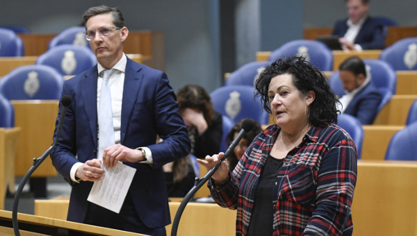
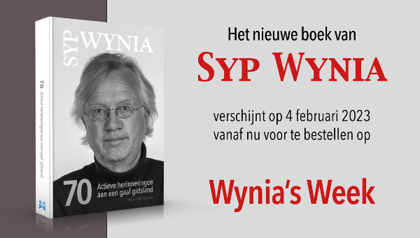
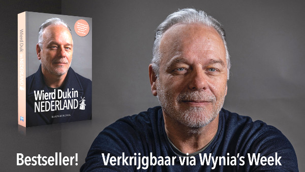
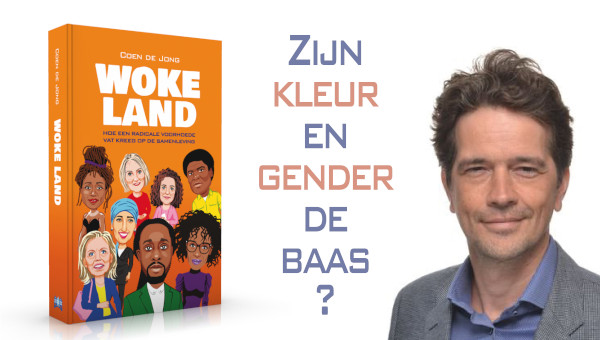
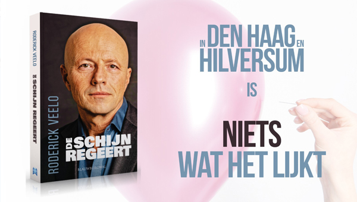

# Hoe deze asielmotie laat zien dat mild-rechts een Kamermeerderheid heeft - Wynia's Week

# Hoe deze asielmotie laat zien dat mild-rechts een Kamermeerderheid heeft

 

Joost Eerdmans van JA21 en Caroline van der Plas van BBB in de Tweede Kamer: ‘Substantiële politieke macht met een geweldige potentie’. (Beeld: ANP/Peter Hilz)

18 februari 2023

**Deel dit artikel:**

Een Kamermeerderheid wil dat asielzoekers voortaan buiten de EU worden opgevangen, bijvoorbeeld in Rwanda. Nederland moet zich daarom aansluiten bij Denemarken dat zich hiervoor al langere tijd sterk maakt.

Dat PVV, Forum, Groep Van Haga, SGP, BBB en Pieter Omtzigt zich achter het [voorstel](<https://www.wyniasweek.nl/Users/paulverburgt/Downloads/Motie%20van%20het%20lid%20Eerdmans%20over%20optrekken%20met%20de%20Deense%20regering%20inzake%20het%20verplaatsen%20van%20asielopvang%20en%20-procedures%20naar%20partnerlanden%20buiten%20de%20Unie.pdf>) van Joost Eerdmans van JA21 schaarden, mag geen verrassing heten. Wél dat VVD en CDA voor stemden.

Dat is daarom zo pikant omdat er in de coalitie grote onenigheid is over het migratiebeleid. Partijen sluiten de val van het kabinet niet meer uit, zo horen we al een tijdje van insiders. Die val is met de ondersteuning van het asielplan-Eerdmans door VVD en CDA een stap dichterbij gekomen. Als ze tenminste voet bij stuk houden.

## Rutte zit klem

Onder druk van zijn eigen fractie en een mopperende en weglopende achterban is Rutte eind vorig jaar eindelijk gaan bewegen. Vooralsnog zonder succes.

Het plan om de gezinshereniging tijdelijk te vertragen is door de rechter afgeschoten. Daarmee is van het compromis binnen het kabinet alleen de _upside_ voor D66 en ChristenUnie overeind gebleven, de wet waarmee gemeenten kunnen worden gedwongen asielzoekers op te vangen. Dat is een ‘winst’ die nog niet is geïncasseerd omdat het wetsontwerp door de Raad van State is afgekraakt. Behandeling door de Kamer zal daarom pas vanaf april plaatsvinden. Als het er al van komt, want VVD en CDA zullen een compensatie voor de mislukte gezinsherenigingsmaatregel verlangen.

Binnen Europa is Rutte ook geen steek verder gekomen. Zelfs een erkend woordgoochelaar als de premier zal het niet lukken om de twee armzalige pilots die hij heeft binnengehaald, voor eigen publiek op te blazen tot een succes.

Ondertussen houdt staatssecretaris Van der Burg er rekening mee dat dit jaar nog meer asielzoekers naar ons land zullen komen dan vorig jaar. Dat wordt een ramp. De helft van de gemeenten die noodopvang hebben georganiseerd, heeft inmiddels aangegeven ermee te gaan stoppen.

## Tjeerd stookt

Tegelijkertijd polariseren mensen als Tjeerd de Groot van D66 zich een ongeluk. Onbekommerd roept hij dat boeren _en masse_ moeten verdwijnen om de natuur te redden, maar vooral ook om woningen te bouwen. Met name voor migranten, zo weet de gemiddelde Nederlander inmiddels.

Om dat nog eens in te peperen bedacht minister Hugo de Jonge (Wonen, CDA) het plan om nog meer sociale huurwoningen voor statushouders te reserveren dan de nu al het geval is (1 van de 8). Hij heeft het even ingeslikt, maar de toon is gezet.

## Rutte staat voor aap

Rutte staat ook nog eens voor aap. Is hij net begonnen PvdA en GroenLinks tot de grote vijand van de liberalen te maken in de hoop bij de Statenverkiezingen van 15 maart stemmen bij JA21, BBB en PVV weg te halen, gaat zijn eigen fractie met deze partijen in zee! Uitgerekend op het veruit gevoeligste onderwerp voor de VVD-achterban.

En dan doet het CDA ook nog eens mee. Hoekstra was na zijn stoere uitspraken over het stikstofbeleid van het kabinet net weer binnen boord gehesen en dan springt zijn partij weer uit de boot.

## Serieus of niet?

Moeten we de bijval van VVD en CDA voor het asielplan van JA21 serieus nemen? Cynische kiezers – en dat zijn er ondertussen heel veel – zullen weinig fiducie hebben. En begrijpelijk. We maken even een lijstje.

_Eerste punt_. Het is verkiezingstijd en politici beloven van alles en doen ongekende voorstellen. Wat blijft daar na 15 maart van over?

_Verder_ , het asieldossier zit al jaren muurvast. De VVD slaat vóór elke verkiezingen manhaftige taal uit (de partij maakte daarvoor speciale roeptoeters vrij zoals Dilan Yesilgöz, Benthe Becker en Ruben Brekelmans) om daags na de verkiezingen het hoofd in de schoot te leggen.

Niet anders is het bij het CDA waar uiteindelijk de progressieve protestanten in samenwerking met de partijtop elk verzet in eigen kring tegen de ongebreidelde asielinstroom telkens weer breekt.

_Derde punt_ , de fracties van VVD en CDA staan erom bekend dat ze nooit, maar dan ook nooit hun poot stijf houden als hun kabinet daardoor in gevaar zou komen. En dan nu wel?

En _tot slot_ de verantwoordelijke staatssecretaris Eric van der Burg. Hij moet van de Kamermeerderheid met de Denen gaan praten. ‘Wel binnen de grenzen van de internationale verdragen’ riep hij direct, een omineuze uitspraak want het Hof voor de Rechten van de Mens heeft enige tijd geleden een vergelijkbaar Rwanda-plan van het Verenigd Koninkrijk al veroordeeld (ook al heeft de Engelse rechter later wel toestemming gegeven). En we weten allemaal hoe graag Van der Burg asielzoekers binnen wil laten: ‘hoe meer, hoe beter’. Die gaat zich niet inspannen, hoor ik u denken.

## De rek is eruit

Maar toch, de rek is eruit. In de samenleving en in de achterbannen van de VVD en het CDA. Er zijn allerhande uiteenlopende overwegingen en accentverschillen aan te wijzen, maar _bottom line_ is het draagvlak voor het huidige migratiebeleid weg. En voor het huidige kabinet ook.

Het CDA zou nog kunnen inbinden, in de deerniswekkende hoop het definitieve einde nog een jaartje of twee te kunnen uitstellen.

## VVD als stopverf

De VVD heeft nog wel toekomst. Dat is een toekomst zonder Rutte, want die vertrekt vroeg of laat en zoals dat in de politiek gaat, per definitie onverwachts.

De VVD moet zich daar eindelijk eens op voorbereiden. Daarbij gaat het om vragen als leiderschap, koers en ook verkiezingsstrategie. Het is hoogst onwaarschijnlijk dat de VVD zich in het post-Rutte-tijdperk weer kan en wil permitteren om uitsluitend over links te regeren. Dat dreigt nu al mis te gaan!

## Mild-rechts heeft potentie

Rechts van de VVD is het speelveld sinds het aantreden van Rutte ingrijpend veranderd. Het gaat niet meer om een geïsoleerde PVV en wat electoraal strooigoed, maar om een substantiële politieke macht met een geweldige potentie als JA21, BBB en Pieter Omtzigt een mild-rechtse alliantie vormen. 45 Kamerzetels zijn voor zo’n alliantie zeker denkbaar.

Het is maar zeer de vraag of een VVD zonder Rutte zo groot wordt als nu. Ze zou wel eens een middelgrote partij kunnen worden van een zetel of twintig. Dan mag ze wachten tot ze wordt uitgenodigd aan de formatietafel van de mildrechtse alliantie.

Alleen door nu vast te houden aan het plan- Eerdmans kan de VVD zich nog als serieuze rechtse partij naar de kiezers profileren. Zo niet, dan wordt de VVD een kleurloze middenpartij met trekjes van alles en iedereen. Ideaal om bij een kabinetsformatie als stopverf te gebruiken.

## Toekijken of meedoen

Het huidige kabinet zit ondertussen in de houdgreep. VVD en CDA hebben de kat de bel aangebonden. De tijd van vooruitschuiven en over de band (van Europa) spelen is voorbij. Als Van der Burg met lege handen of vage plannen uit Kopenhagen terugkomt, is dat de vlam bij het lont. Maar omgekeerd ook, want D66 en ChristenUnie hebben helemaal geen trek in het Rwanda-plan.

Dat kan niet goed gaan.

En wie denkt dat bij Kamerverkiezingen wel een links blok zal ontstaan onder leiding van de combinatie PvdA en GroenLinks, moet beter naar de peilingen kijken. Die combi staat voorlopig op verlies. Er tekent zich een rechtse coalitie af. En de VVD kan maar beter zorgen dat ze meedoet dan dat ze moet toekijken.

[_**Paul Verburgt**_](<https://www.wyniasweek.nl/author/paulverburgt/>) _schrijft wekelijks in Wynia’s Week over politiek en samenleving._

_**Wynia’s Week**_ _is onafhankelijk, ongebonden en onverstoorbaar. De donateurs maken dat mogelijk. Doet u mee? Doneren kan op verschillende manieren. Kijk_[ _**HIER**_](<https://www.wyniasweek.nl/doneren/>) _**. Hartelijk dank!**_

[Doneren](<https://www.wyniasweek.nl/doneren/>)

[Abonneer op Wynia's Week](<https://www.wyniasweek.nl/hoe-deze-asielmotie-laat-zien-dat-mild-rechts-een-kamermeerderheid-heeft/>)
