# Sigrid Kaag over migratie: ‘Hekken horen niet bij een beschaafd land’ | Politiek | AD.nl

# Sigrid Kaag over migratie: ‘Hekken horen niet bij een beschaafd land’

D66-leiderDe wil van VVD en CDA om de migratie te beperken is volgens D66-leider Sigrid Kaag een ‘onuitvoerbare wens’. ,,Als er echt een oorlog is of totale ellende, dan zullen mensen blijven komen”, zegt ze in een interview met deze krant. Een gesprek met de vicepremier over migratie, nieuwe partijen en de stikstofkwestie.

Laurens Kok, Marcia Nieuwenhuis 18 feb. 2023 Laatste update: 08:22

Met de uitspraken van Kaag, tevens vicepremier, komt asieldebat verder op scherp te staan. [VVD-partijleider Mark Rutte](<https://www.ad.nl/politiek/vvd-fractie-stemt-in-met-nieuwe-asielwet-na-toezeggingen-partijleider-mark-rutte~a619251b/>) en [CDA-leider Wopke Hoekstra](<https://www.ad.nl/politiek/als-een-tijdbom-tikt-het-migratievraagstuk-door-onder-de-coalitie~a07bc2f4/>) hebben zich de afgelopen maanden juist herhaaldelijk uitgesproken voor het indammen van de [migratiestroom](<https://www.ad.nl/binnenland/rutte-belooft-vvd-fractie-lagere-asielinstroom-maar-kan-dat-wel~a6b06ba1/>). Dit zou volgens Hoekstra ‘op deze manier [niet vol te houden zijn](<https://www.ad.nl/politiek/fractievoorzitter-heerma-op-partijcongres-cda-politiek-heeft-te-lang-weggekeken~a3ffdc6c/>)’, en de hoge asielstroom moet ‘[substantieel omlaag](<https://www.ad.nl/politiek/de-oplossing-voor-de-vvd-schept-juist-een-probleem-binnen-het-kabinet~af0efb9a/>)’, aldus Rutte.

## Lees ook

Maar volgens de D66-leider, die zich tot dusver spaarzaam over dit onderwerp uitliet, zijn de wensen van haar coalitiegenoten niet realistisch. Koersen op het minderen van instroom is volgens Sigrid Kaag ‘niet de optimale benadering’. ,,Je moet kijken, wat kan je aan, wat kun je beter regelen. Als er echt een oorlog is of totale ellende, dan zullen mensen blijven komen.” 

[ 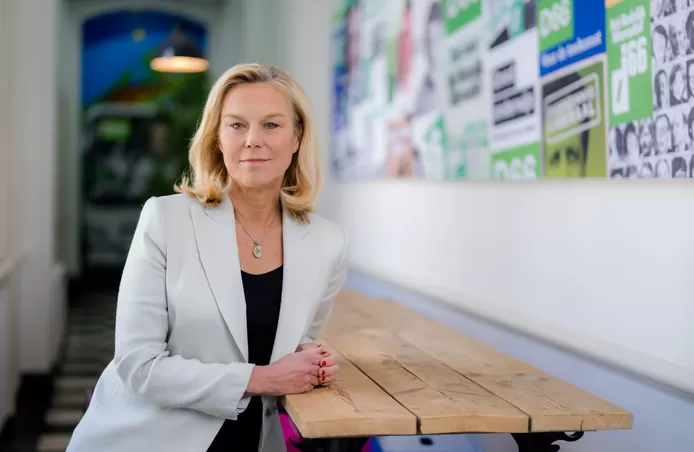  ](<https://www.ad.nl/politiek/sigrid-kaag-over-migratie-hekken-horen-niet-bij-een-beschaafd-land~a8d6a0b0/227575832/>)

D66-leider Sigrid Kaag. © Marco De Swart 

Deze week schaarde een Kamermeerderheid zich achter een motie om te onderzoeken of [Nederland het asielbeleid (deels) kan uitbesteden aan Rwanda](<https://www.ad.nl/binnenland/gaat-nederland-een-asielzoekerscentrum-bouwen-in-afrika-rwanda-heeft-er-al-een-klaar-staan~a6d8faf2/>). Ook hiervan betwijfelt de vicepremier de juridische haalbaarheid. Dit model heeft volgens haar ‘gefaald bij de hoge rechter, omdat het buiten alle verdragen staat’.

## Rechts-extremisten

In de campagne voor de Statenverkiezingen was Sigrid Kaag tot dusver niet heel zichtbaar. Al ziet ze dat zelf anders: ,,Wij waren juist de eerste. In januari riep ik op tot meer openlijk verzet tegen rechts-extremisten en het gevaar dat zij vormen voor de rechtsstaat. Wij kiezen ons eigen moment en laten ons niet opjagen door acties van anderen”, zegt de vicepremier op het partijkantoor van D66.

Met ‘die anderen’ doelt Kaag onder andere op VVD-leider Mark Rutte, die al waarschuwend voor een ‘[linkse wolk](<https://www.ad.nl/politiek/vvd-strategie-ontleed-hierom-waarschuwt-rutte-voor-linkse-wolk~a9db89f7/>)’ hoopt op een tweestrijd met [het koppel PvdA en GroenLinks](<https://www.ad.nl/politiek/attje-kuiken-pvda-en-jesse-klaver-gl-we-kunnen-deze-verkiezingen-de-grootste-worden~a92cc56f/>). ,,Kunstmatig”, recenseert Kaag de [liberale campagnestrategie](<https://www.ad.nl/politiek/een-tweestrijd-is-een-lokkertje-voor-extra-kiezers-maar-eigenlijk-werken-links-en-rechts-samen~ac3d0fbb/>). ,,PvdA en GroenLinks zijn gematigde middenpartijen die we als coalitie straks gewoon weer nodig hebben.”

[ 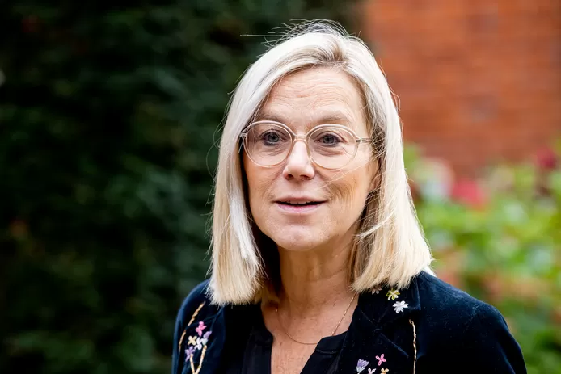  ](<https://www.ad.nl/politiek/sigrid-kaag-over-migratie-hekken-horen-niet-bij-een-beschaafd-land~a8d6a0b0/221508172/>)

© Getty Images 

Dat de verschillen nu even worden uitvergroot, snapt ze wel. ,,Maar het leidt de aandacht af van waar het in de provincies echt om draait. Met zo’n tweestrijd komen we geen meter verder.”

Blijf op de hoogte van het laatste nieuws rondom de [Provinciale Statenverkiezingen](<https://www.ad.nl/dossier/provinciale-statenverkiezingen-2023~d532bc2be-c260-4ddf-b79f-a9329b77c75b/>) en lees [waarvoor we precies stemmen met deze verkiezingen](<https://www.ad.nl/politiek/waarover-gaan-de-provinciale-statenverkiezingen-en-wat-hebben-die-te-maken-met-de-eerste-kamer~a686d4fd/>).

**Waar gaan deze verkiezingen volgens u dan wél over?** ,,15 maart is echt een keuze voor stilstand óf vooruitgang. Het is een sleutelmoment voor de ambities die we hebben op het gebied van klimaat en stikstof. Voor oplossingen hebben we de provincies keihard nodig. Als in de Provinciale Staten straks partijen een groot zeteltal krijgen met de bewering dat het met de stikstofaanpak allemaal wel langzamer kan, komt ons land in een enorm moeilijke positie. Dat raakt de economie, kost banen en dan wordt er geen huis meer gebouwd. Dát staat er op het spel.”

**U doelt op partijen als PVV, BBB en JA21. Vooral BBB maakt volgens peilingen kans op zetelwinst. Hoe verklaart u dat?  
** ,,Ik kan niet het individuele kiesgedrag van iedere stemmer verklaren. Het is aan ons om de kiezer mee te nemen in de mogelijke gevolgen. We hebben al decennia lang te maken met beleid van pappen en nathouden, van niet gemaakte politieke keuzes. We maken het alleen maar moeilijker als we die keuzes blijven uitstellen.”

[ 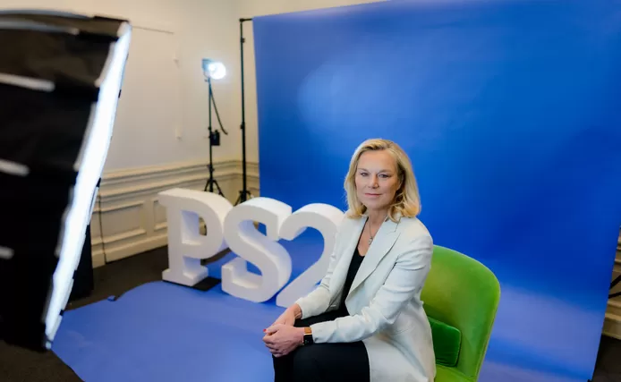  ](<https://www.ad.nl/politiek/sigrid-kaag-over-migratie-hekken-horen-niet-bij-een-beschaafd-land~a8d6a0b0/227575828/>)

© Marco De Swart 

**U heeft vast wel een idee waarom mensen zich aangetrokken voelen.  
** ,,In de politieke geschiedenis zijn nieuwe partijen altijd een uitdaging voor de gevestigde partijen geweest. Zo’n nieuwe stem is aantrekkelijk. Er wordt denk ik ook een knappe campagne gevoerd. Maar dat wil niet zeggen dat ik denk dat het in het landsbelang is.”

**Johan Remkes sprak over een ‘progressieve elite’ die niet in de gaten heeft dat er in grote delen van het land anders wordt gedacht. Dat klinkt als een verwijt aan D66?  
** ,,Ik vond het een beetje een makkelijk label eerlijk gezegd. Laatst is er een enorm interessant artikel verschenen van twee historici: de kloof tussen platteland en stad leeft in Nederland al honderden jaren. Dit raakt niet alleen mijn partij. We moeten allemáál denken: hoe kan het dat er een groeiende ongelijkheid is?”

**Hoe inlevend was uw partijgenoot Tjeerd de Groot toen hij pleitte voor halvering van de veestapel?  
** ,,Wat Tjeerd op dat moment durfde, was het agenderen van een heel belangrijk, bijna onbesproken punt. Dat was zijn doel. Het probleem is denk ik dat er daarna te veel gesproken is alsof halvering van de veestapel een doel op zich is. Dat is het nooit geweest.”

_Luister ook naar onze podcast Politiek Dichtbij, en abonneer je via[Spotify](<https://open.spotify.com/show/7aa6bi3zJtJLHV5okwLcyk>) of [Apple](<https://podcasts.apple.com/nl/podcast/politiek-dichtbij/id1549448639>):_

**U waarschuwt voor stilstand met BBB. Heeft D66 dat monster niet zelf gecreëerd?  
** ,,Dat vind ik te makkelijk. We zitten in een heel moeilijke positie en juist de agrarische sector kan zo niet verder gaan. Transitie en verandering zijn noodzakelijk. Ik denk dat er makkelijk naar ons wordt gewezen maar wij hebben een rechte rug.”

**Wat als de formaties in de provincie u straks niet bevallen?  
** ,,Het gaat niet om ‘niet bevallen’. U moet wel zorgvuldig zijn. Maar stel dat ze straks in bijvoorbeeld Overijssel zeggen, ‘nee, hier doen we het totaal anders’, dan hebben we met zijn allen in dit land een groot probleem. Het ondergraaft ook hoe wij het beleid kunnen uitvoeren. Dan heb je ook een geloofwaardigheidskwestie.”

**Heeft de coalitie dan een groot probleem?  
** ,,Ik zeg dat alleen vanuit D66. Ik ga niet zeggen, dan heeft de coalitie een probleem met ons. We hebben als land een probleem.”

> [attachment](_attachments/Sigrid-Kaag-over-migratie-Hekken-horen-niet-bij-een-beschaafd-land-Politiek-AD.n__svg-2.svg) 
> 
> Koersen op het minderen van instroom is niet de optimale benadering. Je moet kijken, wat kan je aan, wat kun je beter regelen

**We snappen dat u nu niet met een kabinetscrisis dreigt. Maar zitten er politieke consequenties aan?  
** ,,Ik houd het bij een waarschuwing. Ik was verrast door de uitspraken van de Limburgse CDA en VVD, die samenwerking met de PVV en FvD niet uitsluiten. Hebben zij echt niet geleerd van kabinet-Rutte I? Van eerdere mislukte samenwerkingen op provinciaal niveau? Wij dachten dat die brug nu wel gepasseerd was. Kennelijk niet. D66 zal vanuit waarden niet meedoen met een PVV of een Forum. Als je kijkt naar de opties met BBB of JA21, dan zie ik inhoudelijk weinig raakvlakken. Maar dat is een ander perspectief.”

**Hoe vindt u het dat die partijen de boer opgaan met dingen die volgens juristen niet kunnen, zoals de Natura2000-gebieden halveren.  
** ,,Ik vind dat ze de plank misslaan. Bij de halvering van het aantal natuurgebieden sta je niet voor herstel van natuur waar wij in dit landje al heel weinig van hebben.”

**Het CDA roert zich flink op het thema migratie. De partij wil hekken om Europa en de vluchtelingenstatus aanpakken. Wat vindt u?  
** ,,Dat is aan hen. Er is heel veel aandacht voor asiel, terwijl vluchtelingen procentueel maar een kleine groep zijn. Ik denk dat je hier in Europa goede afspraken over kunt maken. Maar wel indachtig internationale verdragen en ook wat het betekent een beschaafd land te zijn. Voor mij horen hekken daar niet bij.”

[ 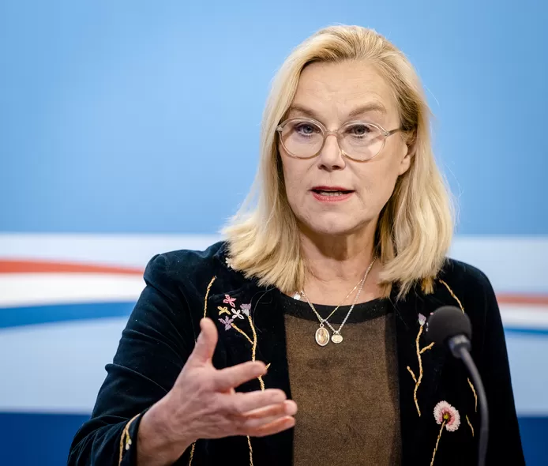  ](<https://www.ad.nl/politiek/sigrid-kaag-over-migratie-hekken-horen-niet-bij-een-beschaafd-land~a8d6a0b0/226680447/>)

Kaag bij de persconferentie na de wekelijkse ministerraad. © ANP / ANP 

**Maar wel kleinere aantallen?  
** ,,Koersen op het minderen van instroom is niet de optimale benadering. Je moet kijken, wat kan je aan, wat kun je beter regelen? Als er echt een oorlog is of totale ellende, dan zullen mensen blijven komen.”

**Rutte beloofde de VVD als partijleider: Ik ga me inspannen voor minder asielzoekers.  
** ,,Ja, dat moet hij doen voor zijn eigen partij. En wij spannen ons in langs de bekende lijnen van D66.”

**Hij krijgt van u geen ruimte?  
** ,,Nou, weet u, wij hebben als D66 op dat vlak een ander wereldbeeld. Wij pleiten al jaren voor de regulering van migratie en een ander soort afspraken…” 

**Het CDA zegt: dat er elk jaar een stad als Deventer bij komt, dat kan Nederland niet aan.  
** ,,Nou, er zijn ook heel veel experts die zeggen: als je het goed regelt dan kunnen we een aantal mensen nog steeds goed blijven opvangen. De omstandigheden en voorwaarden moeten wel op orde zijn. Het is goed dat we binnen de coalitie rustig de gesprekken voeren. Het is een zoektocht. Ik ga hier niet de boel oprakelen. U zult merken: D66 doet weinig uitspraken over migratie. We moeten deze discussie ontgiften. Wij willen kijken of we, indachtig de fundamentele verschillen, eruit kunnen komen. Of dat lukt, weet ik niet.”

> [attachment](_attachments/Sigrid-Kaag-over-migratie-Hekken-horen-niet-bij-een-beschaafd-land-Politiek-AD.n__svg-2.svg) 
> 
> Dit is serieus werk, soms tegen de klippen op, maar omdat het belangrijk is blijf je het doen

**Helpt het als een partij zegt: er moet een hek om Europa?  
** ,,Het zal wellicht ook te maken hebben met de verkiezingsperiode. Elke partij kiest er op een andere manier voor om kleur op de wangen te krijgen. Dat laat ik aan de ander… Wij zijn er niet een nacht minder van gaan slapen.”

**U zegt: migratie moet aan voorwaarden voldoen. Toch liggen Polen nu met tien man op een kamer en sliepen asielzoekers in Ter Apel op het gras. Dat moet dan toch eerst geregeld zijn?  
** ,,Nou, dat is te makkelijk gedacht. We leven niet in een laboratorium. De wereld om ons heen draait door. _People on the move_ is zo oud als de mensheid.”

**Is het naïef om te denken dat je migratie kunt tegenhouden?  
** ,,Ik denk inderdaad dat het een onuitvoerbare wens is. Er zijn bovendien heel veel bedrijven, of het nu de glastuinbouw is of de kenniseconomie, die juist schreeuwen om gekwalificeerde mensen. Of het nu vaklui zijn of de Harvard PhD’s die bij ASML moeten werken. Onze economie wordt juist ook draaiende gehouden door de vele mensen die hier legaal een plek vinden.”

[ 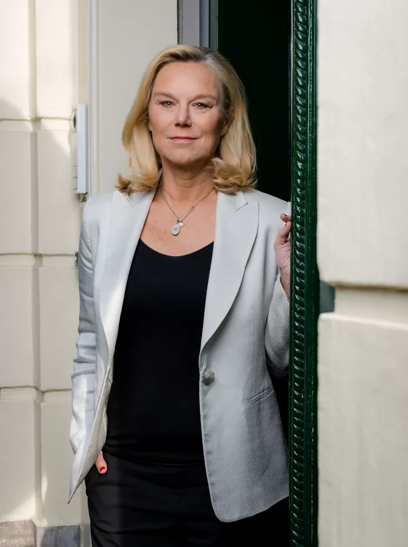  ](<https://www.ad.nl/politiek/sigrid-kaag-over-migratie-hekken-horen-niet-bij-een-beschaafd-land~a8d6a0b0/227575853/>)

© Marco De Swart 

**Dus dat andere partijen over migratie beginnen is verkiezingsretoriek?  
** ,,Nee. Ik zeg alleen, het is aan hen. Jullie stellen hier vragen over. Ik ben niet over migratie begonnen. Wat mij veel meer zorgen baart, is dat er deze week een motie is aangenomen om een studie te doen om mogelijk met [Denemarken vluchtelingen buiten Europa op te laten vangen](<https://www.ad.nl/binnenland/gaat-nederland-een-asielzoekerscentrum-bouwen-in-afrika-rwanda-heeft-er-al-een-klaar-staan~a6d8faf2/>). Een soort Brits model dat gefaald heeft bij de hoge rechter, omdat het buiten alle verdragen staat. Dat baart mij als D66’er veel meer zorgen .”

**VVD en CDA steunen dat.  
** ,,Ja, dat baart ons zorgen als partij.”

**Vindt u het eigenlijk nog leuk in Den Haag?  
** ,,Ik heb nooit gezegd dat het leuk is. Ik heb altijd gezegd dat het belangrijk is. Eervol en belangrijk. Mijn definitie van leuk is meer iets als met de honden wandelen. Dit is serieus werk, soms tegen de klippen op, maar omdat het belangrijk is blijf je het doen.”

_Bekijk hier al onze video’s over de politiek:_

01:52

### Kaag: 'Verkiezing is keuze tussen stilstand en vooruitgang'

Sigrid Kaag (D66) vreest een grote terugval wanneer er rechts gestemd wordt bij de aankomende Provinciale Statenverkiezingen. ,,Het is een keuze tussen stilstand en vooruitgang", aldus de vicepremier. Rechtse partijen spreken volgens Kaag van 'klimaathysterie', maar daarmee zeggen ze 'een hele grote nee tegen de wetenschap', vindt Kaag.

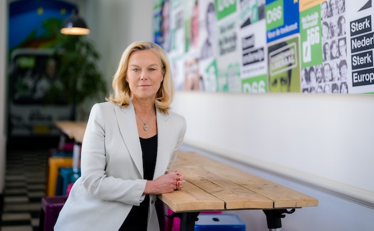 

Gekozen 

### Kaag: 'Verkiezing is keuze tussen stilstand en vooruitgang'

01:52 

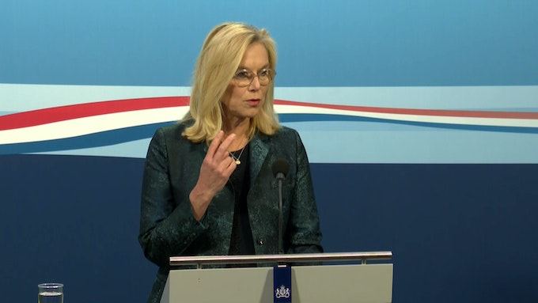 

### Kaag niet onder indruk van ontbieden ambassadeur om MH17

00:53 

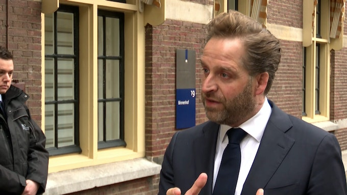 

### Woonminister De Jonge verbaasd over 'liefdeloze' reactie VVD

00:55 

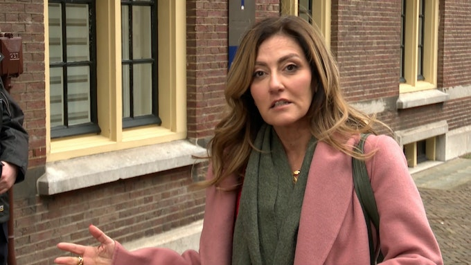 

### Yesilgöz: Meer geld voor aanpak achterstand zedenmisdrijven

01:19 

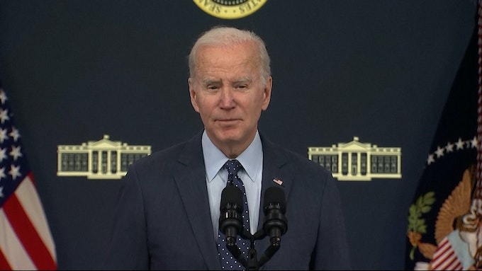 

### Biden: 'Neergeschoten objecten waren niet van China'

00:52 

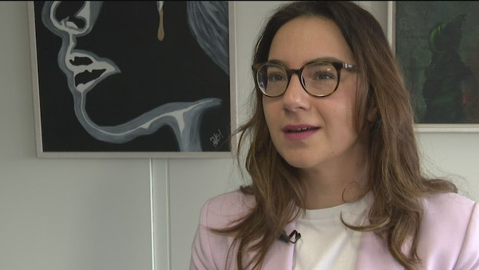 

### Turks-Nederlands D66-Kamerlid Hülya Kat roept op tot doneren

01:45 

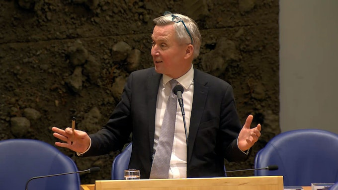 

### Kabinet: Marechaussee moet stoppen met etnisch profileren

01:32 

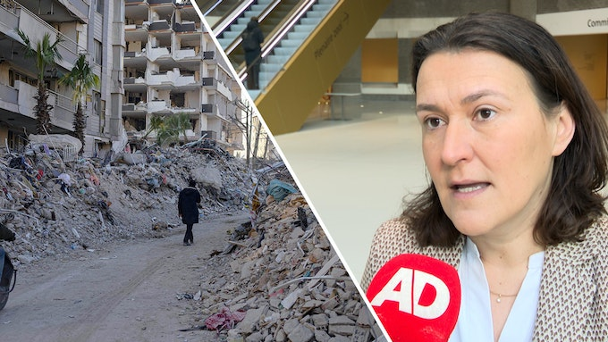 

### Kamerlid Piri wil visumregels Turken en Syriërs versoepelen

01:05 

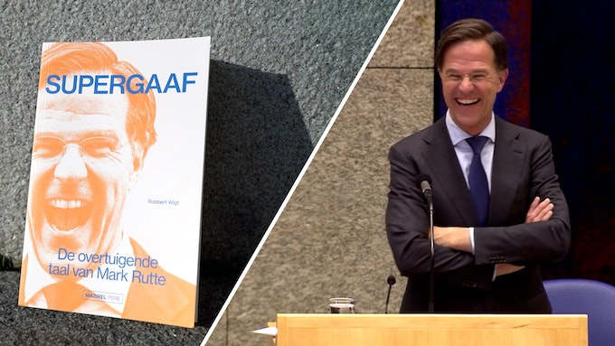 

### Supergaaf: boek over taalgebruik Rutte

02:19 

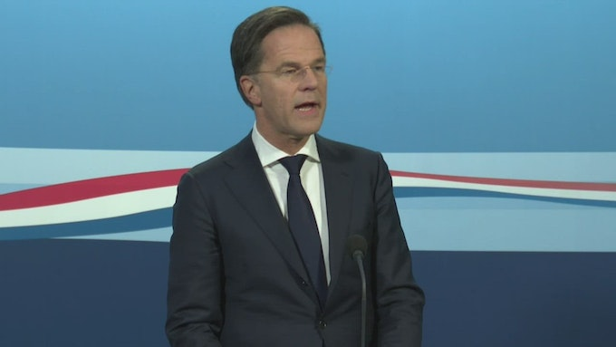 

### Mark Rutte over aardbeving Turkije: 'Gevolgen zijn enorm'

02:31 

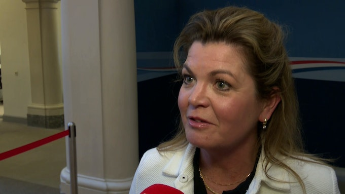 

### Van der Wal: Wet aangepast conform Remkes' advies

02:02 

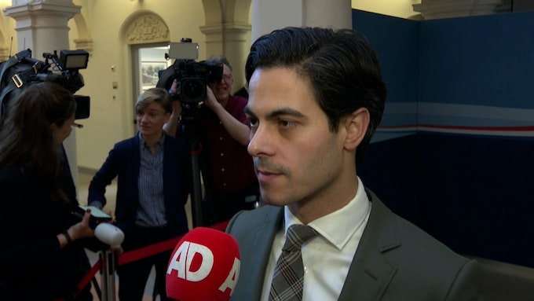 

### Jetten: Niet meer afhankelijk van russisch gas

00:46 

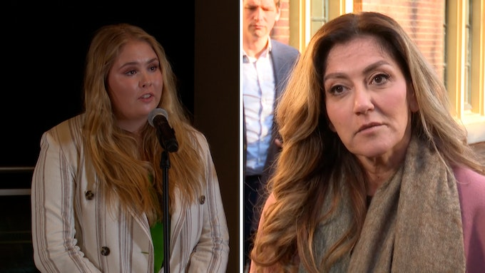 

### Yesilgöz: 'Rusten niet tot dreiging rondom Amalia verdwijnt'

00:46 

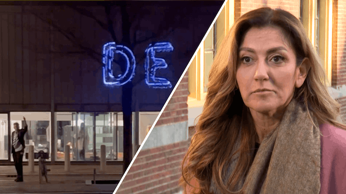 

### Yesilgöz over projectie op Anne Frank Huis: 'Walgelijk'

02:17 

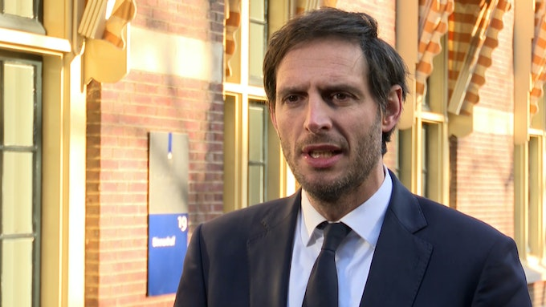 

### Hoekstra over hulp Turkije: Kunnen er niet allemaal heen

00:46 

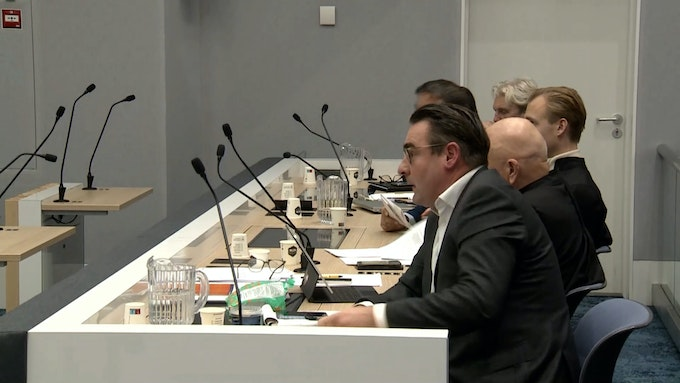 

### De Mos tijdens laatste woord: 'Ik ben geen mister perfect'

01:34 

 

### Chaos in winkelcentrum door Max Verstappen

09:33 

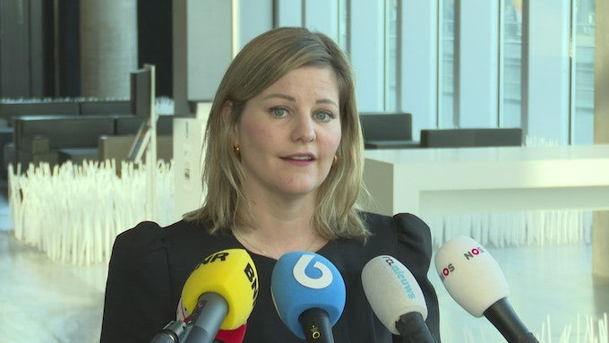 

### Kabinet trekt 10 miljoen uit voor noodhulp Syrië

01:51 

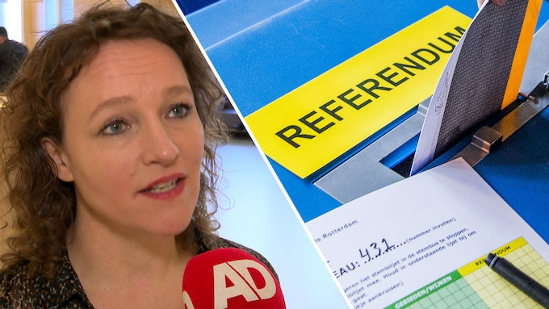 

### Kamer doet voor derde keer poging om referendum in te voeren

02:14 

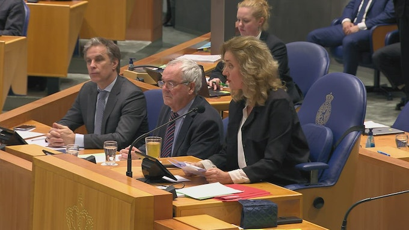 

### Tweede Kamer staat stil bij ramp Turkije en Syrië

01:23 

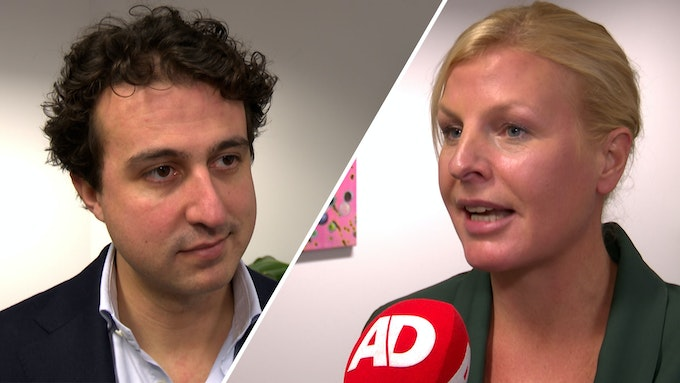 

### Klaver en Kuiken zijn 'nog niet' lid van elkaars partij

02:03 

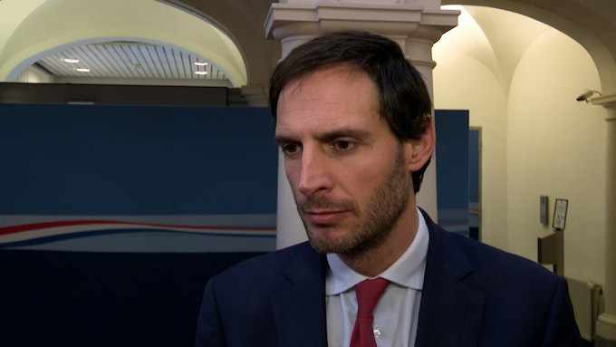 

### Hoekstra: 'Oekraïnehof Den Haag eerste stap naar tribunaal'

02:13 

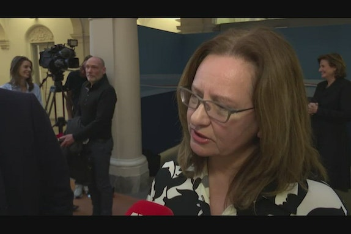 

### Aukje De Vries: 'Elke dag langer wachten is een dag té lang'

01:41 

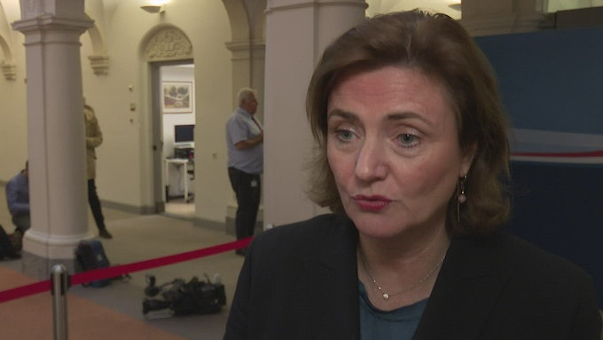 

### Zorgen om personeelstekort: 'Hebben we allemaal last van'

01:10
