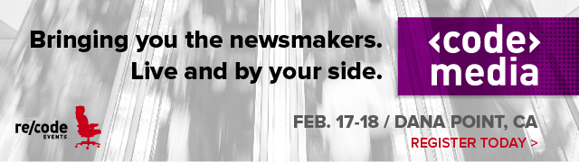

# Talking the Cloud Business With Amazon CTO Werner Vogels | Re/code

# Talking the Cloud Business With Amazon CTO Werner Vogels

July 19, 2014, 11:33 AM PDT

In its relatively short eight-year life-span, there’s a lot we’ve come to know — and yet a lot more that we don’t — about Amazon Web Services.

When it launched in 2006, the idea of renting computing capacity on a pay-as-you-go basis was a new one. Fast-growing startup companies that might have struggled to keep their systems running if they launched a popular new Web service could suddenly have all the capacity they needed in minutes instead of months. AWS fundamentally changed how companies think about their computing infrastructure needs.

And while Amazon won’t say exactly how big a business it is as a percentage of its $74.5 billion in annual revenue, there have been many educated guesses. A new one out yesterday from Pacific Crest Securities — and [noticed by Bloomberg Businessweek](<http://www.businessweek.com/articles/2014-07-15/amazons-cloud-is-one-of-the-fastest-growing-software-businesses-in-history>) — estimates it’s a $5 billion business annually and on its way to approaching $7 billion next year.

If that estimate is accurate, and if we thought of AWS as a separate company, its growth rate after passing the $1 billion revenue mark would be second only to that of Google, and would have exceeded that of Microsoft, Oracle and Salesforce.com.

Against this backdrop, **Re/code** sat down recently with [Amazon CTO Werner Vogels](<http://www.allthingsdistributed.com/>) while he was visiting New York. Werner, [along with Andy Jassy](<http://allthingsd.com/20131108/nine-questions-for-andy-jassy-head-of-amazon-web-services/>), is among the executives continuing the shakeup that AWS started in the enterprise IT world.

Another data point from the Businessweek story: If Amazon sold traditional hardware servers, it would rank number four by revenue behind Dell, IBM and Hewlett-Packard. In response to at least two of those companies, IBM and HP have built up their own cloud computing services to try to take on Amazon.

IBM has been the most vocal about its response in recent months. Last year it spent $2 billion to acquire SoftLayer. It has since pledged to spend big to build out its data center footprint and is running most of its software applications. This week, Big Blue said its combined public cloud services and cloud software business is on [track to book $7 billion in revenue next year](<http://recode.net/2014/07/18/can-the-cloud-really-save-ibm-it-might/>), which will make it about as big as Amazon, though it’s an [apples-to-oranges comparison](<http://recode.net/2014/01/31/is-ibms-4-4-billion-cloud-bigger-than-amazons-not-quite/>).

When we spoke, [Amazon had just announced Zocalo](<http://recode.net/2014/07/10/look-out-box-and-dropbox-here-comes-amazons-zocalo/>), a new document-sharing and collaboration service meant to complement its WorkSpace virtual desktop product and to compete with similar offerings [from Dropbox](<http://recode.net/2014/04/09/dropbox-makes-a-bid-to-be-a-home-for-life-a-what/>) (notably an AWS customer) and [IPO-bound Box](<http://recode.net/2014/07/07/pace-quickens-toward-boxs-ipo-as-it-updates-sec-filings/>).

**Re/code: What do Zocalo and WorkSpaces say about the future of AWS? I’ve always thought of AWS as a replacement for infrastructure that only the IT department would care about. But here, we see you providing a more front-facing application that everyone in a company might use.**

**Vogels:** We’re in the business of pain management for enterprises. Tell me what your pain points are and I’ll help you make them feel better. When we launched [Redshift](<http://aws.amazon.com/redshift/>) and [Glacier](<http://aws.amazon.com/glacier/>), they both came from the same conversations with enterprises. Digital information is exploding; all the regulatory requirements say they need to keep it all. They were asking over and over again for us to build an archiving system. So that’s Glacier.

The other thing was data warehousing. The information explosion means that your mid-sized data warehouse probably doesn’t cut it anymore. You have to move to something larger. That’s not a linear increasing cost, it’s an exploding increasing cost.

**And Redshift also has the analytics piece. Does that mean it’s essentially AWS’s answer to Hadoop?**

I find that is slightly disappearing, actually. If you look at MapReduce by itself or Hadoop by itself, it’s just a distributed execution engine. You still have to write your own analytics programs, which turns out to be rather bothersome for businesses. … Among our customers like Netflix, they’re making heavy use of [Elastic MapReduce](<http://aws.amazon.com/elasticmapreduce/>). It drives their realtime operations; it drives their recommendation engine, their business dashboards. But we see quite a few other companies moving away from MapReduce and toward Redshift because you don’t need to write any analytics code anymore.

**So, in the enterprise, what kind of pain _won’t_ you cure?**

I don’t know. There’s certainly a lot of pain points left. Some of our customers who have a cleaner roadmap can go all in, companies like the Kepminsky Hotel Chain, Condé Nast, Suncorp., which is a big bank, they’re teaching us a lot about things we could do a lot better. They’re telling us where the missing features are, and the things that we should be doing on our platforms. Customers teach us a lot. We have a platform that’s driven more by them than by us simply making stuff up.

**How do you see the competitive situation in cloud services generally? IBM has been making a lot of noise comparing itself to AWS since it bought SoftLayer.**

We’re really not that focused on competition. As a company, you can be competitor-focused. That works for some companies, but we’re just not like that. We’re just totally focused on the customer. Our customers set the roadmap. The only reason when we look at the competing services, is when we want to understand why someone might want to choose something other than AWS. So when our customers choose someone else, it’s really important because it indicates something that we might be doing differently. … One of the things that’s radically different now, in the new world of IT from the old, is that customers [used to] write you an $800,000 check and you could walk away. In our case, we only get paid if our customers use the platform. That means that we have to be on our toes every day to deliver the best service. Customers are not locked in with us and it creates a very different kind interaction.

**It’s interesting that you say your customers aren’t locked in, because that’s one of the first things your competitors will complain about when they talk about you. That’s one of the main reasons behind the rise in OpenStack at companies like IBM and Hewlett-Packard. What do think of that argument?**

I think we’ve worked really hard at not locking our customers in. … There’s no lock-in. Many of our services are really accessible from standard protocols. I’ve never gotten any feedback from our customers saying “please don’t build this.” They all say “please build more….” It’s the same story around standardization. I’ve yet to have a customer say they’re not going to use our stuff because it’s not standardized.

**Do you feel any kind of competitive tension with the OpenStack vendors? Is it creating any kind of threat?**

I don’t get any of that in feedback. Now in the data center world there’s lots of competing technologies. There’s quite a few enterprises that haven’t even reached the point of virtualization yet. … But from a public cloud point of view, we’re not hearing about OpenStack in any of our feedback.

**When will we get a clear view of how big a business AWS is within Amazon?**

I don’t know. You can probably answer that better than me. I’m not an economist or a lawyer so I don’t know when we’ll ever have to break it out. But our expectations are clear. This is a business that will be as big as our retail businesses if not bigger. … It took us six years, or until 2012, to get to 1 trillion objects stored. Then it took us one more year to get to 2 trillion. So that’s an indication of the speed of growth. To my eyes, that it only took a year to get to 2 trillion, it looks like the onset of a hockey stick.

**What’s your priority for the rest of the year?**

Talking to customers. … Lately I’ve been having a lot of fun talking to customers in the Internet of Things world, the connected devices world. We have so many customers doing so many interesting things. We have customers putting sensors at the bottom of the ocean pumping data into Amazon S3. For NASA, the Mars Rover does the same thing. The folks at Human have been doing something really interesting. They have an app that encourages you to move for 30 minutes a day. But when they realized all the data they had, they could create something interesting by [visualizing how people are moving through cities](<http://cities.human.co/>). In 10 days they went from idea to production of these beautiful maps showing how people move around in New York and San Francisco and other cities. In the industrial world, [GE has instrumented all its gas turbines](<http://recode.net/2014/07/14/ge-pushes-boundaries-with-new-research-effort/>) and they collect all that data into Amazon S3 and look for ways to make it all more efficient. Even a one percent improvement in efficiency is a hard-core dollar improvement. There’s so much stuff happening in the world. We have no clue what it’s going to look like two or three years from now.

**Correction:** I fixed a quote where Vogels refers to Suncorp. Originally, thanks to a garbled audio recording, it had said Ocean Corp. 

* * *

* * *
