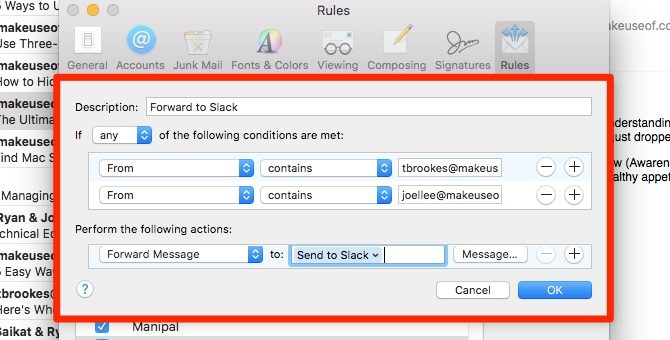
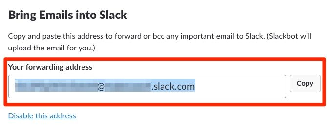

# Apple Mail Rules

## 5\. Send the Most Important Work Emails to Slack 

Not all emails need your immediate attention. Yes, even at work. If your team communicates via [an app like Slack](<https://www.makeuseof.com/tag/flock-slack-team-communication-tool/>), you can pretty much ignore your inbox most of the time. To ensure that the super important emails, if any, don’t escape your notice, forward them to Slack with this next rule. 

Set the condition to identify emails from your manager or other higher-up, or with a specific word/phrase in the subject. Now select Forward Message as your preferred action and type your “send to Slack” address in the field provided. 

 

Where can you find your Slack forwarding address?

It’s hidden under [Your_Team_Name] > Preferences > Messages & Media. Scroll down to the Bring Emails into Slack section, and there it is. You’ll now be able to read the forwarded emails in Slackbot! 

