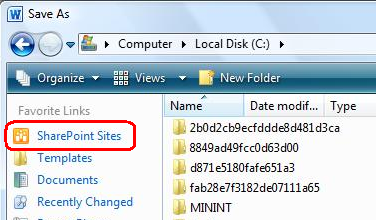

# Connect to Office - SharePoint Online

# Connect to Office

By using the **Connect to Office** commands, you can conveniently access commonly used libraries from a Microsoft Office program. 

## Learn more about how to connect to Office 

 

The **Connect to Office** commands are: **Add to SharePoint sites** , **Remove from SharePoint sites** , and **Manage SharePoint sites**. These commands help you conveniently interact with Office programs (Access, Excel, OneNote, Outlook, PowerPoint, Project, Publisher, Visio, and Word) and their corresponding file formats that may be stored in a library. 

For example, after you use the **Add to SharePoint sites** command, a shortcut to the library is created in the **SharePoint Sites** folder of the favorites list in the Office **Save As** and **Open dialog** boxes.

** Note ** Word 2010, Excel 2010 and PowerPoint 2010 also keep a link to the SharePoint site under **Recent Places** in the Backstage view.

[Top of Page](<https://support.office.com/en-us/article/Connect-to-Office-072b32a8-83c0-492e-ba29-50d7f67001ba#top> "Top of Page")

## Add, remove, or manage SharePoint sites for Office programs 

  1. Navigate to the site containing the library for which you want to connect to Office. 

  2. Click the name of the library on the Quick Launch, or click **Site Actions** , click **View All Site Content** , and then in the **Libraries** section, click the name of the library. 

** Note ** A SharePoint site can be significantly modified in appearance and navigation. If you cannot locate an option, such as a command, button, or link, contact your administrator.

  3. On the **Library** tab, in the **Connect & Export** group, click the arrow next to **Connect to Office**. 

  4. Do one of the following:

     * Click **Add to SharePoint sites**.

A “Library added” message is displayed, indicating that the current SharePoint site has been added to the shortcut bar of the Office **Save As** and **Open** dialog boxes.

     * Click **Remove from SharePoint sites**.

A “Library removed” message is displayed, indicating that the current SharePoint site has been deleted from the shortcut bar of the Office **Save As** and **Open** dialog boxes.

     * Click **Manage SharePoint sites**.

The QuickLinks page (http://my/_layouts/MyQuickLinks.aspx) of you’re my site is displayed so that you can modify the **SharePoint Sites** links displayed on the shortcut bar of the Office **Save As** and **Open** dialog boxes.

[Top of Page](<https://support.office.com/en-us/article/Connect-to-Office-072b32a8-83c0-492e-ba29-50d7f67001ba#top> "Top of Page")
