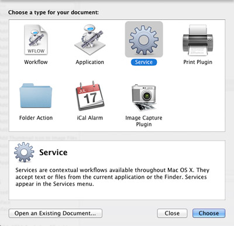
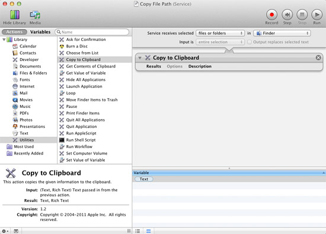
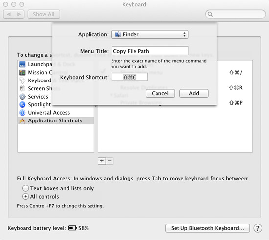

# Copy file or folder path to the clipboard in Mac OS X Lion | MacYourself

# Copy file or folder path to the clipboard in Mac OS X Lion

Posted by Ant on December 31st, 2011 | [77 Comments](<http://www.macyourself.com/2011/12/31/copy-file-or-folder-path-to-the-clipboard-in-mac-os-x-lion/#reply>)

 

Learn how to create your own OS X service that lets you copy & paste the paths of files and folders in Finder. After just a few steps you will be able to select items in Finder, press a quick keyboard shortcut, and paste the path(s) anywhere you want.

Mac users have long complained that there’s no easy way to copy the location of a file or folder on their computer and paste it in a document, email, internet browser, etc. There are a bunch of third party utilities and convoluted workarounds to get this functionality, but let’s be honest – they’re all pretty terrible. Even MacYourself’s [clever workaround from 2009](<http://www.macyourself.com/2009/04/01/copy-the-path-to-a-file-or-folder-using-spotlights-search-box/>) doesn’t work anymore in OS X 10.7 Lion.

So what do we do? We take matters into our own hands, of course! Let’s come up with our own solution – and let’s make it awesome.

Before we get started, we should establish some goals. Obviously we want to copy a file path or folder path from Finder and paste it somewhere else for reference. Let’s take that a few steps further and say we want to:

  * Support the selection of multiple files and folders at a time
  * Require no third party software or plugins to accomplish our goal
  * Integrate with Finder so this feels like a real, native solution
  * Set up a keyboard shortcut for quick & easy access
  * Copy the path to OS X’s clipboard so it can be pasted in any application

Sounds like a plan! Here we go…

  1. Launch Automator from your Mac’s Applications folder. If you’ve never used Automator before, that’s not a problem. This is going to be so simple anyone can do it.
  2. Double-click the Service icon from Automator’s start menu. 

 

  3. Toward the top of the right column, you’ll see this line of text: “Service receives selected _____ in _____”. Choose “Files or Folders” from the first menu and “Finder” from the second.
  4. Next, click on Utilities in the Actions library on the left side. Double-click “Copy to Clipboard” in the middle column. You’ll notice that this action has been added to our workflow on the right. 

 

  5. Go to File > Save in the menu bar and name your service _Copy File Path_. Our work with Automator is now done, so you can safely quit it once the service is saved.
  6. Launch System Preferences and go to the Keyboard pane. Click on the Keyboard Shortcuts tab.
  7. Select “Application Shortcuts” from the list on the left. Next, click on the + button at the bottom of the list.
  8. A small window will come up with a few options that need to be set. Select “Finder” from the Application menu, type _Copy File Path_ as the Menu Title, and create your own Keyboard Shortcut. If you don’t know what to put here, you can just press Shift+Command+C on your keyboard. Click Add and we’re done! 

 

Now let’s test our fancy solution! Here’s how it works…

  1. Select any file or folder (or a mixture of multiple files and folders at once) in Finder.
  2. Press your keyboard shortcut – in our case, Shift+Command+C. This copies the path to OS X’s clipboard.
  3. Open a text document, email message, or other place you’d like to use your location path. Press Command+V (or right-click and select Paste) to paste the file path(s). Hopefully you should see something like _/Users/YourName/Documents/Work/Files/resume.doc_

From now on these 3 easy steps are all you have to do to copy and paste file paths from Finder to your clipboard and, ultimately, another application. Pretty cool!

A few things to mention… If you’re not keen on keyboard shortcuts, the service you created is also accessible when you right-click on an item in Finder and select Services > Copy File Path from the contextual menu. The actual file we created for this service is located in: _~/Library/Services_ in case you ever want to delete it or copy it to put on another Mac. Finally, this tutorial was written specifically for Mac OS X 10.7 Lion, so the steps involving Automator might be a little different if you’re running an older version.

_How does this solution work for you? Does it give your Mac the functionality you were looking for?_
