# How to Add Custom Status and Away Messages to Slack — Medium

# How to Add Custom Status and Away Messages to Slack

When working on distributed teams, posting a status message in your chat client is an easy, effective way to broadcast information about location and availability to colleagues.

Unfortunately, at present (December 2015), Slack doesn’t formally support status messages, and [provides only a simple active/away toggle](<https://get.slack.help/hc/en-us/articles/201864558-Setting-your-Slack-status>) to indicate user status:

 

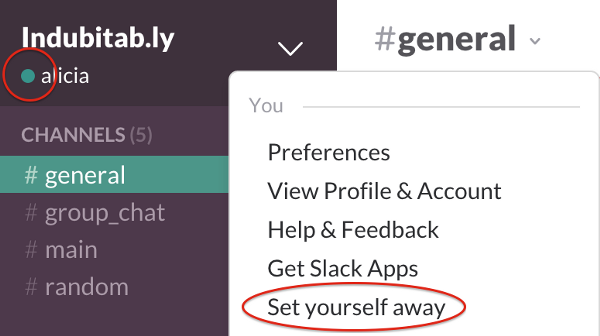 

 

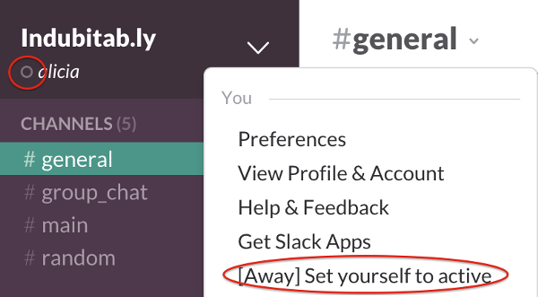 

To toggle active/away status, choose “Set yourself [away|to active]” from the main-menu dropdown in Slack’s left navigation pane.

However, if status/away messages are on your Slack wishlist, there’s no need to [wait for them to be officially implemented](<https://twitter.com/webster/status/623943829079482369>). You can roll your own status-message fields using Slack’s new “[Customize profile feature](<https://get.slack.help/hc/en-us/articles/212281478-Customizing-your-team-s-profiles>),” as described below.*

_* Note: profile customization is available only for Slack customers on paid plans, so the following will not work for teams using free accounts._

#### Customize your team’s profile template

If you’re an owner or admin, you can customize the user profiles for your Slack team. To access the Customize Profile page in Slack’s Desktop or Web app, choose View Profile & Account from the main-menu dropdown in Slack’s left navigation pane, click Edit in the right profile pane, and then on the Edit Profile screen, click “Add, edit, or reorder fields” below the Save Changes button:

 

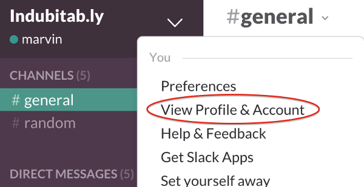 

 

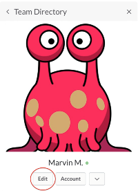 

 

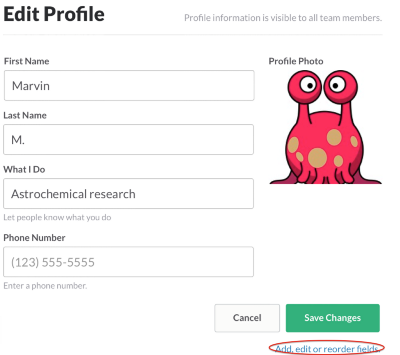 

First, choose View Profile & Account from the main main dropdown, then click Edit in the profile pane, and finally click “Add, edit, or reorder fields” on the Edit Profile screen.

In the Web Slack client, you can also navigate directly to the Customize Profile page by going to the following URL and clicking “Edit your team’s profile fields”:

_http:// <your_team_name_here>.slack.com/customize/profile_

On the Customize Profile page, you can create additional fields for team members to enter status information.

For example, you may want to add a field where coworkers can enter details on where they’re currently based: working in the office, working remotely, or away on vacation. To create a Location field with a dropdown that contains a series of options appropriate for your team, choose “Create a custom field.” Then on the “Create a new field” screen, select “List of Options”:

 

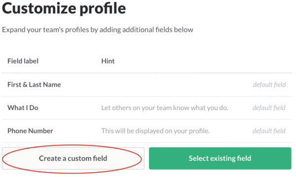 

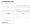 

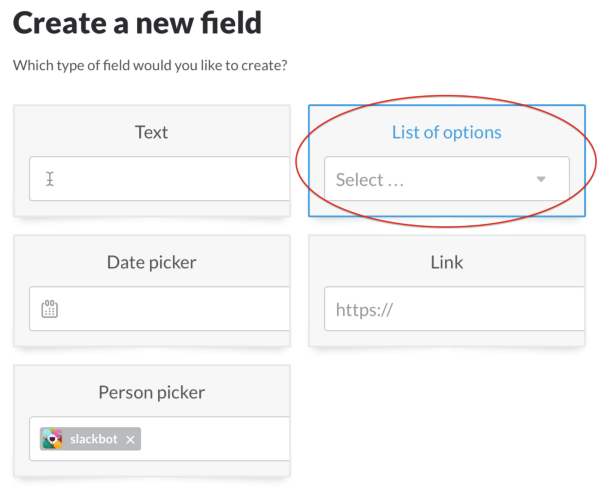 

On “Customize profile,” choose “Create a custom field.” Then, on “Create a new field,” choose “List of options.”

Then, on the “Edit Profile Field,” add a Label and Hint (user aid) for the dropdown, add your desired location options, and hit Save:

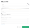 

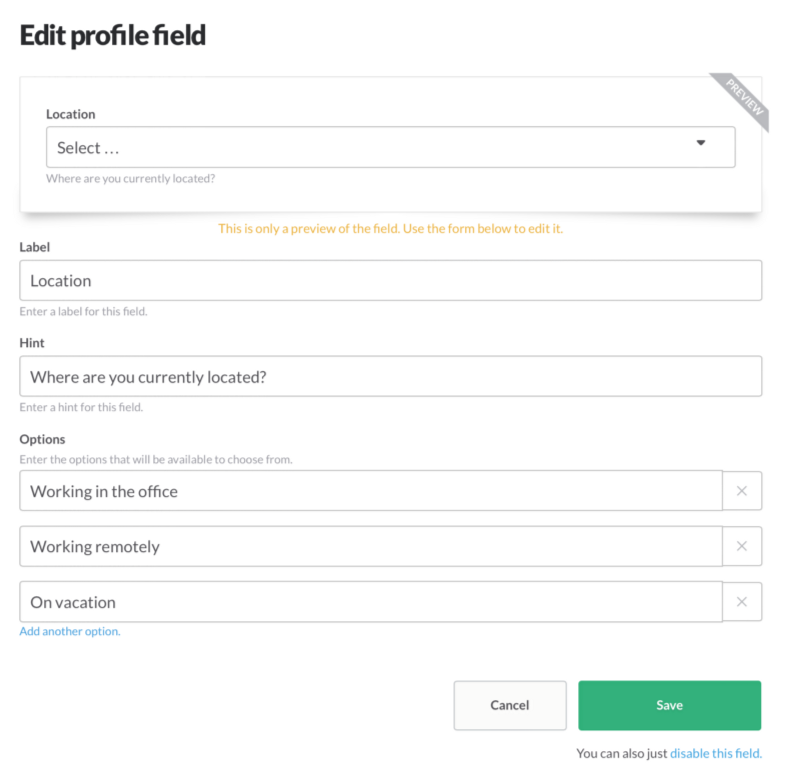 

Under Label, enter “Location.” Under Hint, enter a textual description to aid users (e.g., “Where are you currently located?”). Under Options, enter a list of appropriate location options for your team.

Similarly, you may also want a field for team members to provide a custom away message. In this case, choose the Text field option from the “Create a new field” page, and then add your Label and Hint as before:

 

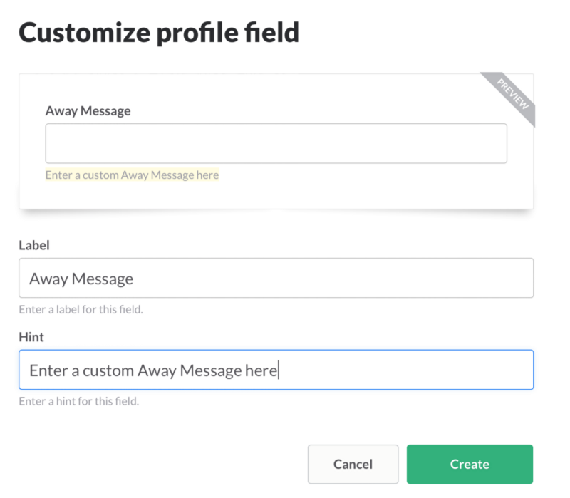 

Under Label, enter “Away Message.” Under Hint, enter a textual description to aid users (e.g., “Enter a custom Away Message here”).

#### Update your profile

You’ve successfully added custom location and away-message fields to your team’s profile template; now you can update your profile to fill in this information.

To edit your profile, again choose View Profile & Account from the main-menu dropdown in Slack’s left navigation pane, and then click the Edit button in the right profile pane. Then fill in the new Location and Away Message fields, and hit Save Changes:

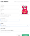 

Update your Location and Away Message, and hit Save Changes to publish your status information on your Slack profile.

Your status information is now published on your profile and will be visible to everyone on your team. 👍
