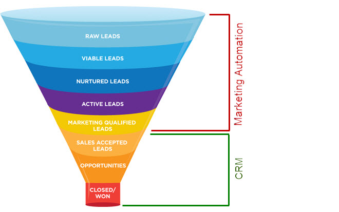

# NS ERM

<https://en.wikipedia.org/wiki/Employee_relationship_management>

  

An employee relationship management (ERM) system is an information system that supports therelationship between a company and its employees.Employee relationship management has focused on enabling employees to collaborate on typical managerial tasks with their employers.

  

[Salesforce](<http://www.salesforce.com/uk/crm/what-is-crm.jsp>), a leading CRM software provider, defines CRM as, “a strategy for managing all your company’s interactions with current and prospective customers”. A CRM system saves information such as a customers addresses, names, phone numbers, and interactions with the company.

  

[Marketo](<http://www.marketo.com/marketing-automation>), a leading marketing automation software provider, describes marketing automation software as a system that, “allows companies to streamline, automate, and measure marketing tasks and workflows”.

  

