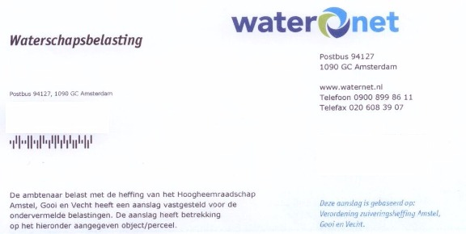
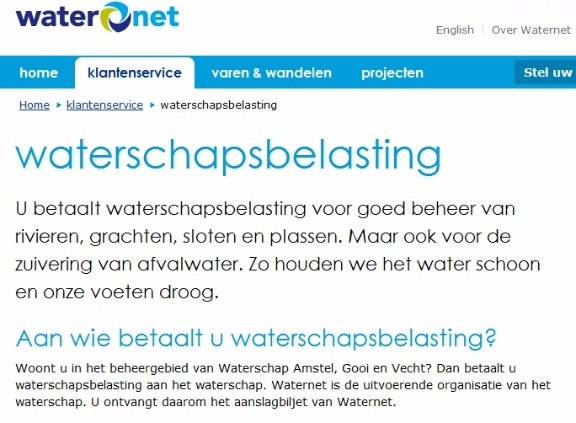
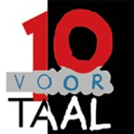

# Teksthuisstijl: schrijven volgens de kernwaarden van je organisatie - Tekstblog - Kennisplatform voor tekst- en communicatieprofessionals

# Teksthuisstijl: schrijven volgens de kernwaarden van je organisatie

Het taalgebruik van een organisatie levert een belangrijke bijdrage aan de beeldvorming rond een bedrijf. Daarom is het slim als organisaties niet alleen aandacht besteden aan de visuele huisstijl, maar er ook voor zorgen dat hun schrijfstijl herkenbaar en eenduidig is. Een teksthuisstijl helpt daarbij. Wat is een teksthuisstijl? Hoe maak je hem? En waar moet je rekening mee houden? In een serie van 3 artikelen belicht ik met 2 collega’s de belangrijkste aspecten.

### **Waarom aandacht besteden aan je taalgebruik?**

Een goede merkidentiteit gaat verder dan een visuele huisstijl. Aandacht voor de taal van een organisatie is minstens zo belangrijk. Met geschreven communicatie laten organisaties namelijk altijd bedoeld of onbedoeld een bepaalde indruk achter bij de lezer. Ongeacht de primaire functie van de boodschap. Steehouder (2001) noemt dat de _expressieve functie_ van een tekst. Vaak slagen organisaties er niet om consequent te schrijven en met elke tekst dezelfde indruk achter te laten bij hun lezers. Vergelijk de volgende voorbeelden:

Beide voorbeelden komen uit uitingen van Waternet. Toch geven ze een andere indruk van de organisatie en word ik als lezer op verschillende manieren benaderd over hetzelfde onderwerp. Het eerste fragment uit een brief is veel onpersoonlijker en formeler dan de tweede tekst van de website. Dat is opmerkelijk. Ik zou Waternet aanbevelen hier één lijn in aan te brengen. Organisaties komen betrouwbaarder en professioneler over als hun teksten in dezelfde stijl geschreven zijn. Bovendien zorgt deze consistentie voor eenzelfde impact als een zichtbaar en herkenbaar logo.

### **Bouwen aan een goede _tone of voice_**

Het is niet alleen belangrijk wát je als organisatie zegt, maar ook hoe je het zegt. Ook als het gaat om indirecte imagocommunicatie – oftewel een tekst die niet primair bedoeld is om het imago van je organisatie te laden. De toon en stijl van teksten leveren altijd een bijdrage aan het imago van organisaties. Daarom is een goede _tone of voice_ essentieel en een belangrijk onderdeel van de teksthuisstijl. Om uit te leggen wat het begrip tone of voice betekent maken we graag de vergelijking met de stem van een moeder. Zoals ook Kathy Hanbury doet in [een uitstekend artikel over dit onderwerp](<http://e3contentstrategy.blogspot.com/2010/08/how-your-web-copy-is-like-your-mother.html>). Daarbij trekken we de begrippen ‘tone’ en ‘voice’ even los van elkaar.

  * **Voice** – de stem van je organisatie moet uniek en altijd herkenbaar zijn. In elke situatie en voor elke doelgroep. Net als de stem van je moeder, die je uit duizenden kan onderscheiden.
  * **Tone –** deze kan wisselen. De toon van je stem kan bijvoorbeeld variëren per afdeling van je organisatie of de doelgroepen waarmee je communiceert. Zo zal je moeder een andere toon aanslaan wanneer ze met jou praat over gezinsuitbreiding, dan wanneer ze een kwaal bespreekt met haar huisarts. Maar haar stem blijft in beide situaties duidelijk herkenbaar.

Een accountantskantoor kiest bijvoorbeeld een andere toon en andere woorden in voorlichting voor potentiële stagiairs, dan in een projectvoorstel voor een nieuwe klant. Bij het opstellen van een teksthuisstijl is het zaak om hiermee rekening te houden. Je beschrijft de voice van de organisatie en de verschillende tonen die voorkomen.

### ****

### **Je eigen tone of voice in 3 stappen**

Het is zinvol dat organisaties goed nadenken over hun taalgebruik. Maar dat is makkelijker gezegd dan gedaan. Want welke toon en stijl passen dan echt bij je organisatie? En hoe zorg je ervoor dat iedereen die namens je organisatie schrijft die toon en stijl ook toepast? Zoals ook geldt voor een visuele huisstijl of interne omgangsregels: met goede afspraken kom je een heel eind. Hoe kom je tot zulke afspraken? Wat Sabel Communicatie betreft, doorloop je grofweg 3 stappen:

  1. **Bepaal de identiteit van je organisatie** en leg die vast in heldere k _ernwaarden  
_
  2. **Vertaal je kernwaarden naar richtlijnen** voor inhoudelijke keuzes en een passende _tone of voice_ : je teksthuisstijl.
  3. **Veranker deze richtlijnen** in je organisatie.

Een deel van dit proces komt ook voor in een interessant artikel van ABC Copywriting: _[How to define your brand’s tone of voice](<http://www.abccopywriting.com/blog/2010/08/31/tone-of-voice-brand/>)_. De auteur Tom Albrighton doorloopt de eerste 2 stappen en geeft daarbij aan dat je het vooral simpel moet houden. Mee eens. Een teksthuisstijl moet vooral praktisch zijn. Dat doet Albrighton heel eenvoudig voorkomen. Maar uit ervaring blijkt dat het moeilijk is om treffende kernwaarden boven tafel te krijgen en ze te vertalen naar schrijfafspraken waar het merendeel van de medewerkers een gevoel bij heeft en mee uit de voeten kan. Ik loop daarom graag per stap nog enkele aandachtspunten langs.

### **Stap 1: Kernwaarden en de identiteit van je organisatie**

Het startpunt van de teksthuisstijl is de identiteit van de organisatie. Daarbij gaat het erom dat je de belangrijkste kenmerken van je organisatie boven tafel krijgt. Het gaat om kernwaarden die in de genen van de organisatie zitten en die volgens Sabel Communicatie aan 4 voorwaarden moet voldoen:

  * De waarden zijn **concrete verwoordingen** van diepgewortelde gevoelens en ideeën die diep in de cultuur van de organisatie besloten liggen.
  * De waarden moeten al **langere tijd van toepassing** zijn op de organisatie en de huidige identiteit verwoorden.
  * De waarden moeten **organisatiebreed gelden** ; ze zijn afdeling- en functieoverstijgend.
  * De combinatie van kernwaarden moet **uniek zijn** voor de organisatie.

Sla de vakliteratuur erop na en je ontdekt dat er verschillende methoden zijn om de identiteit van een organisatie te bepalen. Variërend van diepte-interviews tot analyses van schriftelijke uitingen en vragenlijsten. Een ding is zeker: het achterhalen van kernwaarden is geen eenvoudige klus. Het is voor het management lastig om te komen met woorden die de organisatiecultuur treffend samenvatten. Dat ontdekte Merlinn Busnel (2011) in haar [onderzoek naar de kernwaarden van Groupe Danone](<http://igitur-archive.library.uu.nl/student-theses/2011-1111-200555/Kernwaarden%20in%20tekst%20en%20beeld%20-%20Merlinn%20Busnel.pdf>). Vaak zijn de diepgewortelde waarden namelijk zo vanzelfsprekend dat organisaties ze niet zomaar kunnen oplepelen. De eerste kenmerken of woorden die worden genoemd, zijn meestal heel oppervlakkig, zakelijk en eerder doelstellingen dan echte kernwaarden. Denk aan woorden als klantgericht, professioneel of maatschappelijk betrokken. Volgens ons vind je de échte kernwaarden van een organisatie alleen door de diepte in te duiken. Daarbij gebruiken we min of meer dezelfde aanpak die we toepassen voor het ontwikkelen van ijkpersonen. Het resultaat van dit proces noemen we dan ook de ik-persoon: de kern van de organisatie gevat in een persoonlijk profiel. Hoe dat werkt, leggen we uit in het tweede deel van deze artikelenreeks.

### **Stap 2: van kernwaarden naar kernwoorden**

Staan de kernwaarden vast, dan volgt stap 2. Je vertaalt de kernwaarden naar een passende _tone of voice_. Zo is een van de kernwaarden van een fonds tegen kanker ‘strijdbaar’, hierbij past bijvoorbeeld een actieve, krachtige schrijfstijl. Vervolgens geef je schijftips die helpen de _tone of voice_ te laten doorklinken in teksten. Het is belangrijk je te beperken tot een overzichtelijke hoeveelheid tips. Met een flink pak schrijfregels krijgen medewerkers die niet graag schrijven namelijk nog meer tegenzin en collega’s met weinig taalgevoel worden geen schrijfwonderen als je ze een overdosis richtlijnen geeft. De bedoeling is dat je medewerkers die namens de organisatie schrijven, laat nadenken over keuzes die ze maken tijdens het schrijfproces en de gevolgen daarvan en ze een zet in de goede richting geeft. Daarom geldt: hoe praktischer de richtlijnen hoe beter. Richtlijnen voor de schrijfstijl liggen voor de hand, maar denk ook aan tips die helpen de inhoud te bepalen. Je kan nog zo respectvol schrijven, maar als je als verzekeraar een brief stuurt aan familie van een overleden klant en geen medeleven betuigt maar direct terzake komt, sla je de plank behoorlijk mis. Ook nuttig is een lijst met verboden woorden en woorden die juist erg goed bij de organisatie en _tone of voice_ passen. Zo’n lijst is een handig geheugensteuntje tijdens het schrijfproces.

### **Stap 3: tone of voice implementeren**

De laatste en moeilijkste stap is de implementatie van je _tone of voice_. Het allerbelangrijkste is draagvlak voor de kernwaarden. Worden die niet organisatiebreed gedragen, dan gaat je _tone of voice_ ook niet werken, al is die nog zo goed uitgewerkt. Daarom is het belangrijk om vertegenwoordigers van alle afdelingen en uit alle lagen van de organisatie in het proces te betrekken. Kunnen ze zich vinden in de waarden? En wat verstaan zij eronder? In het derde deel van deze reeks gaan we dieper in op het creëren van draagvlak voor een teksthuisstijl.

De uiteindelijke implementatie van een _tone of voice_ is maatwerk. Er zijn verschillende opties. Voor sommige organisaties volstaat een boekje waarin de belangrijkste richtlijnen en tips zijn samengevat. Anderen hebben behoefte aan wat extra’s. Bijvoorbeeld een gemeenschappelijke aftrap in de vorm van een quiz, ambassadeurs die de _tone of voice_ bewaken en medewerkers ondersteunen of een bureau dat vanaf de zijlijn meekijkt en geregeld steekproeven uitvoert en tips geeft. Het is belangrijk een keuze te maken die echt bij je organisatie past en werkbaar is voor iedereen. Alleen dan werpt het voortraject zijn vruchten af en heeft je organisatie een stem die uiteindelijk net zo herkenbaar is als die van je moeder.

### Verder lezen

  * Albrighton, T. [How to define your brand’s tone of voice](<http://www.abccopywriting.com/blog/2010/08/31/tone-of-voice-brand/>).
  * Busnel, M. K _[ernwaarden in tekst en beeld: een kwalitatief onderzoek naar de betekenis van de kernwaarden bij de Groupe Danone](<http://igitur-archive.library.uu.nl/student-theses/2011-1111-200555/Kernwaarden%20in%20tekst%20en%20beeld%20-%20Merlinn%20Busnel.pdf>)_. Scriptie Universiteit Utrecht.
  * Gemert, J.E.W.C. van, Schellens, P.J., Steehouder, M. (2001). Taal en corporate communication. In: C.B.M. van Riel (red.) _Corporate communication: het managen van reputatie_(pp. 207-245)_._ Alphen aan den Rijn: Adfo.
  * Hanbury, K. _[How your webcopy is like your mother](<http://e3contentstrategy.blogspot.com/2010/08/how-your-web-copy-is-like-your-mother.html>)_.
  * Riel, C.B.M. van, (2003). Identiteit en imago: recente inzichten in corporate communication _: theorie & praktijk. _Schoonhoven: Academic Service.
  * Riel, C.B.M. van, (1997). _Identiteit en imago: grondslagen van corporate communication._ Schoonhoven: Academic Service.

_Verder verscheen in deze serie:_
