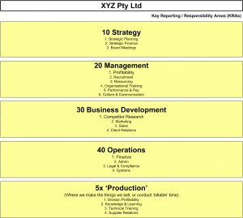
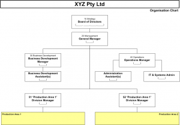

# The best way to structure your information (folders and files) electronically

<http://www.holacracy.org/>

  

  

<http://growasmallbusiness.com/>

  

Key Responsibility Area’s ( KRA )

  

  * 10 Strategy 
    *       1. Planning
      2. Product Strategy
      3. Strategic Finance
      4. ( Exit )
  * 20 Management 
    *       1. Leader/Manager Development
      2. Profitability
      3. Recruitment
      4. Resourcing
      5. Organisational Training
      6. Performance & Pay
      7. Culture & Communication
  * 30 Business Development 
    *       1. Competitor Research
      2. Marketing
      3. Sales
      4. Customer Relations
  * 40 Operations 
    *       1. Finance
      2. Admin
      3. Procurement
      4. Legal & Compliance
      5. Internal IT
  * 50 Production 
    *       1. Profitability
      2. Knowledge & Learning
      3. Training
      4. Supplier Relations

  

* * *

 

  

* * *

  

 

* * *

  

## The best way to structure your information (folders and files) electronically.

BY [TROY](<http://growasmallbusiness.com/author/admin/> "Posts by Troy") ⋅ JULY 18, 2011 ⋅ [POST A COMMENT](<http://growasmallbusiness.com/the-best-way-to-structure-your-information-folders-and-files-electronically/#comments>)

**FILED UNDER** [FILING](<http://growasmallbusiness.com/tag/filing/>), [STRUCTURE](<http://growasmallbusiness.com/tag/structure/>), [SYSTEMS](<http://growasmallbusiness.com/tag/systems/>)

  *   

  *   

  *   *   

  *   

  * Email

**A common thing I see as small businesses grow is the handling of their information is all over the place like a mad persons’ breakfast. Getting a good structure and policy in place early-on is another small thing that really helps your business grow.**

You need structure and a policy around how you store information, otherwise everyone does it their own way and it is slow and hard for your team to locate files. I recommend you follow the [small business KRA and their activities](<http://www.growasmallbusiness.com/create-your-org-chart-before-you-hire-your-sixth-team-member/> "Small business KRA"). After that, people can make up logically folders to group similar documents.

 And, I suggest you use this structure for filing your emails under your email inbox (see an example on the right from my ‘The London Pub Crawl Company’ inbox – this business guides tourists to London to only the best [London pub](<http://www.thelondonpubcrawlco.com/> "Best London pub") near them!)

For example, if you wanted to file your company logo files I would recommend they go in a folder under this structure:

  * 30 Business Development 
    * 2 Marketing 
      * Branding 
        * Logos

When looking for a file, think which KRA and activity am I working in at the moment?

Company logos are part of branding, and a marketing activity. Yes, there will be confusing things which could go in 2 places, but this structure will cover 90% of the situations and you get further gains of using a functional structure with a KRA and activity approach.

For production, that can be a little tricky. I do recommend you create a folder for each distinct Production area. If for example your business provides Consulting and Project Management, use 51 Consulting and 52 Production as KRAs. The activities under each area could be:

1 Profitability

2 Knowledge & Learning

3 Training

4 Supplier Relations

Add other activities if it makes sense for that production KRA, but I feel these are the basic activities each production area undertakes.

Use the numbering systems of the KRA and activity number so the folders are ordered in a more logical order.

**How a small business owner / manager can implement file and folder structure:**

  1. Appoint a role in your Organisation Chart (and therefore person) as the ‘Filing Owner’ – responsible for managing your company information storage structure (an Admin Officer or the Systems/IT Admin)
  2. Ask the Filing Owner to: 
     1. Read this post
     2. Add a policy in your Operations Manual on how your business files things
     3. Create a folder structure on your network drive with all the [KRA and activities shown here](<http://www.growasmallbusiness.com/create-your-org-chart-before-you-hire-your-sixth-team-member/> "Growing a small business with Key Reporting Areas")
     4. Email the new policy to the team and mention they are the Filing Owner, so questions and coaching should go to them (not you, the Entrepreneur – you have bigger fish to fry). They also say they will move all the files under the new structure by a certain date. They can also offer to provide a training session in the next [weekly team meeting](<http://www.growasmallbusiness.com/get-your-small-business-into-a-meeting-rhythm/> "Small business weekly team meeting")
     5. To move all your files under that structure – ask them to let you know when they have done around 10%
     6. You do a [quick QA](<http://www.growasmallbusiness.com/the-value-of-qa-%e2%80%93-a-quality-assurance-verb-and-habit/> "Small business quality assurance") of their work, provide them feedback and coaching on how they are filing things, then let them finish the job and own it

  

For step 2c you could also ask the Filing Owner to have the team move their own files over to the new structure, and they simply provide the role of coach and project manager on this one-off project.

  

  

* * *

  

  

  
|  BambooHR |    
|    
|  vTiger Sales |  vTiger Ops |  vTigerFin |  Replicon Fin |  Replicon Ops |  Fin Adm  
---|---|---|---|---|---|---|---|---|---  
10 Strategy |    
|    
|    
|    
|    
|    
|    
|    
|    
  
20 Mngmnt |    
|    
|    
|    
|    
|    
|    
|    
|    
  
30 Bus Dev |    
|    
|    
|    
|    
|    
|    
|    
|    
  
40 Ops |    
|    
|    
|    
|    
|    
|    
|    
|    
  
50 Production |    
|    
|    
|    
|    
|    
|    
|    
|
