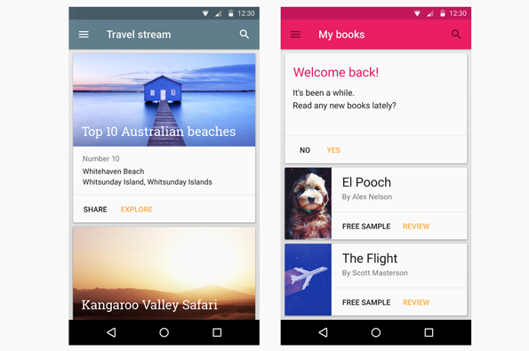
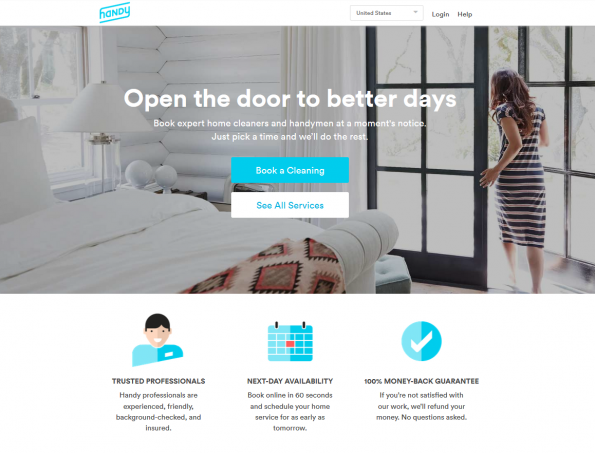

# Wat zijn de belangrijkste digital- en webdesigntrends van 2015? - Frankwatching

# Wat zijn de belangrijkste digital- en webdesigntrends van 2015?

#### shares

[14](<http://www.frankwatching.com/archive/2015/01/07/wat-zijn-de-belangrijkste-digital-en-webdesigntrends-van-2015/#comments> "Reactie op Wat zijn de belangrijkste digital- en webdesigntrends van 2015?")

 

Happy New Year, iedereen! De oliebollen hebben we inmiddels weer achter de kiezen en de maand van terugkijkende ‘best-off’-lijstjes ligt achter ons. 2014 was een mooi jaar voor digital, tijd om vooruit te kijken: wat worden de belangrijkste digital- en webdesigntrends voor 2015? Een kort overzicht, gebaseerd op niets anders dan berekend giswerk en onderbuikgevoelens. 

Voorop gesteld: eigenlijk zijn dit soort lijstjes natuurlijk een beetje idioot, zeker als het om designtrends gaat. Goed interfacedesign gaat om het ontwerpen van de optimale designoplossing voor die specifieke situatie, niet om het volgen van trends. En eigenlijk geldt hetzelfde voor trends op het gebied van content, start-ups en andere digitale ontwikkelingen. Waarom dan toch 7 voorspellingen voor 2015? Gewoon, omdat lijstjes leuk zijn. Dus, daar gaat ‘ie!

**Wat gaat het helemaal worden dit jaar?**

## 1\. Webdesign 2015: simplicity, typografie & design for mini-mobile

2014 was het jaar waarin de designcommunity de ongekende mogelijkheden van HTML5 definitief omarmde en volop benutte voor steeds rijkere digital storytelling. Het leidde tot steeds meer beleving en meer (soms te veel?) interactie in de webervaring. Toch verwacht ik dat 2015 juist het jaar zal worden van het zo spaarzaam en zo relevant mogelijk toepassen van nieuwe interacties en animaties, strevend naar een cleane, elegante en een vooral hyper eenvoudige interface.

Maar hoe rustig en genuanceerd de designs ook worden, toch verwacht ik dat de al toenemende rol van typografie in webdesign alleen maar verder zal groeien. Steeds vaker zal typografie de ruggengraat van het visueel design vormen. In 2015 mag tekst groter dan ooit, soms zelfs als vervanger van beeld. Daarnaast wordt aandacht voor maximale leesbaarheid van content een absolute pijler.

Ook zal in 2015 de aandacht voor ‘mobile’ in design nog altijd verder toenemen. Met de steeds verder uitdijende hoeveelheid (kleinere) schermen, groeit het belang van het ontwerpen van content in kleine, hapklare blokjes. Google noemt dit ‘ _[Card design](<http://www.google.com/design/spec/components/cards.html>)_ ’, onderdeel van Google’s befaamde ‘ _[Material design](<http://www.google.com/design/spec/material-design/introduction.html>)_ ’. Card design is een designprincipe dat de waarde en impact van informatie probeert te maximaliseren door middel van het ontwerpen van korte, snelle contentcomponenten. Card design is niet nieuw, maar ik verwacht dat deze visie zijn stempel zal drukken op webdesign in 2015.

 

Voorbeelden van Google Cards

## 2\. Content & marketing: het contextuele web

Het belang van content marketing zal komend jaar alleen maar verder toenemen. Personalisatie van content (de inhoud van websites aanpassen aan de interesses van de bezoeker) kennen we al langer. Maar tot nu toe zijn het met name e-commerce partijen die gebruik maken van analytics en _marketing automation_ om hun bezoekers relevante content voor te schotelen. In 2015 verwacht ik te zien dat ook niet-e-commerce spelers gebruik zullen gaan maken van gebruikersdata om contextuele content te serveren.

## 3\. End User Development: iedereen wordt maker

‘ _End User Development_ ’ is een beweging van digitale producten en diensten die eindgebruikers zelf kunnen doorontwikkelen voor hun eigen doeleinden. Denk bijvoorbeeld aan makkelijk te bewerken minicomputers zoals Arduino, maar ook aan diensten als IfThisThenThat. Ook 3D-printers zijn natuurlijk een onderdeel van deze trend. Alhoewel 2014 al bol stond van de ontwikkelingen rondom End User Development, zal in 2015 blijken dat we pas net zijn begonnen.

## 4\. Start-ups 2015: alles on-demand

Techniek is bedoeld om het leven te vergemakkelijken en dat lijken start-ups maar al te goed te begrijpen. ‘Gemak’ is altijd een goede reden tot aankoop en 2015 zal het jaar worden van start-ups die onze innerlijke luiaard proberen aan te spreken. Zet je schrap voor nieuwe ‘on-demand’ diensten voor het bestellen van eten ([Munchery](<https://munchery.com/>), [WunWun](<https://www.wunwun.com/>), [Postmates](<https://postmates.com/>)), services voor meer woongenot ([Porch.com](<http://porch.com/>), [Handy](<http://www.handy.com/>), [Homejoy](<https://www.homejoy.com/>)) en natuurlijk _same-day-delivery shopping services_ (zoals Google Shopping Express, [Curbside](<https://shopcurbside.com/index.html>) en [InstaCart](<https://www.instacart.com/>)).

 

Handy

**En wat gaat het juist helemaal niet worden in 2015?**

## 5\. De smartwatch gaat een lastig jaar tegemoet

Huh? Is de smartwatch met de komst van de Android Wear en de Apple Watch juist niet de grote belofte van komend jaar? Misschien wel, maar 2015 zou best wel eens een zwaar jaar kunnen worden voor de smartwatch. Waarom? Omdat ik om mij heen eenvoudigweg te weinig interesse merk in de aankomende generatie smartwatches. Dat is natuurlijk geen representatief onderzoek, maar toch lijkt het alsof de toegevoegde waarde ten opzichte van de smartphone simpelweg te klein is. Of de afhankelijkheid van de smartphone juist te groot.

Ik sluit overigens zeker niet uit dat wearables een grote toekomst tegemoet gaan. Maar gecombineerd met commentaar op de kracht van de batterij en ook op de vormgeving van de smartwatch, zou het me erg weinig verbazen als de introductie van de Android Wear en de Apple Watch wel eens zou kunnen tegenvallen.

## 6\. Webdesign en content: stock content kan echt niet meer

Nou goed, Shutterstock zal eind 2015 best nog wel bestaan, maar onderscheidend interface design kan niet zonder hoogwaardige content. In 2015 zal voor alle ambitieuze digitale merken gelden dat unieke, ‘ _custom_ ’ copy, fotografie- en videocontent de absolute basis zal vormen voor elke digitale identiteit. Juist het volledig integreren van de contentcreatie in het webdesignproces, zal leiden tot de beste digitale producten die 2015 zal voortbrengen.

 

Weg met de stockphoto

## 7\. Social: Facebook’s begin van het einde?

Het Facebook aandeel noteerde zeer recent haar hoogste waarde tot nu toe, dus deze laatste voorspelling is absoluut geen zekerheidje. Maar toch de voorspelling: 2015 wordt het jaar waarin Facebook flinke klappen ter verduren zal krijgen, zowel van haar concurrenten als van zichzelf.

Waarom? Volgens de [_American Customer Satisfaction Index_](<http://www.theacsi.org/>) heeft Facebook de laagste gebruikerstevredenheid van alle grote social platforms. Deze lage score komt vooral voort uit onvrede over de nogal losse omgang met privacy en het zeer aanwezige advertentiesysteem dat Facebook hanteert (dat zal zeker niet minder worden).

Maar er lijkt meer aan de hand: gebruikers lijken ook moe te worden van het volgen van de levens van Facebook’s generieke, one-size-fits-all doelgroep. Jongeren zitten niet te wachten op een constante stroom van babyfoto’s in hun newsfeed. En van eindeloos vakantiefoto’s bekijken van halve bekenden wordt niemand echt gelukkig. Daarom verwacht ik dat 2015 vooral het jaar zal worden van social platforms met een duidelijke focus op interesses (Pinterest) en een duidelijke focus in doelgroep (Snapchat).

## Wat het ook wordt: een schitterend 2015 gewenst!

Niemand heeft een glazen bol dus ook aan bovenstaande voorspellingen zal ongetwijfeld het nodige schorten. Maar wat het ook moge worden in 2015, namens heel Jungle Minds: de allerbeste wensen!
