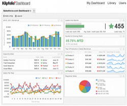

# Web Analytics Consultant

# Vacature **Web Analytics Consultant**

Webanalytics speelt een cruciale rol in de online marketing mix. Met behulp van webanalytics data krijgen onze klanten een goed inzicht wat er op hun website gebeurt en wat hun investering in online marketing precies oplevert.

Heb jij een passie voor data en heb je ervaring met implementaties van Google Analytics in grote eCommerce omgevingen? Dan kan je bij ons aan de slag als Web Analytics Consultant om klanten als [Marktplaats](<http://www.marktplaats.nl/>) en [Shurgard](<http://www.shurgard.nl/>) aan de beste online resultaten te helpen.

##  Functieomschrijving Web Analytics Consultant

Als Web Analytics Consultant ben je verantwoordelijk voor de implementatie, analyse en rapportages van webanalytics trajecten voor onze (internationale) klanten. Je adviseert over websiteoptimalisaties, helpt klanten bij het interpreteren van webanalytics data en zet deze analyses om in toepasbare adviezen.

  |  |  Je werkt met verschillende web analytics en online dashboard platforms zoals Google Analytics, Klipfolio en Qualaroo en bent onderdeel van een [gedreven Web Analytics team](<http://www.maxlead.nl/over-maxlead/maxlead-team/#web-analytics>) waarin je samenwerkt met ervaren web analisten. Het betreft een uitdagende functie waarin je afwisselend in een projectmatige en uitvoerende rol zal werken voor een diversiteit aan opdrachtgevers.  
---|---|---  
  
##  Verantwoordelijkheden

  * Adviseren van de klant over het effectief inzetten van webanalytics
  * Vertalen van marketingdoelstellingen in meetbare KPI’s.
  * Campagnerapportages opstellen en toelichten op marketing en directie niveau.
  * Analyse van website statistieken omzetten in praktische optimalisatievoorstellen.
  * Samenwerking in grote SEA en SEO trajecten, waarbij jij de webanalytics expert binnen het team bent.
  * Project management van webanalytics implementatietrajecten.
  * Schrijven van implementatiedocumenten voor de webbouwer van de klant.
  * Schrijven en uitvoeren van testplannen voor bestaande en nieuwe webanalytics implementaties.

##    
Profiel

Maxlead zoekt een ambitieuze Web Analytics Consultant die wil groeien in dit jonge vakgebied. Het is belangrijk dat je goede communicatieve vaardigheden hebt en eenvoudig op verschillende niveaus kunt meedenken en adviseren.

  * Sterk analytisch vermogen om grote hoeveelheden data snel te vertalen in duidelijke conclusies en adviezen.
  * Je bent in staat om te communiceren en rapporteren aan marketeers en IT op management en directieniveau.
  * Minimaal 2 jaar ervaring met webanalytics (bij voorkeur met Google Analytics en/of Omniture).
  * Managen van meerdere klant accounts tegelijkertijd (implementatie/rapportage/advies).
  * Basiskennis Excel is een voorwaarde. We verwachten dat je deze kennis bij Maxlead verder ontwikkelt.
  * Uitstekende beheersing van Engelse taal in woord en geschrift voor onze internationale accounts.

##    
Wat biedt Maxlead?
