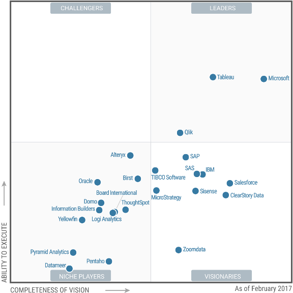

# Gartner - BI Tools in 2018

# Magic Quadrant for Business Intelligence and Analytics Platforms

**Published:** 16 February 2017 **ID:** G00301340 

Analyst(s):

Rita L. Sallam,  Cindi Howson,  Carlie J. Idoine,  Thomas W. Oestreich,  James Laurence Richardson,  Joao Tapadinhas

## Summary

The business intelligence and analytics platform market's shift from IT-led reporting to modern business-led analytics is now mainstream. Data and analytics leaders face countless choices: from traditional BI vendors that have closed feature gaps and innovated, to disrupters continuing to execute. 

##  Strategic Planning Assumptions 

By 2020, smart, governed, Hadoop/Spark-, search- and visual-based data discovery capabilities will converge into a single set of next-generation data discovery capabilities as components of modern BI and analytics platforms. 

By 2021, the number of users of modern BI and analytics platforms that are differentiated by smart data discovery capabilities will grow at twice the rate of those that are not, and will deliver twice the business value. 

By 2020, natural-language generation and artificial intelligence will be a standard feature of 90% of modern BI platforms. 

By 2020, 50% of analytic queries will be generated using search, natural-language processing or voice, or will be autogenerated. 

By 2020, organizations that offer users access to a curated catalog of internal and external data will realize twice the business value from analytics investments than those that do not. 

Through 2020, the number of citizen data scientists will grow five times faster than the number of data scientists. 

##  Market Definition/Description 

_This document was revised on 3 March 2017. The document you are viewing is the corrected version. For more information, see the[ Corrections ](<http://www.gartner.com/technology/about/policies/current_corrections.jsp>) page on gartner.com. _

Visual-based data discovery, a defining feature of the modern business intelligence (BI) platform, began in around 2004 and has since transformed the market and new buying trends away from IT-centric system of record (SOR) reporting to business-centric agile analytics. Modern BI and analytics platforms are characterized by easy-to-use tools that support a full range of analytic workflow capabilities and do not require significant involvement from IT in order to predefine data models upfront as a prerequisite to analysis (including at enterprise-scale deployment). 

Gartner redesigned the Magic Quadrant for BI and analytics platforms in 2016, to reflect this more than decade-long shift. A year later, in 2017, there is significant evidence to suggest that the BI and analytics platform market's multiyear transition to modern agile business-led analytics is now mainstream. Reduced feature differentiation among a crowded market of players, buyer requirements for larger enterprise deployments, and the emergence pricing pressure are evidence of the maturity of the current market. For their part, buyers want to expand modern BI usage, including for self-service to everyone in the enterprise and beyond. They want users to analyze a more diverse range and more complex combinations of data sources (beyond the data warehouse or data lake) than ever before — without distinct data preparation tools. Whereas the initial modern BI disruption shifted purchasing from IT to the lines of business — where new tools initially landed as point purchases — as these tools have demonstrated value, enterprise buying of these platforms has grown to the point where the purchasing influence is tipping back to include IT and central purchasing groups. This is further evidence of market mainstreaming and has caused buyers to place greater emphasis on enterprise readiness, governance and price/value, in addition to the agility and ease of use demanded by business users. Land-and-expand buying models are still important to demonstrate value and drive expansion, but mechanisms to economically scale deployments across the enterprise have gained in importance. 

The crowded BI and analytics market includes everything from longtime, large technology players to startups backed by enormous amounts of venture capital. What is new this year, is that traditional BI vendors that were slow to adjust to the "modern wave of disruption" (such as IBM, SAP, Oracle and MicroStrategy) and struggled to remain relevant during the market transition, have finally matured their modern offerings enough to appeal to many in their installed bases already using these platforms as the standard for enterprise reporting, and that value their enterprise features and the potential to leverage years of investment in data models and analytic content. 

Moreover, as the visual-based exploration paradigm has become mainstream, a new innovation wave is emerging that has the potential to be as disruptive as (or more than) visual-based data discovery has been to the previous semantic-layer-based development approach of traditional BI and analytics platforms. While the current visual-based data discovery approach has accelerated data harmonization and the visual identification of patterns in data, as opposed to the previous IT-centric semantic-layer-based approach, the tasks for creating insights are still largely manual and prone to bias. Smart data discovery — introduced by IBM Watson Analytics and BeyondCore (acquired by Salesforce as of September 2016) — leverages machine learning to automate the analytics workflow (from preparing and exploring data to sharing insights and explaining findings). Natural-language processing (NLP), natural-language query (NLQ) and natural-language generation (NLG) for text- and voice-based interaction and narration of the most statistically important findings in the user context are key capabilities of smart data discovery. Consistent with the classic innovator's dilemma, many of the traditional BI vendors (such as IBM and SAP, which were innovators of the semantic-layer-based platform) were slow to adjust to the shift to modern BI. However, they have been ahead of the current modern BI disrupters — Tableau, Qlik and TIBCO Spotfire — now facing their own innovator's dilemma regarding investment in the next smart data discovery market wave. 

Views on deployment options are also shifting and having an impact on the market. For the past three years, interest in deploying BI and analytics platforms in the cloud had been hovering around 45% of customer reference survey respondents for this Magic Quadrant — with the greatest interest coming from lines of business. In this year's survey, active and planned cloud BI deployments jumped to more than 51%, with much of this shift in interest coming from IT respondents. Most BI and analytics platform vendors are now responding in a significant way: with a range of cloud deployment and subscription pricing model options, and different degrees of support for leveraging the on-premises investments that buyers have already made. 

This Magic Quadrant focuses on products that meet the criteria of a modern BI and analytics platform (see "Technology Insight for Modern Business Intelligence and Analytics Platforms" ), which are driving the majority of net new mainstream purchases in the market today. Products that do not meet the modern criteria required for inclusion in the Magic Quadrant (because of the upfront requirements for IT to predefine data models, or because they are enterprise-reporting-centric) will be covered in our Market Guide for traditional enterprise reporting platforms (to be published later in 2017). Emerging and next-generation innovative modern BI and analytics platforms that do not yet meet the inclusion criteria for the Magic Quadrant are mentioned in the Appendix to this Magic Quadrant. 

Magic Quadrant customer reference survey composite success measures are cited throughout the report. Reference customer survey participants scored vendors on each metric; these are defined in Note 1. 

###  The Five Use Cases and 15 Critical Capabilities of a BI and Analytics Platform 

We assess and define 15 product capabilities across five use cases as outlined below. 

Vendors are assessed for their support of five main use cases: 

  * **Agile Centralized BI Provisioning.** Supports an agile IT-enabled workflow, from data to centrally delivered and managed analytic content, using the self-contained data management capabilities of the platform. 

  * **Decentralized Analytics.** Supports a workflow from data to self-service analytics. Includes analytics for individual business units and users. 

  * **Governed Data Discovery.** Supports a workflow from data to self-service analytics to SOR, IT-managed content with governance, reusability and promotability of user-generated content to certified SOR data and analytics content. 

  * **OEM or Embedded BI.** Supports a workflow from data to embedded BI content in a process or application. 

  * **Extranet Deployment.** Supports a workflow similar to agile centralized BI provisioning for the external customer or, in the public sector, citizen access to analytic content. 

Vendors are assessed according to the following 15 critical capabilities. Changes, additions and deletions from last year's critical capabilities are listed in Note 2. Subcriteria for each capability are listed in Note 3, and detailed functionality requirements are included in a published RFP document (see "Toolkit: BI and Analytics Platform RFP" ). How well the platforms of our Magic Quadrant vendors support these critical capabilities is explored in greater detail in "Critical Capabilities for Business Intelligence and Analytics Platforms." 

**Infrastructure**

  1. **BI Platform Administration, Security and Architecture.** Capabilities that enable platform security, administering users, auditing platform access and utilization, optimizing performance and ensuring high availability and disaster recovery. 

  2. **Cloud BI.** Platform-as-a-service and analytic-application-as-a-service capabilities for building, deploying and managing analytics and analytic applications in the cloud, based on data both in the cloud and on-premises. 

  3. **Data Source Connectivity and Ingestion.** Capabilities that allow users to connect to structured and unstructured data contained within various types of storage platforms, both on-premises and in the cloud. 

**Data Management**

  1. **Metadata Management.** Tools for enabling users to leverage a common SOR semantic model and metadata. These should provide a robust and centralized way for administrators to search, capture, store, reuse and publish metadata objects such as dimensions, hierarchies, measures, performance metrics/key performance indicators (KPIs), and report layout objects, parameters and so on. Administrators should have the ability to promote a business-user-defined data mashup and metadata to the SOR metadata. 

  2. **Self-Contained Extraction, Transformation and Loading (ETL) and Data Storage.** Platform capabilities for accessing, integrating, transforming and loading data into a self-contained performance engine, with the ability to index data and manage data loads and refresh scheduling. 

  3. **Self-Service Data Preparation.** "Drag and drop" user-driven data combination of different sources, and the creation of analytic models such as user-defined measures, sets, groups and hierarchies. Advanced capabilities include machine-learning-enabled semantic autodiscovery, intelligent joins, intelligent profiling, hierarchy generation, data lineage and data blending on varied data sources, including multistructured data. 

**Analysis and Content Creation**

  1. **Embedded Advanced Analytics.** Enables users to easily access advanced analytics capabilities that are self-contained within the platform itself or through the import and integration of externally developed models. 

  2. **Analytic Dashboards.** The ability to create highly interactive dashboards and content with visual exploration and embedded advanced and geospatial analytics to be consumed by others. 

  3. **Interactive Visual Exploration.** Enables the exploration of data via an array of visualization options that go beyond those of basic pie, bar and line charts to include heat and tree maps, geographic maps, scatter plots and other special-purpose visuals. These tools enable users to analyze and manipulate the data by interacting directly with a visual representation of it to display as percentages, bins and groups. 

  4. **Smart Data Discovery:** Automatically finds, visualizes and narrates important findings such as correlations, exceptions, clusters, links and predictions in data that are relevant to users without requiring them to build models or write algorithms. Users explore data via visualizations, natural-language-generated narration, search and NLQ technologies. 

  5. **Mobile Exploration and Authoring.** Enables organizations to develop and deliver content to mobile devices in a publishing and/or interactive mode, and takes advantage of mobile devices' native capabilities, such as touchscreen, camera and location awareness. 

**Sharing of Findings**

  1. **Embedding Analytic Content.** Capabilities including a software developer's kit with APIs and support for open standards for creating and modifying analytic content, visualizations and applications, embedding them into a business process and/or an application or portal. These capabilities can reside outside the application, reusing the analytic infrastructure, but must be easily and seamlessly accessible from inside the application without forcing users to switch between systems. The capabilities for integrating BI and analytics with the application architecture will enable users to choose where in the business process the analytics should be embedded. 

  2. **Publish, Share and Collaborate on Analytic Content.** Capabilities that allow users to publish, deploy and operationalize analytic content through various output types and distribution methods, with support for content search, scheduling and alerts. Enables users to share, discuss and track information, analysis, analytic content and decisions via discussion threads, chat and annotations. 

**Overall platform capabilities were also assessed:**

  1. **Platform Capabilities and Workflow.** This capability considers the degree to which capabilities are offered in a single, seamless product or across multiple products with little integration. 

  2. **Ease of Use and Visual Appeal.** Ease of use to administer and deploy the platform, create content, consume and interact with content, as well as the visual appeal. 

##  Magic Quadrant 

**Figure 1.** Magic Quadrant for Business Intelligence and Analytics Platforms 

 

Source: Gartner (February 2017) 

###  Vendor Strengths and Cautions 

####  Alteryx 

Alteryx offers a workflow-based platform for data preparation and building of parameterized analytic applications. The company's origins in location and geoanalytics have proved to be a differentiator, along with its advanced analytic capabilities (discussed in depth in Gartner's Magic Quadrant for data science). Alteryx is widely used in combination with other modern BI and analytic products (particularly Tableau), but also as an end-to-end analytic application as well as formatted, scheduled reports. With the Alteryx Server, data modelers can create interactive, parameterized dashboards published on-premises or in the cloud via the Analytics Gallery. 

Alteryx is positioned at the top of the Niche Players quadrant. Its movement out of the Visionaries quadrant is driven in part by its lack of focus on smart data discovery, limited industry vertical offerings, and being given lower scores by its reference customers on sales strategy (these were dragged down by pricing concerns). 

#####  Strengths 

  * **Self-service data preparation with advanced analytics:** Alteryx scored in the top quartile of all the vendors in this Magic Quadrant for supporting complex types of analysis. It allows power users, such as citizen data scientists, to combine data from multiple and varied data sources, while also transforming and cleansing data, then perform predictive or spatial analytics in the same repeatable workflow. In this regard, Alteryx is ideal when a data lake is part of a logical data warehouse. Alternatively, Alteryx can be used as the agile modeling layer whose output feeds into a visual data discovery tool (such as Tableau, Qlik Sense or Microsoft Power BI). The product provides in-context data browsing to aid in the preparation process. Alteryx's reference customers report among the greatest breadth of usage (of all Magic Quadrant vendors), which includes data integration and predictive analytics. It also has among the highest percentage of its survey customers using the platform for moderately complex analysis. 

  * **Business benefits:** Alteryx is in the top quartile for achievement of business benefits, for both qualitative factors and the hard benefits of data monetization, improved customer service and decreased IT costs. In terms of decreased IT costs, Alteryx's reference customers cite the ability to rapidly prototype complex data mashups as a way of substantially reducing development times compared with traditional data integration processes. 

  * **Operations and support:** Customer reference survey scores for vendor operations include an assessment of product support, quality and migration. For product support, Alteryx is ranked second overall; this is arguably made easier by a single product line and less frequent product releases (with one major release, and two to three minor releases, per year) than vendors with multiple products and continuous release cycles. Alteryx's product quality scores also put it in the top quartile. 

  * **User enablement and skilled resources:** User enablement is important for self-service analytics, where business users become the data preparers and application authors. Traditional classroom training is one aspect of this, but continuous education approaches — such as self-paced tutorials, community forums, and sharing of best practices at user conferences — are also important. Alteryx ranked in the top quartile overall for user enablement, with particularly high customer survey scores for the availability of its skilled resources. However, there is less satisfaction among its customers with the availability of Alteryx-skilled resources in the broader marketplace. 

#####  Cautions 

  * **"Co-opetition" and lack of front-end visualization capabilities:** A number of Alteryx's partners continue to invest in their own self-service data preparation capabilities, potentially marginalizing Alteryx to just fill its partners' products shortcomings. Conversely, Alteryx's portfolio is most notably lacking in its visual exploration capabilities for business users, with the current charting and exploration capabilities geared to data preparation. Once an analyst builds an application or dashboard, this is more akin to a parameterized report than to free-form exploration. 

  * **Subscription costs:** Software cost was cited as a barrier to the wider deployment of Alteryx by 51% of its survey customers, a jump from 38% in 2015. Alteryx licenses its software as an annual subscription, starting at $3,995 for the desktop Alteryx Designer. This is not only higher priced than alternative self-service data preparation products, but also potentially comes on top of the cost of partner products (such as those from Qlik and Tableau) for which customers already cite cost as a barrier to adoption. 

  * **Deployment size:** Alteryx deployments are small, which can partly be explained by the product being used by a few power users to fill a particular piece of the analytics workflow; cost concerns may be a further inhibitor here. The average deployment size was 83 users, with 57% of reference customers having fewer than 50 users; this puts Alteryx in the bottom quartile of deployment size for this Magic Quadrant. In addition, Alteryx is rarely the only enterprise BI and analytics platform standard (identified as such by just 18% of reference customers); less than one-third of its reference customers say it is one of many standards and 20% cite another product as their enterprise standard. 

  * **Mixed ease-of-use scores:** Ease of use can be a difficult aspect to assess, because it is somewhat based on a user's experience with other products. Alteryx has benefited from a halo effect when users compare its data preparation capabilities with industrial-strength data integration products and manual efforts to mash up and cleanse data. Initially, the product and its processes seem so much easier by comparison, and this is one reason why surveyed reference customers rank Alteryx the highest of all vendors in this report on ease of content development. However, the business user (who is the ultimate decision maker) is perhaps the most important user, and for content consumers Alteryx ranks in the bottom quartile for ease of use. Lower scores on ease of use are a significant part of the market understanding of its offerings, which further affects Alteryx's position for Completeness of Vision. 

####  Birst 

Birst provides a full range of data management and analytic capabilities on multitenant cloud architecture through a software as a service (SaaS)-based delivery model. Birst Enterprise Cloud can be deployed in a public or private cloud or in a customer's data center; and for organizations that are not willing or able to adopt a cloud-based BI solution, the same underlying product — branded as Birst Enterprise Virtual Appliance — is offered for on-premises deployments. 

In 2016, Birst added enhanced functionality for self-service data preparation, the ability to utilize Exasol as a high-performance, in-memory massively parallel processing (MPP) data store, and increased its use of responsive design techniques as part of a "design once, use everywhere" approach to multiple device types. 

Birst is positioned in the Niche Players quadrant. It has the capability to displace incumbent BI deployments and compares very well (functionally) against the leading vendors in this year's Magic Quadrant for some use cases. However, beyond its product alone, Birst has not demonstrated enough traction to be considered a direct challenger to this year's market leaders. Further, its smart and advanced analytic capability and vision lack the required direction for it to be positioned in the Visionaries quadrant. 

#####  Strengths 

  * **End-to-end capabilities:** Birst offers compelling functionality — scoring in the top quartile overall from a functional perspective. The Birst platform is strong in the critical capabilities for metadata management, embedded analytic content, BI platform administration, security and architecture, cloud BI, self-contained ETL and data storage, and also in mobile exploration and authoring. The work the company has done in the area of self-service data preparation — in Birst 6 (launched November 2016) — further bolsters its suitability for decentralized and governed data discovery analytic use cases. 

  * **Networked semantic layer:** Birst's core concept of "Networked BI" is a differentiator. Its ability to connect centralized and decentralized groups via a network of virtual instances that share a common and reusable set of business rules and definitions is attractive to organizations that want to offer self-service in a managed environment. However, despite its evident suitability for governed data discovery use cases, this remains a minority use of the Birst platform (about one quarter of its customers use it in this way), although this may grow. Birst is deployed across a diverse range of use cases, with centralized BI provisioning and embedded BI being the most prevalent (according to its customer survey references). High utilization in these use cases is expected, given Birst's platform strengths. 

  * **Enterprise standard:** Birst is a credible vendor, viewed as a viable alternative standard. Its reference customers reported that Birst is their only enterprise BI standard in 66% of cases. This is notable (given that none of the Leaders in this Magic Quadrant scores above 45% for this) and underlines Birst's position as a credible alternative. Note, however, that according to the data gathered, Birst is a standard in smaller deployments. References cited an average deployment size of 787 users, which, while an increase over the prior year, falls below this year's market average of 1,182 users. 

  * **Cloud leadership:** Birst's platform was built for cloud deployment and its origins remain one of its main differentiators in a market where some competitors are scrambling to catch up in the cloud. This focus was evident among responses from Birst's reference customers, where the top three reasons for selecting it were overall total cost of ownership (TCO), cloud deployment, and implementation cost and effort. 

#####  Cautions 

  * **Narrow use for reporting and dashboards:** As in 2016, Birst scored in the bottom quartile for complexity of analysis; this indicates that the platform continues to be widely used to deliver a narrow range of less complex reporting and dashboard content, even though it offers more advanced capabilities such as data preparation and data discovery. This indication is supported by the fact that 69% of Birst's reference customers report using the platform for parameterized reports and dashboards (the highest proportion of all the vendors in this Magic Quadrant). 

  * **User enablement:** Birst's user-enablement capabilities are patchy. As would be expected from an organization with a cloud focus, its online user community is excellent. However, in other areas (such as training and documentation) the feedback is less positive and Birst customers report that the availability of skilled resources (from the vendor or its partners) to assist in their deployments is an issue. 

  * **Achievement of business benefits:** There is a disconnect between Birst's stated aim — of placing great emphasis on customer success and quantifiable business value — and the experience of the reference customers surveyed for this research. This could be related to lower scores on user enablement, which is linked to how much value users get out of their BI and analytics platform. Birst was scored "good," but ranked in the bottom quartile for business benefits in aggregate, and was ranked bottom overall in its ability to reduce external IT costs and reduce IT head count when using BI. 

  * **Used for less complex types of analysis:** Birst's vision is not currently tracking with the overall trend in the BI and analytics platform market — toward increasingly automated and autoinferred approaches to analysis. This is reflected in the fact that embedded advanced analytics, and in particular smart data discovery, are areas of weaknesses in the platform. Birst needs to guard against being left behind as the buying agenda shifts toward these criteria. While Networked BI is a different message, it effectively remains an improved approach to traditional BI use cases rather than a visionary approach to analytics. 

####  Board International 

Board delivers a single, integrated system that provides BI, analytics and corporate performance management (CPM) capabilities in a hybrid in-memory self-contained platform. The focus is to deliver a single and unified information platform as a basis for analytics, planning and budgeting, and consolidation. Board is based in Switzerland; its main market is Europe, with subsidiaries in Europe, North America and Asia/Pacific. It supports clients in South America through its partners. Board's investments in expansion have paid off, with growth across all regions and in particular in the North American market. Board established a new international headquarters in Boston, Massachusetts, U.S., during 4Q16. 

Board is positioned as a Niche Player in this Magic Quadrant. It successfully serves the submarket for centralized, single-instance BI, analytics and CPM platforms. Board's narrow focus, but growing regional adoption, together with limited market awareness explains its position for Completeness of Vision. Board is well-positioned in this unified BI/CPM submarket and offers its platform on-premises as well as in the cloud. Board has started to invest in machine-learning automated smart capabilities in order to catch up with the visionaries of the fast emerging next wave — that of smart data discovery platforms. 

#####  Strengths 

  * **Widely deployed unified platform:** Board's single-instance platform, with its proprietary hybrid in-memory capabilities, is mostly used in the agile centralized BI provisioning use case. The average deployment size (in terms of number of users among its survey reference customers) puts it in the top quartile of all the vendors in this Magic Quadrant and shows evidence of Board's success in large enterprises and broader deployments across its midsize client base. 

  * **Improved business operations:** Board achieved scores that were slightly above average for support and operations (from its reference customers). This is an improvement over last year's survey, where these scores were below average. Migration experience was also slightly above average and sales experience is good, as outlined, with a score that is slightly above average. In this respect, Board is a good company for clients to work with throughout the life cycle of engagement. 

  * **Customer satisfaction:** Board was in the top third of all the vendors in this Magic Quadrant for client satisfaction, with a very low number of clients indicating that they plan to discontinue their use of its products. In addition, no really significant platform limitations, or limitations to its wider use, were expressed by its customer references. Sales experience was rated slightly above average. Board's clients were able to achieve the business benefits they had expected, as revealed by a slightly above-average score from reference customers. 

  * **Breadth of use:** Board achieved the top score in terms of breadth of use. Breadth of use looks at the percentage of users that use the product for a range of BI styles — from viewing reports, creating personalized dashboards and doing simple ad hoc analysis, to performing complex queries, data preparation, and using predictive models. This plays to the strength of a unified platform. 

#####  Cautions 

  * **Keeping user enablement in focus:** Board's growth in all regions, in particular outside its European home market, challenges it to find new ways to better enable its users. Customer reference scores in the bottom quartile indicate room for improvement here. The availability of documentation and online tutorials, an active user community, and the availability of skilled resources are particular aspects that Board should focus on improving in order to sustainably satisfy a growing global customer base. This is also critical to the delivery of business benefits as usage expands. More proficient users tend to use the platform to drive greater business value. 

  * **Used on smaller datasets:** More than 40% of Board reference customers report that their largest queries are below 1GB, among the lowest of any Magic Quadrant vendor; they also report querying among the lowest number of data sources. Board's core cube architecture based on multidimensional online analytical processing (MOLAP) or relational online analytical processing (ROLAP) can become a limiting factor, especially for clients who need to access and analyze diverse data sources and for clients who wish to perform more complex types of analysis on those diverse data sources. 

  * **Market understanding:** While the proportion of Board's survey customers selecting the platform for its usability is among the highest of any vendor in this Magic Quadrant, ease of use across all measures (including for administration, content authors, content consumers and for visual appeal) is rated as below average. Moreover, customers use Board for less complex types of analysis and data models and less diverse data sources, which has contributed to its slightly below-average score for complexity of analysis (a component of market understanding). The fact that Board has one of the highest percentages of its survey respondents using the platform for parameterized reports and dashboard, is another indication that the platform tends to be used for simpler analytics (similar to last year). 

  * **Limited use for cloud and embedded:** Board received lower ratings for its cloud capabilities, with the percentage of its reference customers using or planning to deploy the platform in the cloud (compared with other Magic Quadrant vendors) putting it in the bottom quartile. Similarly, and consistent with its weaker ratings for embedded capabilities, Board's survey customers report among the lowest use of the platform for embedded as well as externally facing use cases. 

####  ClearStory Data 

ClearStory Data is a cloud-based BI and analytics platform that allows for smart data integration, data storytelling and collaboration in a single platform. It uses Spark-based processing to handle large data volumes, but that data must be moved to the cloud. ClearStory is well-suited to business users that need to combine, harmonize and explore multiple and varied data sources, including personal, cloud, streaming and syndicated data. 

ClearStory Data is once again positioned in the Visionaries quadrant, but further to the right this year. Its far-right placement is largely influenced by its strong market understanding, with high scores for ease of use and complexity of analysis, as well as a product roadmap that includes further enhancements to smart data discovery and crowdsourced analytics. ClearStory Data's Ability to Execute is limited by its lack of a strong geographic presence, being a smaller vendor in an already crowded market, and limited awareness among potential customers. 

#####  Strengths 

  * **Smart data inference and harmonization:** ClearStory was recently awarded a U.S. patent for its smart data inference and harmonization, which leverages machine learning. Customers choose ClearStory primarily for its data access and integration capabilities. The broad range of data sources, as well as broad usage styles (from data integration and complex queries, to simple ad hoc analysis), contributed to the vendor gaining the highest score of all those in this Magic Quadrant for complexity of analysis. ClearStory can ingest from traditional personal and relational data sources, but can also harmonize these data sources with Hadoop-based and other NoSQL data sources — including Google BigQuery and IBM BigInsights, log files, and streaming data sources. Data is processed using Spark for high levels of query and analytic performance on granular data. 

  * **Ease of use:** ClearStory Data sets a new standard for ease of use, having achieved the highest customer reference score for ease of implementation and administration, as well as ease of content consumption. Across other ease-of-use drivers — for content creation and visual appeal — ClearStory Data scored in the top quartile. Its data blending capabilities are an example of why this vendor rates so highly for ease of use; most products will help with data mashups by automatically joining other datasets based on the same column name once a secondary set has been selected. ClearStory Data, on the other hand, will profile data based on values in order to do smart matching. In addition, the product will suggest other public and premium datasets that are mashable, a capability it refers to as "Data You May Like." 

  * **Customer experience:** ClearStory also gained the highest score for customer experience based on the achievement of business benefits, user enablement, and availability of skilled resources from the vendor. As a smaller vendor, it would be expected that the availability of skilled resources in the marketplace would be lower, yet customers reported satisfaction here as well. This result may be based on the general availability of Spark and cloud expertise; or there being no need for such resources; or the "halo effect" in which satisfied customers rate everything as high. The one low area for user enablement is the lack of a user conference, although this is hardly surprising with less than 100 production customers. 

  * **Industry data sources and templates:** While many startup BI and analytics vendors lack industry vertical solutions, ClearStory has continued to expand its prebuilt templates and the number of industry-specific data sources it understands and can readily ingest. The vendor provides templates for Customer Service Insights, Pipeline and Opportunity Analysis, Ad Intelligence, Trade Promotion and Loyalty Analysis, Media Customer Churn Analysis and Clinical Trial Analysis, to name a few. ClearStory estimates that half its customers begin their deployment with these templates. The vendor has added more application connectors in 2016, including Zendesk, Jira and Google Analytics. 

#####  Cautions 

  * **Mainly cloud:** ClearStory Data is primarily a cloud BI and analytics solution. It lacks hybrid connectivity for live query of on-premises data sources, although customers can connect to and load on-premises data sources. This may make the product less suitable for customers with large-scale, on-premises data sources that do not want their data in the cloud. In addition, ClearStory Data relies on its own physical data centers; on a case-by-case basis, ClearStory will work with customers who want to deploy in Amazon Web Services (AWS) or on-premises. The data centers have a number of security certifications — such as SOC2, the Federal Information Security Management Act (FISMA) and ISO 2700. 

  * **Limited funds:** A privately held vendor, ClearStory Data is a smaller vendor in a crowded market. As of December 2016, the vendor had received $54 million in venture capital funding. Many other BI and analytics startups have continued to receive more funding during the past two years, enabling additional head count and market momentum. While the granting of a patent is important in the company's evolution, the self-service data preparation market continues to expand and become more crowded, making this set of capabilities a more challenging differentiator. 

  * **Deployment size:** ClearStory Data has some of the smallest deployments of all the vendors in this Magic Quadrant, scoring in the bottom quartile with 85% of reference customers having less than 100 users. While ClearStory had no large-scale deployments in 2015, it did add six customers with more than 500 users during 2016. Only 11% of reference customers say the product is the enterprise standard, while 63% say it's one of several standards supported. The Spark-based processing is positioned to provide greater performance at scale, yet the majority of ClearStory's customers are analyzing less than 1TB of data in the in-memory analytic cache; input data sizes from both Hadoop and relational sources also put it in the bottom quartile. In part, the movement of data to the cloud may be a limiting factor, even though based on customer choice rather than any technical limitation. 

  * **Geographic presence and awareness:** ClearStory Data only has employees in North America, though it has plans to add local head count in Europe and Asia/Pacific during 2017. ClearStory's product is only available in English, with no localization. 

####  Datameer 

Datameer specializes in big data analytics, targeting organizations investing in data lakes and other types of big data environments supporting analytics. The company offers a modern BI and analytics front end with the potential to solve complex problems (leveraging the native query engines for Hadoop and Spark) and with support for an expanding range of connectors to other types of data (including SQL-based data stores, digital interaction sources and sensor data). As of December 2016, the company has received $76.7 million in venture capital funding. 

For its debut in the BI and analytics Magic Quadrant, Datameer is positioned as a Niche Player. Datameer is well-suited to organizations with complex analytics requirements on big data. Its product strategy is focused on big data analytics. More-limited market awareness and geographic coverage that is highly centered on North America (not uncommon for a new startup), combined with an immature land-and-expand sales strategy (compared to other vendors on this Magic Quadrant) and limited vertical offerings, have contributed to its position on the Completeness of Vision axis. While strong in big data, which is Datameer's "sweet spot," it has gaps in its front-end capabilities and this, together with limited market awareness and a weaker sales, customer and operations experience, has contributed to its position on the Ability to Execute axis. 

#####  Strengths 

  * **Analytics on big data:** Datameer has strong capabilities in self-contained ETL and data storage, and native connectors to big data sources. A patent pending smart execution framework is one of the components supporting those platform back-end strengths. The Datameer platform is capable of identifying the right query processing engine for each analytics task — from Hadoop Tez to Spark, and others — in a way that is transparent to the user. The platform can ingest and process data from multiple sources, but is optimized for big data use cases. 

  * **Complex data and analytics environments:** The platform is fit for complex types of analysis, with the highest ratings for complexity of analysis of all the vendors in this Magic Quadrant (according to the reference customer responses). It is especially suited to serve the citizen data scientist and data engineer roles. Support for different types of data, from digital marketing sources to Internet of Things (IoT) environments, are also strengths for which Datameer scores in the top quartile of all the vendors in this Magic Quadrant. Customers select Datameer's solution for its ease of use for content authors and developers — for challenging big data use cases, for data access and integration with minimal IT support required — and for its ability to support large amounts of data. 

  * **Short time to develop content:** Datameer customers report favorable development times for content across different levels of complexity when compared with the averages for this Magic Quadrant. This is particularly impressive given the complexity of the data and analysis done by content authors with Datameer. This ability will appeal to roles such as the citizen data scientist, which need to speed the exploration process and time to insight. 

  * **Large data source sizes and diverse types of data:** The average size of data sources on Datameer deployments places it in the top quartile of the vendors in this Magic Quadrant. This is, however, an expected result, based on the fact that the platform is usually selected for its ability to explore big data repositories (on Hadoop-based data lakes, for example). Confirmation of this scalability is provided by the highest percentage of Datameer reference customers reporting (more than 47%) that they have queries of more than 1TB (the highest in this Magic Quadrant). At the same time, only 5% of Datameer's reference customers report poor performance as an issue; this is one of the top results for this Magic Quadrant. 

#####  Cautions 

  * **Capability gaps:** Datameer version 6, which launched in early 2016, improved the platform's front end in several areas and offers good infographics capabilities, but there are still gaps in a number of key capabilities that are expected features of modern BI and analytics platforms. In particular, interactive visual exploration, analytic dashboards, mobile exploration and authoring, publishing, sharing and collaboration are weaker capabilities for Datameer. Moreover, 20% of Datameer's reference customers reported absent or weak functionality to be a platform problem (placing it in the top quartile for this type of issue). To cope with the front-end limitations, it is possible to leverage Datameer's data environment and big data engine using Tableau's interactive visualization capabilities — a capability also extended to Microsoft Power BI more recently. 

  * **Vendor viability:** Although in a better position this year, versus last, reference customers' perception of Datameer's improved viability still places it in the lowest quartile for this Magic Quadrant. Its lower score for success of the product in the organization, and below-average business benefits, contribute to this result. External factors could also have contributed to this concern as similar products have struggled to gain traction in the market; for example, Platfora (which was acquired by Workday in 2016 before reaching maturity), and Oracle Big Data Discovery (which is too early in its market traction to be considered for this Magic Quadrant). Datameer may be in a better position than these vendors, given its federated support for a range of big data and traditional data sources. 

  * **Product quality and migration:** Although few customers have reported implementation difficulties — a good result considering the typical complexity of the big data environments where Datameer is deployed — reference scores for both product quality and migration experience put Datameer in the bottom quartile of vendors in this Magic Quadrant. This could be a result of a fast product evolution in the relatively immature and rapidly changing big data space. 

  * **Small average deployment size:** While data sizes are large for Datameer deployments, user numbers are relatively small. The average deployment size, at 50 users, is near to the lowest for this Magic Quadrant (with 1,182 as the average for all the vendors). Furthermore, customer reference responses confirm that Datameer is not viewed as the enterprise standard for 85% of the organizations that use it (placing it in the bottom quartile). This is not unexpected for a startup. 

####  Domo 

Domo is a cloud-based interactive dashboard platform aimed at senior executives and line-of-business users. Domo enables rapid deployment by leveraging its native cloud architecture, an extensive set of data connectors and prebuilt content, and an intuitive, modern user experience. Because Domo is primarily used by business people for management-style dashboards, and is often deployed in lines of business with little or no support from IT, a higher percentage of its customer references report using it primarily for decentralized use cases than is the case for most other vendors in this Magic Quadrant. 

During the past year, Domo formalized its channel program and launched developer.domo.com on a newly branded Domo Business Cloud platform and an Appstore for Domo and its ecosystem of partners to sell vetted Domo connectors and apps. Data as a service is on the roadmap, where Domo customers will be able to access, blend and analyze their enterprise data with external open and premium data. Domo also added a limited freemium offering with the option for a fully featured 60-day trial to give users a way to try before they buy and expand their use based on getting business value from the platform — a land-and-expand model supported by most other vendors in the market. 

Domo is positioned in the Niche Players quadrant. Its seasoned management team and marketing and sales efforts, funded by a large venture capital reserve, have resulted a high level of awareness. It has been able to expand its customer base and grow deployments in an increasingly crowded and price-sensitive market, with positive execution on a number of measures related to customer experience. Domo's easy-to-use platform has translated into good market understanding; however, its early but expanding geographic presence, and a product vision (with the exception of Domo's app marketplace) that is focused more on closing gaps with current leaders than on innovation, place it just to the right of center in the Niche Players quadrant on the Completeness of Vision axis. 

#####  Strengths 

  * **Rapid deployment of management-style dashboards:** Domo offers an appealing and modern user experience, extensive alerting and workflow, with a range of social and collaboration features — in DomoBuzz — for discussing findings, following alerts, collaboratively developing content, and the user rating of dashboards from the web or mobile devices (including smartphones). These capabilities make it well-suited to rapid deployment of intuitive management-style dashboards. Its native cloud deployment, plus an extensive range of prebuilt connectors to cloud-based data sources and applications, feeds the Domo Apps (both free and premium), which are out-of-the-box content packs with KPIs and dashboards. Although Domo has adoption across all domains, it has most traction in marketing and sales. 

  * **Ease of use:** Domo is most often selected by its reference customers for its ease of use, data access and integration, and for its implementation effort. Similarly, Domo ranks in the top quartile of the vendors in this Magic Quadrant for its ease-of-use scores. It scores well on market understanding, because of the positive ease-of-use ratings that outweigh its support for the less complex types of analysis and data models on this metric. 

  * **Business value:** Reference customers score Domo in the top quartile for achieving business benefits using the platform. Domo's ease of use — combined with what customers report as a "high touch" approach — and its commitment to making them successful as the product matures, contribute to these results. Above-average scores for product quality and migration experience, which is not uncommon for cloud-only platforms, also contribute to its favorable customer perception. Domo customers are also positive about its viability and future, and report greater success with the product this year compared with last year. 

  * **Growing data and deployment sizes:** Customers report above-average deployment sizes in terms of number of users; dataset sizes analyzed have also increased. With Domo, data is pulled into the Domo Cloud for analysis. Reference customers report that the level of data they are able to query from within the Domo data repository is relatively high (in the top half) compared with the other vendors in this Magic Quadrant. Many reference customers also report selecting and using Domo because it can combine a large number of data sources into business-friendly dashboards; reference customers report that they are able to combine a high (top quartile) average number of data sources compared with the solutions from other vendors in this Magic Quadrant. 

#####  Cautions 

  * **Cloud-centric approach:** Domo's approach requires all data, whether from on-premises sources or cloud applications to reside in its cloud for visualization and analysis, which may not suit organizations with primarily on-premises data sources. Domo has recently introduced an on-premises version (with limited adoption to date) when this is a requirement, and hybrid data connectivity to on-premises data is on the roadmap. Domo offers a desktop tool specifically built for admin users to load on-premises data into its cloud, but this tool is less business friendly than other components of the platform. Also, Domo now supports live customer instances on the following data centers: Amazon US-East, Amazon Australia, Microsoft Azure, and an Equinix colocation. Amazon Ireland is on the roadmap for 2017. 

  * **Management dashboards with basic interactivity:** While management dashboards are a strength, data discovery features — including business-user-oriented self-service data preparation, analyst-oriented advanced data exploration and manipulation, and embedded advanced analytics — are works in progress compared with the market leaders. This is reflected in Domo's below-average score for complexity of analysis. 

  * **Cost as limitation to broader deployment:** While reference customers often select Domo for its fast implementation time, they cite cost as a limitation to its broader deployment (at a higher rate than for most other vendors) — despite the potential cost benefits from cloud deployments. Pricing pressure has become more acute, with more competition and large players introducing dramatically lower cost offerings. This dynamic is likely to increase, because the market has mainstreamed and price/value becomes a more important buying criterion for large-enterprise deployments. 

  * **Standardization rates and support:** The degree to which Domo's reference customers view Domo as their enterprise BI and analytics platform standard put it in the bottom quartile of the vendors in this Magic Quadrant, which is consistent with its line-of-business focus. User enablement is often the key to widespread adoption. In this regard, Domo is rated below average, particularly for its training, availability of skills in the market and user community, the last of which should improve with Domo's new marketplace investments. Support from Domo is scored relatively low by its reference customers (in the bottom quartile) and customers cite this as one of the biggest limitations to its broader deployment. Support growing pains are not uncommon in a rapidly growing organization such as Domo; however, because support quality is directly related to the customer experience and the ability of users to get value from the platform, if weakness in support becomes chronic it could inhibit growth and satisfaction in the future. 

####  IBM 

IBM offers a broad range of BI and analytic capabilities, as represented by the participation of two product offerings in the Magic Quadrant this year: IBM Cognos Analytics and IBM Watson Analytics. Cognos Analytics is version 11 of the Cognos Business Intelligence product line and a much improved and redesigned modern product offering. Watson Analytics continues to pioneer the next-generation, machine-learning-enabled user experience, including automated pattern detection, support for natural-language query and generation and embedded advanced analytics, via a cloud-only solution. IBM's complete analytics portfolio also includes IBM SPSS Predictive Analytics, and IBM Data Science Experience (DSX) which was announced in late 2016 (both covered in the 2017 Magic Quadrant for Data Science Platforms), as well as with IBM Planning Analytics. 

During the past year, IBM has delivered on adapting its offerings to more closely align with the market. Cognos Analytics was released in December 2015. The product combines both IT-authored content and content authored by business users within one platform. In addition, several design elements from Watson Analytics have been incorporated, resulting in an easier to use, more visually appealing experience. Cognos Analytics can be deployed both on-premises or as a hosted solution via the IBM Cloud. 

IBM remains in the Visionaries quadrant this year. It continues to provide a strong vision, particularly due to innovations around Watson Analytics — although this vision is tempered by offering two distinct products. IBM has generated strong market awareness around both the disruption potential of Watson Analytics' smart data discovery approach and the applicability of Cognos Analytics to help modernize the Cognos installed base. The inclusion of Cognos Analytics, however, marginalizes the market understanding score of Watson Analytics (by bringing down IBM's overall scores for ease of use and complexity of analysis, which make up this measure). Its position on the Ability to Execute axis is higher than last year, due to an improved sales experience and an improved track record for success within client organizations that are finally considering Cognos Analytics to leverage their long-term Cognos investments, instead of buying competing stand-alone products. A lack of comprehensive product capabilities in both products has kept IBM out of the Leaders quadrant. 

#####  Strengths 

  * **Smart capabilities:** The smart data discovery capabilities introduced by Watson Analytics reflect the next wave of market disruption in the BI and analytics industry. "Smarts" have now been incorporated into both Cognos Analytics and Watson Analytics for automating tasks, exploration and guidance. This results in a faster time to insight for a broader set of users that can now generate the most relevant insights from advanced analytics, without them having specialist data science skills. Machine-learning automation also extends to data preparation tasks such as recognizing time, place and revenue data, analyzing and scoring data quality and natural-language exploration. 

  * **Vision:** IBM's ability to innovate has been impressive. First demonstrated with the introduction of IBM Watson Analytics, and followed closely by the introduction of Cognos Analytics, IBM has the potential to leapfrog the current visual exploration market to be a major player in next-generation machine-learning-enabled BI and analytics with a user experience in Watson Analytics that is rivaled only by innovative startups. A higher portion of IBM's reference customers chose it for its strong product vision and roadmap than for any other vendor in this Magic Quadrant. 

  * **Breadth and ease of use:** IBM supports a wide spectrum of analysis and is used by a range of users from business consumers and analysts to citizen and specialist data scientists. The offerings' strong breadth-of-use rating by reference customers puts IBM in the top quartile for this capability. However, breadth of use differs for each product: Cognos Analytics is still primarily being used for parameterized reports and dashboards, while IBM Watson Analytics has broader usage. Reference customers scored IBM in the top third for ease of use, which was also one of the top three reasons why organizations chose to use the platforms — with a higher proportion of Watson Analytics' references choosing this reason than those using Cognos Analytics. 

  * **Interactions that generate value:** IBM has invested heavily in improving the value customers get out of their interactions with it, and this is starting to pay off. IBM's reference scores put it in the top quartile for both customer and sales experience, and it is considered to be an enterprise standard by the majority of respondents. Use of the platform combined with strong, consistent client/vendor interactions translates into tangible benefits and IBM's reference scores place it in the top quartile for business benefits achieved. Despite being a newer product with a different sales model, Watson Analytics' customers are currently less satisfied with their experiences than those of Cognos Analytics and scored it as below average. 

#####  Cautions 

  * **Confusing marketing compounded by lack of cohesiveness:** Although IBM has breathed new life into Cognos Analytics, product enhancements are still a work in progress. IBM was relatively late in the market cycle with a viable modern offering for its Cognos installed base, and not combining the products that comprise its modern BI and analytics offering creates confusion for both existing and potential IBM customers. The objective of Cognos Analytics is to provide one tool to address content created by both IT and the business users. Having Watson Analytics as a separate and additional offering — with some similar and extended capabilities — creates issues for those trying to understand how best to leverage the platform. The lack of robust integration and consistency between, and within, the two products further exacerbates these issues. 

  * **Adoption:** Available since December 2015, Cognos Analytics' adoption has been slow and low, but improving as installed base customers accustomed to long planning cycles to roll out new major releases adapt to the new rapid delivery approach. Average deployment size for Watson Analytics remains low, especially as a percentage of potential users within the organization, and could be attributed to extensive UI changes in 2016 and the modification and omission of some functionality. 

  * **Support:** IBM's reference customer scores place it in the bottom quartile for overall support. This is the lone area of customer experience that continues to affect IBM's customers, and is inconsistent when compared with the strength of other customer interactions outlined above. 

  * **Issues with data volume, performance and functionality:** Although IBM users tend to access a relatively high number of data sources (specifically in Cognos Analytics), there are issues with handling required data volumes. IBM rated in the top quartile of all the vendors for the percentage of reference customers citing the inability to access the required volumes of data as a platform problem. Despite IBM's strong breadth of use, there are still gaps in product functionality: Scores for absent or weak functionality ranked in the top third of problems with the platform, suggesting that the modern BI enhancements, particularly in Cognos Analytics, are still a work in progress. While IBM has added an embed and share capability in Cognos Analytics, there are limited software development kits (SDKs) for embedding analytic content. Discrepancies exist between reporting and new analytic dashboards in Cognos Analytics: for publishing and sharing output formats, event-based scheduling and conditional alerts. Real-time collaboration is one example of the gaps in functionality that remain across both platforms. 

####  Information Builders 

Information Builders sells multiple components of its integrated WebFOCUS BI and analytics platform (including InfoAssist+, App Studio, Business Intelligence Portal, Pro Server, Active Technologies, Magnify, Mobile Faves, Performance Management Framework and RStat). For this Magic Quadrant, Gartner has only evaluated InfoAssist+. While Information Builders is known for delivering analytic applications to large numbers of mainstream users in more operational or customer-facing roles (including deployments exceeding 1 million users), InfoAssist+ is positioned for authors who want more than an information consumption experience. 

During the past year, Information Builders made significant investments in the self-service data preparation and visual exploration capabilities of InfoAssist+. It has also made major changes in packaging and distribution, and is now leading with InfoAssist+ as the introductory edition to all three editions of the WebFOCUS platform: business user edition, application edition and enterprise edition. 

Information Builders is positioned in the Niche Players quadrant. Its ratings in the market understanding, innovation and product vision criteria impacted its Completeness of Vision positioning. The foundation of its modern BI and analytics platform offering — InfoAssist+ — still has little visibility or momentum in the market outside Information Builders' own installed base, which affects its rating for Ability to Execute. Despite changes in packaging and go-to-market strategy, InfoAssist+ is still not being evaluated in many competitive sales cycles. 

#####  Strengths 

  * **Governed data discovery:** InfoAssist+ is a combination of visual data discovery, reporting, rapid dashboard creation, interactive publishing, mobile content and the Hyperstage in-memory engine. Users can create their own analytic content and promote it as InfoApps on the WebFOCUS Server with scalable distribution. If required, InfoAssist+ can also be completely decoupled from the WebFOCUS Server, enabling easier implementation. This combination of IT-centric and modern features demonstrates a strong vision for governed data discovery. This is borne out by Information Builders' reference customers rating InfoAssist+ in the top quartile for the governed data discovery use case. 

  * **Core functional capabilities:** Consistent with Information Builders' historical strengths, InfoAssist+ has excellent functional ratings in the BI platform administration, security and architecture, mobile exploration and authoring, embedded analytic content, data source connectivity and ingestion, and self-contained ETL and data storage capabilities. As a result of its broad areas of functional strength and use by reference customers, Information Builders' scores place it in the top quartile for breadth of use. 

  * **User enablement:** Information Builders is a solid, dependable vendor. Its customers have a positive view of its future and very few are considering discontinuing their use of its products. In part, this is due to the strength of its user enablement services. Its customer reference scores place it in the top quartile for user enablement overall, and its user conferences (one element of enablement) were ranked second only to those of Tableau — an impressive result. This vendor was also in the top quartile for all user enablement categories, with the exception of the availability of skilled resources in the market (where it came in the bottom quartile). This latter result may be surprising given the impressive roster of partners that Information Builders has assembled. However, the majority of its partners are concerned with larger WebFOCUS enterprise deployments, rather than being focused specifically on InfoAssist+. 

  * **Sales execution and pricing:** This continues to be one of Information Builders' stronger metrics on the Ability to Execute axis. For the most part, customer references gave Information Builders high scores in terms of the flexibility of licensing options and overall experience during the sales cycle. In a crowded market, a high-touch approach to customers remains one of the company's key differentiators. 

#####  Cautions 

  * **Ease of use:** Despite investing in improving its ease-of-use capabilities, customer feedback on this important capability remains considerably below the survey average, being rated in the bottom quartile overall. Customers using InfoAssist+ reported difficulty of use more than for any other product in this Magic Quadrant. Perhaps as a result, both ease of use for business users and ease of use for developers were rated in the top quartile in terms of reasons limiting wider deployment in customer organizations. Accordingly, Information Builders' score for market understanding — a composite rating of ease and complexity of use, and complexity of data, and a contributor to its placement on the Completeness of Vision axis — has weakened compared with 2016 and now places it in the bottom quartile of the vendors in this Magic Quadrant. Information Builders' strong score for complexity of data is offset by its weak scores for complexity of analysis and ease of use. 

  * **Areas of limited functionality:** Although strong in a number of functional areas, InfoAssist+ has limited functionality in some more modern areas (specifically the cloud BI, self-service data preparation and smart data discovery categories). Cloud is becoming a far more popular deployment model, but InfoAssist+ reference customers are among the least likely to intend adoption of this approach. Information Builders does offer its own cloud hosting, and has also established new partnerships with Microsoft Azure, Amazon Web Services (AWS) and IBM SoftLayer during 2016, better positioning it to take advantage of growing cloud adoption intentions in the future. 

  * **Lack of momentum:** Based on new customer acquisition, searches and inquiries, Information Builders has not generated an overwhelming amount of interest — especially for a company trying to position InfoAssist+ as a modern BI platform. The InfoAssist+ offering is primarily sold into Information Builders' existing WebFOCUS Server installed base — as part of its traditional information application core business — it is not typically sold stand-alone. Where it is used, InfoAssist+ deployments are small (averaging 166 users in the sample for this Magic Quadrant) and departmental in the main, penetrating just 9% of the total staff of customer organizations (the lowest position overall compared with other vendors in this Magic Quadrant). 

  * **Slowed innovation:** Information Builders was one of the early innovators of search functionality (as applied to BI), but has been slow to build on this; despite the technical depth of its sister search product Magnify, InfoAssist+ is still primarily a visual data discovery solution. While Information Builders is beginning to develop its products along various available paths — including search-based and smart-based data discovery — this is happening at a slower rate than in the market overall. Key markers on the roadmap include adding the search engine to the platform core, voice-activated query, BI and analytics content narration, and using AI to build self-optimizing apps based on usage; however, none of these was generally available at the cutoff point for this research (1 December 2016). 

####  Logi Analytics 

Logi Analytics' BI platform is composed of Logi Info, Vision and DataHub. Logi Analytics is known for its Logi Info product — its ability to embed analytic content in websites and applications, and to enable end-user organizations to extend their BI access externally to customers, partners and suppliers. For this Magic Quadrant, however, Gartner evaluated Logi Suite, the combination of Logi Vision, Logi Info and DataHub. Logi Vision is the company's data discovery tool, which enables business users to prepare, analyze and share data. Logi's DataHub is a data preparation and columnar data store that ingests, blends and enriches data from multiple sources. There is a tight integration between Info and Vision, both of which use DataHub to deliver self-service data preparation. 

In 2016, Logi Analytics released version 12.2 of the Logi Suite, delivering enhanced functionality to make self-service data discovery embeddable into analytical applications — for shared authoring of analytics and applications — and expanded data preparation to include more data joining and blending fidelity, as well as faster query performance. 

Logi Analytics is positioned in the Niche Players quadrant this year. An increased focus on its long-standing core strength in embedded analytics for IT developers, and its weakness in both marketing strategy and verticalization are reflected in its placement. This should not be seen as an overly negative move, rather, one that reflects how the Logi Suite is used by the majority of its customers. Logi Analytics has an evident specialism in embedding modern BI and analytics within other apps and business processes. 

#####  Strengths 

  * **Solid performer:** According to its reference customers, Logi Analytics provides a high-quality all-round service. Its scores for overall support, product quality and business benefits achieved placed it in the top quartile of vendors for this Magic Quadrant. Reference customers seem untroubled by any of the problems tested for in the survey, and similarly report encountering the common limitations to wider deployment less frequently than average. 

  * **Cost-effectiveness:** The top two reasons organizations give for selecting Logi are ease of use for developers and an expectation of lighter implementation cost and effort, both of which are indicators of a lower TCO. This expectation is borne out by its reference customers — when it comes to seeing cost of software as a barrier to wider deployment, Logi's customers are among the least concerned of all. In part, this can also be attributed to its attractive and flexible core-based pricing model. 

  * **Embedded use-case specialism:** Logi is deployed in an embedded use case by more of its customers than any other vendor covered in this Magic Quadrant. It continues to score highly in the embedded use case from a product perspective. To its credit, Logi has been focusing its marketing efforts on this use case — playing to its functional strengths in a niche were its offering is well-differentiated. In particular, functions such as rapid security integration and real-time database write-back make it very attractive for both OEMs and large-enterprise customers that want to embed modern self-service BI in other apps. 

  * **Self-service-enabled analytics apps:** In line with its marketing focus, in 2016 Logi improved its self-service capabilities, enabling the use of data discovery embedded within its analytic apps. New capabilities included multilevel crosstab tables and charts; a quick-launch visualizer that smartly understands the data and creates visualizations; and automatic date hierarchy creation, additional visualization forms, and data animations. Logi's capabilities for governed data discovery are also worth evaluating, though little used by its reference customers as yet. 

#####  Cautions 

  * **Simple usage predominates:** Logi's reference customers' scores placed it bottom overall for breadth of use, and in the bottom quartile for complexity of analysis. In other words, Logi tends to get used for less-complex parameterized reporting more often than the Leaders in this market. In line with this (and in part as a result of its usage profile), relatively few Logi customers are employing it for the agile centralized BI provisioning, decentralized analytics, or governed data discovery use cases (for all three of which it is placed in the bottom quartile). After embedded BI, by far the most popular use case for Logi Analytics is in traditional IT-centric reporting, which is not covered by this research. 

  * **Brand and product recognition:** Logi Analytics remains a little-known name. As the market matures to one where large vendors are once again making their presence felt, brand recognition is of increasing importance because those in the early and late maturity stages of a technology's adoption curve are far more likely to evaluate known names than the market disrupters. In Logi's case, this is exacerbated by some confusion over product naming, even among its customers. The complexity of the Logi Suite, Logi Info, Logi Vision and DataHub naming create some confusion — the company is in the process of simplifying its product labelling. For example, none of its reference customers said they used Logi Vision (its data discovery product), yet they evidently make use of its functionality. Logi's recognition is further limited by its only being directly present in the U.S. and the U.K. and relying on partners elsewhere. 

  * **No specific cloud offering:** Many buyers now view cloud as a viable alternative deployment option and Gartner data shows an increased tendency toward adoption of BI in the cloud in 2017. Logi has little to offer those buyers directly; its cloud offering is relatively modest, with Logi Info and Logi Vision being available to run within AWS and Microsoft Azure. Logi neither manages nor hosts customer data. 

  * **Capability gaps:** While Logi Suite has some forecasting features for estimating continuous variables, Logi does not have comprehensive embedded advanced analytics. Also, its smart data discovery functions, which are new in this year's evaluation for the Magic Quadrant, are limited. These gaps may be a factor in how buyers view Logi's offering, as an alternative, in a market where automatically generating forecasting, trends, predictions, clustering, segments, correlations and factor analysis on data load, as well as natural-language query and narration, are readily available. 

####  Microsoft 

Microsoft offers a broad range of BI and analytics capabilities with its Power BI suite, delivered via the Azure cloud. Power BI Desktop can be used as a stand-alone, on-premises option for individual users, or when power users are authoring complex data mashups involving on-premises data sources. Power BI offers data preparation, data discovery and interactive dashboards via a single design tool. 

(Microsoft Reporting Services and Analysis Services are covered in our Market Guide for traditional enterprise reporting platforms, as on-premises offerings. Excel is frequently used for data analysis, and while it is not considered here as a BI and analytics tool per se, the integration with Power BI has continued to improve.) 

Microsoft substantially lowered the price of Power BI in 1Q15 (to $9.99 per user per month), making it one of the lowest-priced solutions on the market today. Gartner has also seen many customers add Power BI to their Office 365, Microsoft E5 and ELA agreements, further lowering the price and seeding the customer base — regardless of whether or not the product has been deployed. 

Microsoft is positioned in the Leaders quadrant again this year, with continued strong uptake of Power BI, accelerated customer interest and adoption, and a clear and visionary product roadmap that includes vertical industry content. 

#####  Strengths 

  * **Cost:** Microsoft is placing downward pricing pressure on the BI and analytics market with both a free desktop product as well as low subscription price per user per month. On an annualized basis, Microsoft Power BI is roughly one-third of the license cost of a three-year perpetual BI license, but 80% lower than other cloud BI products. Low total cost of ownership was cited as the second most important reason for reference customers choosing Microsoft Power BI. However, potential customers should be aware that additional data scale-out options incur additional costs when leveraging Microsoft SQL Azure or HDInsight in the cloud — once they reach the 10GB per user limit in the standard Power BI Pro price. Being free but functionally deficient does not succeed; this was a problem with the first release of Power BI. However, Microsoft has now narrowed feature gaps and successfully executed on its "five by five" strategy — five seconds to sign up and five minutes to "wow" the customer. 

  * **Ease of use plus complex analysis:** Microsoft's customer reference scores place it in the top quartile for ease of use and complexity of analysis. Ease of use for content consumers was also the most-cited reason for customers choosing Microsoft Power BI. It was also placed in the top quartile for composite ease of use; however, there is room for improvement in ease of administration and authoring (where the vendor was average). Customers now want ease of use not only with simple queries, but also with increasingly sophisticated types of questions — mashing together multiple data sources from multiple fact tables. Microsoft's ability to manipulate data from multiple data sources — both cloud-based and on-premises, relational as well as Hadoop-based, and including semistructured content — contributed to this high composite score. 

  * **Vision:** Microsoft is furthest to the right on the Completeness of Vision axis and has also continued to execute on its roadmap with frequent (monthly) product releases. Microsoft was relatively early to introduce search-based queries with Power BI Q&A, and has recently introduced Quick Insights as a basic form of smart data discovery. Microsoft continues to integrate its machine-learning capabilities as part of a complete solution, the Cortana Intelligence Suite. This vendor has also moved a step closer to linking insights to actions, with the recent integration of Power BI with Microsoft Flow and within its business application, Microsoft Dynamics. 

  * **Active community:** Microsoft has a strong community of partners, resellers and individual users. This community extends the product with prebuilt apps, visualizations and video tutorials, in addition to the content provided directly by Microsoft. This additional content is available via the Microsoft AppSource, further contributing to Microsoft's far-right placement for its Completeness of Vision. Microsoft's reference customer scores placed it in the top quartile for the user-enablement metrics of user community and availability of skilled resources in the marketplace. 

#####  Cautions 

  * **Product immaturity and cloud-only:** The two biggest concerns that Microsoft's reference customers cited relate to absent or weak functionality and an inability to handle required data volumes. While Microsoft has handled some of the tougher product problems (such as hybrid cloud to on-premises connectivity and search), it is missing basic functionality such as the ability to display data in a pivot table or to create subtotals within a tabular display. Microsoft's current work-around is to use Excel to create the pivot table, but this creates a workflow challenge. While Microsoft offers scale-up options, the path is not clear and is further complicated by differing strategies for Analysis Services on-premises versus in the cloud. Data can reside on-premises, but for sharing and collaboration the dashboards are stored in the Microsoft Azure cloud. An option to publish Power BI reports to on-premises Reporting Services is part of the 2017 roadmap. 

  * **Breadth of use:** Microsoft's scores from its reference clients place it in the bottom quartile for breadth of use (as with last year). Breadth of use looks at the percentage of users who use the product for a range of BI styles, including viewing reports, creating personalized dashboards and doing simple ad hoc analysis, to performing complex queries, data preparation and using predictive models. Microsoft Power BI is mainly being used for parameterized reports and dashboards. 

  * **Support:** Microsoft's reference scores placed it in the bottom half of all the vendors in this Magic Quadrant for support quality. While the community is strong, support from Microsoft is not what its customers expect, particularly in terms of response time and time to resolution. Also, 7% of reference customers said that support quality is a barrier to wider deployment, putting Microsoft in the top quartile for this complaint. In part, support challenges can be exacerbated by frequent product releases in which capabilities are changing rapidly. 

  * **Not the only standard:** Microsoft Power BI is often used in combination with other BI tools, which is not surprising for a newer product to market and one with gaps in functionality. However, this mix-and-match strategy may make it harder for customers who want to minimize their portfolio's complexity. Here, customers may use Power BI as a low-cost option for broadly used, simple dashboards, and then complement it with products from other BI vendors whose products have more robust capabilities. This dynamic may change as Microsoft continues to improve its product capabilities with monthly releases. 

####  MicroStrategy 

MicroStrategy Version 10 (released in 2015) combines self-service data preparation, visual data discovery and big data exploration with enterprise BI. 

Version 10, a major release for MicroStrategy, added near-functional parity for interactive visual exploration with market-leading platforms to its already best-in-class enterprise reporting capabilities. This combined with MicroStrategy's enterprise features delivered in a single platform make it better-suited to large-scale SOR reporting and governed data discovery deployments for large complex datasets, than most other offerings. 

Point releases during the past year have introduced a new dossier client and "workstation" to simplify the creation, sharing and viewing of analytic dossiers and briefing books. Workstation capabilities also streamline the configuration and administration of enterprise deployments, including dynamic scaling of MicroStrategy Cloud in AWS. The new workstation is built on new REST APIs to make the platform more attractive for embedded and OEM use cases. 

MicroStrategy is positioned in the Visionaries quadrant, because of its differentiated product strategy around enterprise-grade governed data discovery — including the ability to certify datasets and generate recommendations, based on user behavior and interest, from large and complex datasets. However, while there are signs of improvement, MicroStrategy's limited market momentum (despite a strong product) and weak customer and operations experience scores from reference customers keep it out of the Leaders quadrant. 

#####  Strengths 

  * **Fully featured integrated product for all use cases:** MicroStrategy has among the highest product ratings of any vendor in this Magic Quadrant, both overall and for all the evaluated use cases. Outstanding scores (the highest product rating) for BI administration, architecture and security, connectivity and mobile platform workflow integration anchor this rating. For mobile BI in particular, MicroStrategy has been an early innovator, with some of the most comprehensive, highly rated and widely adopted capabilities. 

  * **Readiness for agile enterprise deployments:** MicroStrategy 10 has a seamless workflow for promoting business-user-generated data models and content to enterprise sources while leveraging enterprise features to enable large-scale trusted self-service. Advanced data manipulation, enterprise-grade security (including geofencing through Usher free of charge), native Hadoop access and in-memory columnar data store (PRIME) give business users a gold-standard-like data exploration experience for very large and complex datasets and models. 

  * **Large deployments with high standardization rates:** MicroStrategy has the largest average deployment size of any vendor in this Magic Quadrant (almost four times the survey average with a percentage that puts it in the top quartile), with more than 55% of its reference customers using the platform as the enterprise standard and another 34% saying that MicroStrategy is one of their standards. 

  * **Free desktop a compelling add-on:** MicroStrategy has historically focused primarily on enterprise sales to IT buyers. This has made it difficult to generate awareness and attract new business customers — who now (predominantly) buy new products after having first tried them and then expand use virally based on success. In 3Q16, MicroStrategy made its Visual Insight desktop offering for both Windows and Mac available free — a first step toward enabling land-and-expand buying. For existing MicroStrategy customers, the new data discovery functionality in Version 10, combined with an attractive incremental license cost, makes it a compelling alternative to augmenting their BI portfolio with competing products. 

#####  Cautions 

  * **Gaps in collaboration, cloud and smart data discovery:** MicroStrategy is rated highly across most of Gartner's critical capabilities for this market; however, smart data discovery, collaboration and some elements of cloud provisioning score lower. Smart data discovery features such as automated insight generation or integrated NLG are lacking in the current product — although recommendations based on user context, interest and usage are on the roadmap. MicroStrategy's single-tenant cloud solution lacks packaged domain and vertical content, and a robust content marketplace for customers and partners. Although MicroStrategy was early to invest in the cloud, it also has among the highest percentage of its reference customers reporting that they have no plans to consider deploying it in the cloud. 

  * **Ease of use:** Although an ongoing area of focus for MicroStrategy development, customers still rate its platform as more difficult to administer (although administration is highly rated in terms of functionality) and consider it less visually appealing than many competing products. Similar feedback is reflected in Gartner's Peer Insights ratings and in inquiries. For both ease of use and visual appeal, MicroStrategy's reference scores place it in the bottom quartile of vendors in this Magic Quadrant. While desktop deployment is relatively easy to download and use, an enterprise deployment still requires significant IT involvement. 

  * **Limited traction beyond the installed base:** MicroStrategy Version 10 is beginning to gain traction in the MicroStrategy installed base as a viable, often lower cost and integrated alternative to its competitors for the agile self-service and content authoring capabilities. Despite having a strong product, Gartner sees MicroStrategy on new buyer shortlists at markedly lower rates than the Leaders in this Magic Quadrant. Awareness of the product and its differentiators is limited with new buyers. Moreover, sales experience continues to be rated as below average and sales growth and momentum have been modest, although there are indications of improvement. 

  * **Customer experience and operations:** MicroStrategy scores in the bottom quartile of the vendors in this Magic Quadrant for both customer experience and operations (indeed, on all key measures that make up these composite scores). Below-average scores for support (with response time improved slightly from last year), product quality and ease of migration reveal the concern of its reference customers. The key elements of user enablement are also a work in progress for MicroStrategy. While MicroStrategy has added a user community, and its conferences are rated as slightly above average, detailed scores for training, online tutorials and documentation (which get updated every few weeks) are bringing down the overall average. 

####  Oracle 

Oracle offers a broad range of BI and analytic capabilities, both on-premises and in the Oracle cloud. Oracle Data Visualization (ODV), Oracle's modern BI offering, is available as part of the Oracle Business Intelligence Cloud Service (BICS) as a stand-alone cloud service, a desktop offering or as an optional component to Oracle Business Intelligence 12c deployed on-premises. Oracle Big Data Discovery (introduced in February 2015) is a Hadoop-based data exploration and data science platform that is too early in terms of market traction to be assessed. ODV (the focus of this Magic Quadrant) offers integrated data preparation, data discovery (with advanced exploration) and interactive dashboards via a single design tool supporting both desktop and web-based authoring. It can be deployed in the cloud, on-premises or in hybrid mode (both data and deployment) for a range of analytics use cases — from decentralized to governed and centralized deployments. 

Oracle has made it back onto the Magic Quadrant this year because its modern BI and analytics components continue to gain market traction and have functionally matured. Oracle is positioned in the Niche Players quadrant, with an improved product and customer experience and some visionary elements planned on the product roadmap. While Oracle was late to respond to the shift in the market toward modern BI and analytics, it is now starting to appeal to the market — particularly in its own installed base — and is investing early in machine learning-enabled smart data discovery, including automated pattern detection and integrated search/NLP. 

#####  Strengths 

  * **Full spectrum of capabilities:** ODV's narrowing feature gap (compared with its competitors), combined with its integrated end-to-end hybrid cloud approach, appeals to IT departments that have implemented Oracle's traditional BI platform capabilities and to lines of business that have deployed Oracle BI SaaS operational reporting on top of Oracle enterprise applications, particularly given its domain-specific content packs. Users are also able to conduct "what if" and scenario analysis within BICS or ODV Cloud Service via Oracle's Essbase Service. As a result, Oracle's reference customers score it among the highest for breadth of use. 

  * **Global and hybrid cloud offerings:** Oracle BI can be deployed on-premises or in its global cloud, with the ability to directly query on-premises data from the cloud or migrate and extend on-premises data models and content to the cloud (and vice versa). Oracle's support for hybrid cloud deployments and data has given its on-premises BI customers a glide path to transition to the cloud. More than 54% of Oracle 12c's on-premises reference customers are either deploying or planning to deploy Oracle BI in the cloud — significantly higher than the 45% for IT-centric role respondents in the Magic Quadrant overall. 

  * **Visual appeal and support for complex analysis:** Reference customers rate the visual appeal of ODV's integrated design experience for reports and dashboards in the top third of all the vendors in this Magic Quadrant, although overall ease of use scores at the survey average. In addition to offering core visual exploration features for light analysis, ODV supports advanced exploration — including custom groups, and drag-and-drop advanced analytic functions such as forecasting, clustering, trending, outliers, and so on. Oracle BI's historical strengths in function shipping queries to the underlying database contribute to its slightly above-average data complexity ratings. Moreover, Oracle's reference customers combine the highest number of data sources in support of their analyses (of any Magic Quadrant vendor). 

  * **Improved customer experience:** Customers are beginning to report positive results from an increase in emphasis (by Oracle) on product quality and a more streamlined, easier migration/upgrade experience. While its reference scores for support put Oracle in the bottom quartile, it is placed in the top quartile for migration experience and is above average for product quality — with one of the highest percentages of references reporting no platform problems (of any vendor in this Magic Quadrant) as a limitation to its broader deployment. The new addition of global customer success managers for the cloud is another positive step toward helping customers expand use and standardization rates. 

#####  Cautions 

  * **Pricing and sales experience:** Oracle's challenge to expand beyond early adoption is further hindered by its customers' view of a complex portfolio of multiple product offerings, higher-end pricing and a rating in the bottom quartile for sales experience. Overall for Oracle, the sentiment of Gartner inquiries around buying and negotiating with Oracle is negative, with an above-average percentage of Oracle's reference customers (one in five of the respondents) citing cost as a limitation to broader deployment. Oracle has a new land-and-expand sales approach to line-of-business people, which is the dominant adoption model for most modern BI purchasing. However, while Oracle's list price of $1,250 for ODV on-premises or $75 per user per month or core-based pricing for the ODV Cloud Service, is in line with some competitors' list prices for content authors, it is higher than that of many of its competitors for content consumer roles in a market of downward pricing pressure. 

  * **Immature user enablement:** User-enablement programs are critical for organizations to expand their adoption and derive maximum business benefit from modern BI investments. Although an instant "click to chat" help feature was recently added, user enablement for ODV is a work in process — with scores for user communities and documentation putting it in the bottom quartile, and more limited help within the product than from many other vendors in the Magic Quadrant. Reference customer scores also put Oracle in the bottom quartile for availability of skills from the vendor. 

  * **Appeal is mostly in the Oracle installed base:** Oracle optimizations — such as smart connectors that inherit Oracle security, content packs for Oracle enterprise applications, and semantic layer access to Oracle 12c and Oracle BI SaaS — make Oracle ODV attractive to its installed base of customers. Oracle's modern BI capabilities are primarily deployed in organizations that also use Oracle's enterprise applications and data management technology. Oracle has the highest percentage (of any vendor in this Magic Quadrant) of its reference customers (at 45%, more than double the next-highest vendor) having standardized on Oracle enterprise applications. Likewise, 64% of its customers have standardized on Oracle as their primary enterprise data warehouse — slightly less than double the next-highest vendor. Oracle is investing to generate net new customers outside of its installed base. 

  * **Product differentiation:** While ODV has closed many feature gaps with stand-alone competitive offerings, is well integrated with Oracle's traditional BI platform capabilities, applications and data management products, and has some visionary features on the roadmap, it remains a "me too" offering without significant product differentiation. 

####  Pentaho 

Pentaho is a Hitachi Group company. The Pentaho platform offers a range of functionality across data preparation, self-service and advanced analytics, with a particular focus on big data access and integration. Mature data access and data transformation capabilities are provided by Pentaho Data Integration (PDI), and advanced analytic capabilities by its Data Science Pack. While Pentaho can be used for a broad range of BI use cases, it has a strong presence in the OEM and embedded BI market. 

In late 2016, Pentaho released version 7.0, which combined its data integration and business analytics servers to support an integrated analytic workflow, added visual data access and preparation, and enhanced its capabilities for accessing diverse data sources with improved governance to solve large-scale and complex analytic use cases. 

Pentaho is positioned in the Niche Players quadrant this year. Its relative lack of vision around cloud BI and a range of next-generation machine-learning automation capabilities for smart data discovery including autoinsight generation and natural-language query and generation, as well as weaker customer and analyst views of the ease of use of the platform, have affected its evaluation in the heavily weighted product strategy and market understanding categories (for this year's Magic Quadrant) and have therefore influenced its position on the Completeness of Vision axis. Pentaho's marketing strategy is to focus on big data analytics and the IoT with the Hitachi Insight organization; utilization is frequently for OEM and embedded analytics use cases. Its position on the Ability to Execute axis reflects its relative scores across all measures compared with other vendors in the Magic Quadrant. In particular, current product capabilities, market responsiveness and track record, and vendor viability are slightly below average; it also gained weaker scores for sales experience, customer experience and operations — derived from both customer reference survey data and Gartner inquiries. 

#####  Strengths 

  * **Scope for complexity and scale:** The Pentaho platform's capabilities are broad, spanning from data integration with PDI to advanced analytics with Weka and R integration. Pentaho scores in the top third of vendors in this Magic Quadrant for complexity of analysis undertaken. This aligns with the company's focus on big data and IoT deployments, favoring specialized and advanced implementations. In addition, Pentaho's customer reference scores put it in the top quartile for scale of user deployments, reflecting its use — often by OEM customers — for embedded BI use cases. 

  * **Data reach beyond traditional sources:** Pentaho is able to blend and analyze traditional SQL-based repositories, ad hoc files, NoSQL databases and unstructured data (such as social media feeds, log data and machine data streams from IoT sources). The top two reasons reference customers cite for selecting Pentaho remain data access and integration, and license cost (derived from the company's open-source BI platform background). For big data, while most other vendors covered take the easy route of accessing Hadoop through Hive (an Apache SQL compatibility layer), Pentaho offers native integration with technologies such as Hadoop, Spark, Cassandra and MongoDB. 

  * **Core data-centric functional capabilities:** From a functional completeness perspective, Pentaho's capabilities in the areas of administration, security and architecture, self-contained ETL and data storage, embedded advanced analytics, embedded analytic content, data source connectivity and ingestion and metadata management are all rated as excellent or better. Its capabilities in self-service data preparation, interactive visual exploration, analytic dashboards, and mobile exploration and authoring are less strong, but still rated as good. 

  * **Embedded analytics:** The OEM and embedded use case is the most frequently employed for Pentaho (where its score puts it in the top quartile). Some of Pentaho's embedded use cases started as open-source enterprise reporting customers that later evolved into a commercial solution. The company's open-source enterprise reporting heritage provides it with a wide network of system integrators and a global geographic presence. 

#####  Cautions 

  * **Customer experience:** Pentaho faces an ongoing challenge in the area of customer experience. Its customer references scored it in the bottom quartile in this area. To be specific, Pentaho's ratings on measures of user enablement (conferences, user community, and availability of skills from the market and the vendor) and business benefits achieved were weaker compared with other vendors in this Magic Quadrant. With additional investment received from Hitachi last year, Pentaho is focusing on improving customer care and developing user-enablement assets. Pentaho needs to allocate some of the resources it now has available (as part of Hitachi Data Systems) to addressing these issues. 

  * **Market awareness in a crowded market:** Based on volume of searches, analyst inquiries and new customer acquisition, awareness of Pentaho is less than for the market leaders in this space. Although its focus on big data deployments is well-targeted, and different from other vendors, the use of modern BI and analytics platforms on top of big data sources is still emerging and not yet fully mainstream or mature. While a focus is useful, the corollary is that Pentaho's marketing perception and adoption for other use cases may affect its ability to compete in evaluations outside of big-data-specific use cases. 

  * **Ease of use:** Pentaho's reference customers report that ease of use — a top buying criterion in the modern BI market — is a concern. The Pentaho platform was scored in the bottom quartile for ease of administration, content development and visual appeal when compared to others in the Magic Quadrant. When asked what problems they had encountered, Pentaho reference customers were in the top quartile in naming difficulty in both implementation and usage. This could in part be a reflection of the big data use cases, and the complex data integration and blending and governance challenges that Pentaho addresses. Perhaps as a consequence, Pentaho's reference customers were also the most likely to report issues with ease of use for developers as a limitation to wider deployment. Pentaho reference customers indicated that they had encountered poor performance (31%), perhaps because of larger data volumes. Weaker ease of use and poor performance both inhibit adoption, and may explain why more than 20% of the reference customers surveyed indicated that their organization is planning to, or may, discontinue its use of Pentaho. 

  * **Functional gaps:** While strong in the core capabilities of a BI platform, Pentaho is less capable in other areas, with lower scores for critical capabilities in cloud BI and in the business-user-centric categories. These include support for publishing, sharing and collaborating, smart data discovery (where it lacks the ability to automatically generate insights) and natural-language query and generation functionality. 

####  Pyramid Analytics 

Pyramid Analytics offers a modern BI and analytics platform with a broad and balanced range of analytics capabilities, including ad hoc analysis, interactive visualization, analytic dashboards, mobile, collaboration, automated distribution and alerts. The solution is well-suited to governed data discovery through features such as BI content watermarking, reusability and sharing of datasets, metadata management and data lineage. As of December 2016, the company has received $41.5 million of venture capital funding. 

Continuing a long-term partnership, Pyramid Analytics remains highly integrated with Microsoft's BI offerings. The platform offers an enterprise analytics front end to Microsoft SQL Server Analysis Services (SSAS), while Microsoft Power BI can publish to the Pyramid BI Office server in order to deliver Power BI content on-premises. The year 2017 may represent a critical period for the company, with Microsoft potentially offering a fully featured on-premises solution for Power BI. Pyramid Analytics will need to demonstrate superior product roadmap development and sales execution in order to be recognized as a viable competitor outside its partner ecosystem and customer base, or as a preferable alternative to Microsoft when competing against it. This represents both an opportunity to sell to the Microsoft customer base and the risk of being sidelined by Microsoft's own offerings if customers begin deploying Power BI fully on-premises. 

Pyramid Analytics continues to be positioned in the Niche Players quadrant, demonstrating some challenges to differentiate itself or innovate in a crowded market, particularly in co-opetition with Microsoft — which is rapidly improving its low-cost offering. Pyramid's product roadmap is more focused on rearchitecting the platform to expand beyond its Microsoft roots — in order to also support other platforms — than on developing visionary features. Customers report some weaknesses in market understanding, business benefits, the success of the product in the organization, and customer experience — which affected Pyramid's position on the Ability to Execute axis. 

#####  Strengths 

  * **Solid and broad range of highly integrated capabilities:** Pyramid Analytics offers a solid range of functionality across the spectrum of capabilities expected from a modern platform. Interactive visualization, data source connectivity, and the ability to publish, share and collaborate, can be highlighted as good examples, but the functionality extends well beyond that. Only 9% of Pyramid's reference customers cited absent or weak functionality as a problem with the platform, an above-average result (compared with the other Magic Quadrant vendors). Although not specializing in one particular area, the capabilities of Pyramid's solution are well-implemented, tightly integrated and are surfaced through a user interface that appeals to Microsoft Office users (because of its similar interface). 

  * **Well-suited to a range of use cases:** The solution offers a good balance between user-driven self-service analytics capabilities and centralized system administration. Governed data discovery continues to be a use case where Pyramid scores in the top quartile, according to its customer references. Traditional IT-centric reporting and extranet deployment are two other use cases where Pyramid Analytics also has high scores; however, customers also report above-average use of the platform for agile centralized and decentralized use cases. Pyramid therefore emerges as a balanced platform fit for multiple purposes. 

  * **Rapid development times:** With an ease of use that is considered only average, Pyramid is still able to offer quick content development on all categories (simple, moderate and complex content). Reported development times are below the averages for this Magic Quadrant, including being quicker than some of the platforms that are rated more highly on ease of use for content development. 

  * **Good integration with Microsoft's environment:** Pyramid Analytics has the highest percentage of deployments on top of Microsoft-based enterprise data warehouses (EDWs), at 74% of its customer references. This is even higher than Microsoft's own result or the implementation of Oracle's BI tools on top of an Oracle-based EDW. It is also one of the top platforms used with Microsoft's ERP and CRM solutions. Pyramid does offer a tight and extensive integration with the Microsoft environment and should therefore be assessed when that is a top requirement, although the stated roadmap is to make Pyramid platform-agnostic and available to any enterprise data warehouse. 

#####  Cautions 

  * **Reliance on Microsoft:** Pyramid Analytics' platform offers a balanced set of capabilities, but lacks clear areas of differentiation compared with the market leaders. Currently, Pyramid's "unique capability" and differentiation comes from its integration with Microsoft — an advantage that is turning into a threat to the company. Pyramid Analytics' roadmap announcements for 2017 are intended to leverage an expanded set of data management infrastructures in addition to the Microsoft investments that they already have. 

  * **Business impact:** Reference customers report a number of issues that signal the low impact Pyramid has on its customers. Its scores for overall user enablement, complexity of analysis, success of product in the organization and customer experience all place it in the bottom quartile for this Magic Quadrant. Delivery of business benefits is also below average. The platform may not be delivering the expected value to customers, which is a concern and particularly so for smaller vendors competing to expand market awareness and use. 

  * **Market awareness:** Pyramid Analytics is generally not known outside Microsoft-centric organizations. Despite its high-profile partnership with Microsoft for Power BI, during thousands of Gartner's interactions with customers focused on BI and analytics platforms or vendors, customers seldom bring up Pyramid in the conversation or consider the company to be a viable option on their shortlists. Geographic expansion is also an ongoing process. Pyramid Analytics will need to continue the uphill battle of gaining awareness in the market to expand beyond its current (Microsoft-centric) target segment. This will be a concern for some customers, who may struggle to justify their selection of the platform. 

  * **Future viability:** Reference customers report concerns about Pyramid's viability, positioning the company on the lowest quartile for that question. This situation may be driven by the expanding Microsoft's presence in the market with a solid product; however, below-average product quality, the issues referenced above about lack of impact, and the overall lack of a distinctive product roadmap may be adding to the perception. 

####  Qlik 

Qlik offers governed data discovery and analytics either as a stand-alone application or (increasingly) embedded in other applications. Qlik Sense is the vendor's lead product, while QlikView continues to be enhanced and makes up a larger portion of the company's installed customer base. 

The in-memory engine and associative analytics allow customers to build robust, interactive applications and to visualize patterns in data in ways that are not readily achievable with straight SQL. NPrinting, which provides report scheduling and distribution, was added to Qlik Sense in 2016 (previously only available for QlikView), enabling Qlik to provide interactive visual discovery and also Mode 1 BI in an agile way. 

Qlik is positioned in the Leaders quadrant, driven by a robust product, an above-average customer experience and a strong global partner network. However, its market execution relative to other Leaders has been tempered by challenges in supporting both the established QlikView and the less mature Qlik Sense. Also, the company was taken private by Thoma Bravo in September 2016. While this change has had no material impact on the product roadmap thus far, customers will be watching for consistent and continued commitment to the vendor's longer-term roadmap. Qlik's vision components — a marketplace, smarter data preparation, and leaving data in place for intelligent push-down processing — are important differentiators; however, the vendor lags behind in its investment in smart data discovery (which Gartner believes poses the next wave of disruption) and its competitors are further along. 

#####  Strengths 

  * **Momentum:** Qlik's customer reference scores place it in the top quartile (of all the vendors in this Magic Quadrant) for its market responsiveness, based on a combination of how successfully the product is deployed in organizations and its strong momentum. Qlik's revenue grew 20% for the first half of 2016 (financial numbers are no longer available following Qlik's privatization). Qlik was also placed in the top quartile for interest, based on searches on gartner.com and customer inquiries. With the incorporation of NPrinting into Qlik Sense, Qlik supports both Mode 1 (traditional BI capabilities to schedule reports) and Mode 2 (agile, governed data discovery and visual exploration); this breadth of product capabilities further contributes to its position in the Leaders quadrant. 

  * **Rapid deployment:** Qlik's scalable, in-memory engine allows lines of business as well as central IT to rapidly mash data from multiple data sources that is then accessible via highly interactive dashboards. Qlik's ease of use for consumers and its visually appealing dashboards have proven to be product differentiators. 

  * **User enablement:** User enablement is once again a strength for Qlik. With a modern BI architecture, business power users may become the predominant content developers, instead of IT developers. Newer types of training — in the form of online tutorials and community forums — become more important than traditional classroom-style training. Qlik's customer reference scores placed it in the top quartile for these more self-paced forms of training. 

  * **Partner network:** Qlik's partner network continues to be a differentiator through which partners offer not only product extensions and complementary capabilities, but also professional services. Qlik reference customers score the availability of skilled resources in the market in the top quartile. This partner network has also provided a way for Qlik to expand its capabilities through acquisition, most recently with partner Industrial CodeBox — whose capabilities have improved Qlik's out-of-the box data source connectivity options. In January 2017, Qlik also completed the acquisition of partner Idevio in order to bolster its mapping and location intelligence capabilities. 

#####  Cautions 

  * **More narrow use case:** Complexity of analysis is an important part of a vendor's Completeness of Vision in this Magic Quadrant. While Qlik supports a range of data sources and data models, its reference customers are not using the product in this way. A lower portion of Qlik's references are using it for data integration or visual discovery than in previous years, with a much higher percentage of customers using it for parameterized reports and dashboards. This more narrow use case has affected its positon on the Completeness of Vision axis. Bearing this in mind, Qlik's sweet spot may increasingly be for agile, centralized BI provisioning, rather than for more sophisticated analytics use cases as it is deployed more broadly in the enterprise. This may be a reflection of how competitors have evolved in terms of easier data preparation, in contrast to Qlik — in which a load script is still required for more complex data models and data preparation. Also, advanced analytics capabilities are largely lacking in Qlik Sense, both in the form of R integration as well as out-of-the-box visualizations and menu options, although these items are on the roadmap. 

  * **Software licensing and cost:** Cost of software was (again) cited as a barrier to adoption by 30% of Qlik's reference customers, putting it in the top quartile for this complaint (similar to 2016). Qlik Sense primarily uses token-based pricing, which more closely aligns to a named user than concurrent user licensing; in theory, tokens can be shared by multiple users to provide a degree of sharing, but with a reset frequency that appears to make license management a challenge. As QlikView customers adopt Qlik Sense, this token approach is proving less flexible and more expensive than the myriad packaging options offered to QlikView customers (which offered session, document, and named user options). More recently, Gartner has begun to see CPU core pricing and enterprise agreements for larger deployments that show more flexibility. Beyond pricing, there were no major barriers to wider adoption, or platform problems; this shows an improvement in product maturity over the previous year. 

  * **Technical support lags:** Customer references scored Qlik's technical support as slightly below average (compared with other Magic Quadrant vendors) for level of expertise, response time and time to resolution (similar to the responses in 2015). There is a high bar in the modern BI and analytics space, as demonstrated by the fact that despite 66% rating the support as excellent, and only 5% as poor, the vendor was still slightly below average. These scores are part of the reason why Qlik is positioned lower in the Leaders quadrant. 

  * **Evolving cloud strategy:** Qlik's cloud strategy continued to evolve in 2016, most recently with the addition of Qlik Cloud for Business, which is positioned for small to midsize organizations and limited to 500GB per workgroup. Prior to this release, Qlik customers could deploy QlikView or Qlik Sense in the cloud in a bring-your-own license model. A Qlik Sense Cloud for enterprise customers, with more fine-grained control and unlimited data storage, is planned for 2017. 

####  Salesforce 

Salesforce Wave Analytics (Wave) offers standard point-and-click interactive visualizations, dashboards and analysis with integrated self-service data preparation. Wave is sold as a stand-alone platform and also as the foundation of packaged, closed-loop front-office analytic applications for sales, marketing and service. Sold globally, the platform is natively mobile and offers collaboration through integration with Salesforce Chatter. During the past two years, Salesforce has acquired a number of AI-centric companies with the goal of integrating them to build new AI-enabled customer-facing services and applications — branded Einstein — including those analytic applications based on Wave to automatically serve up insights and optimized actions to users in their application context. Salesforce's acquisition of smart data discovery startup BeyondCore in September 2016 is the most relevant of these acquisitions to this Magic Quadrant and is included in the evaluation and position of Salesforce this year (BeyondCore was positioned as a Visionary on last year's Magic Quadrant). BeyondCore, now rebranded as Salesforce Analytics Cloud Smart Data Discovery (BeyondCore) automatically finds, visualizes and narrates important findings, or the story, in the data that are relevant to each user, without requiring them to build models or write algorithms. The user explores data via visualizations and natural-language-generated narration. 

Salesforce plans to continue to sell Analytics Cloud Smart Data Discovery (BeyondCore) as a stand-alone product, marketing it extensively (beginning in 2017) to the Salesforce installed base and beyond. Salesforce has also begun integrating BeyondCore into Wave and Wave-based apps — as separate Einstein-branded apps. Ultimately, the plan is for BeyondCore's automated insight and narrative generation to be a seamless part of the Einstein-enabled Wave platform, applications and experience. 

The combination of BeyondCore's disruptive product, together with Salesforce's vision for the combined offering, global presence, partner network, strong positioning and marketing and sales execution potential, places the combined Salesforce/BeyondCore set of capabilities in the Visionaries quadrant. Salesforce continues to initially cater to its installed base, but executing on its next-generation, machine-learning-enabled roadmap could make it a more significant player in the market overall during the next year and beyond. 

#####  Strengths 

  * **Well-positioned for the next BI and analytics wave:** The acquisition and integration of BeyondCore (Analytics Cloud Smart Data Discovery) with the Salesforce Wave Analytics platform and apps has the potential to automatically serve up the most relevant machine-learning-based insights to users in their context through narratives. The algorithms and underlying R code that BeyondCore uses to render results is open for data scientists to validate findings and to export and extend the model. 

  * **Optimized for Salesforce:** Reference customers rate Wave's dashboard experience as visually appealing and easy to use for Salesforce business consumers to gain integrated, contextualized insights from within the Salesforce Application workflow (particularly when using the packaged Wave-based analytics apps for Sales, Service and Marketing). Data from Salesforce can be combined with non-Salesforce cloud and on-premises data — using Salesforce's new Data Designer self-service data preparation capabilities, as well as data integration partners, to load and model non-Salesforce data into the cloud (rather than accessing it in place). Wave is natively integrated with Salesforce security, collaboration and metadata, including simplified access to Salesforce application tables through an intuitive wizard. Users can invoke Salesforce actions from within Wave (such as data quality, new campaigns and targeted outreach) and can collaborate using Chatter. Analytics Cloud Smart Data Discovery extends this integration to include automated insights within the user's application context. 

  * **Partner ecosystem and marketplace:** Salesforce Wave Analytics has a robust partner ecosystem that includes ETL and predictive analytics vendors, independent software vendors and system integrators. Its developer marketplace, AppExchange, provides a platform for independent software vendors/developers to build and sell custom content (such as datasets, lenses and applications). An above-average percentage (more than 30%) of Wave's reference customers report using it for an OEM or embedded use case. 

  * **Sales and customer experience:** Salesforce's Wave customers report having a positive sales experience and a favorable view of Wave's future, which has improved since the BeyondCore acquisition. Salesforce is among the top vendors for this metric, with among the highest change in perception of vendor viability this year compared with last. Its strong support and product quality capabilities combined with an easy migration experience (that is similar to most cloud offerings) give Salesforce a favorable overall score for its operations. 

#####  Cautions 

  * **Unproven appeal outside the Salesforce installed base:** Due to a focus on Salesforce optimizations and customer-facing Wave-enabled apps, Wave continues to appeal primarily to the Salesforce installed base with most of their data in the cloud (particularly in Salesforce) and who want to augment it with on-premises data. BeyondCore (Analytics Cloud Smart Data Discovery) could help to expand Salesforce's reach to the analyst and citizen data scientist across the enterprise within existing Salesforce enterprises, as well as to non-Salesforce user organizations, but this is yet to be proven. Current Wave reference customers report that more than 76% of data analyzed in Wave originates in the cloud, with more than 88% of customers — more than for any other vendor in this Magic Quadrant — using Salesforce as their primary enterprise application vendor. 

  * **Functional gaps:** Most Wave customers continue to use the platform for centralized provisioning of management dashboards, which is consistent with its low complexity of analysis (including low scores for complexity of data). The uses of the platform and complexity of analysis supported may expand as BeyondCore is more tightly integrated into Wave during the next year and beyond. Despite improvement during the past year, self-service data preparation, advanced data exploration and manipulation for the business analyst, extensive geospatial capabilities and hybrid cloud querying of on-premises data in place, continue (among others) to be works in progress. 

  * **Cost:** Salesforce continues to evolve its Wave and BeyondCore (Analytics Cloud Smart Data Discovery) pricing model, but reference customers continue to cite the cost of its software as the main barrier to its broader deployment (by a higher percentage than most other vendors in this Magic Quadrant). 

  * **Nascent self-service data preparation:** While the new self-service data preparation feature of Wave (Data Designer) makes it easier to access and harmonize multiple datasets without coding, complex data and data models involving non-Salesforce data still require third-party ETL partners. This adds to the cost of ownership when complex data modeling is a requirement. 

####  SAP 

SAP delivers a broad range of BI and analytic capabilities for both large IT-managed enterprise reporting deployments and business-user-driven data discovery deployments. Companies often choose SAP as their enterprise BI standard, especially if they also standardize on SAP applications. With the introduction of SAP BusinessObjects Cloud in 2016 (formerly called SAP Cloud for Analytics) SAP now offers two distinct platforms: SAP BusinessObjects Enterprise for on-premises deployments, and SAP BusinessObjects Cloud as a purely cloud-based deployment (built on SAP's Hana cloud platform). SAP's new Digital Boardroom solution is built on the SAP BusinessObjects Cloud platform. 

Several of SAP's BI and analytic components were not considered in this Magic Quadrant. (Components, such as Design Studio, Dashboards, Crystal Reports, Web Intelligence, Analysis for Office, are addressed in the Market Guide for traditional enterprise reporting platforms.) This Magic Quadrant is focused on SAP Lumira in combination with the SAP BusinessObjects platform capabilities and the new SAP BusinessObjects Cloud platform. 

SAP's position is in the Visionaries quadrant. While SAP's momentum has increased, particularly in its installed base, it still does not have the broad market momentum of the Leaders in this space. Moreover, despite an above-average rating for customer experience, lower scores for operations including product quality and support affected its position regarding Ability to Execute. On the Completeness of Vision axis, SAP's visionary product capabilities lean toward establishing an early position in the emerging smart data discovery segment — likely to be the next wave of disruption in the BI and analytics market. SAP's full spectrum of critical capabilities for a modern BI platform, focus on innovation, improving customer experience, and global presence as a megavendor make it well-positioned to regain a leadership position in the modern BI segment, if its momentum on all fronts continues. 

#####  Strengths 

  * **Complementary to enterprise reporting platforms:** SAP has strengthened its position in the modern BI market segment. Among the top three reasons for reference customers to select SAP Lumira or SAP BusinessObjects Cloud were ease of use and user autonomy, respectively. With an average deployment size for its modern components of a little less than 300 users (which is about 25% of the overall average deployment size for this Magic Quadrant), it often complements SOR reporting platforms. SAP's use cases are fairly equally split between the agile centralized BI provisioning, decentralized analytics and governed data discovery use cases. Four out of 10 reference customers did not have SAP as their enterprise standard. 

  * **Customer perception:** SAP's reference customers indicate that their view of its future is positive (with an above-average score). Its solutions are also successfully used within the clients' organizations, as indicated by a score in the top third for success in the organization (a significant improvement over last year). Only a few clients intend to discontinue using SAP (putting it in the top third of vendors for this metric). Both platforms demonstrated growth and increased adoption. 

  * **Vision:** Product roadmap and future vision were among the top five reasons for reference customers selecting SAP, although this was more important for SAP BusinessObjects Cloud than for SAP Lumira. The integrated vision of planning, analytical and predictive capabilities in a unified, single platform — SAP BusinessObjects Cloud — and its product vision toward smart data discovery capabilities is also promising. 

  * **Digital Boardroom is a differentiator:** SAP's Digital Boardroom solution, which is built to be used with large touchscreen displays, has gained a lot of attention. It speaks well to the vision of a data-driven company and is particularly attractive to executives because it includes "what if" analysis and simulations. SAP can leverage its strategic position in a customer base of large enterprises and also protect its installed base against smaller vendors with less access to (and visibility with) senior executives. 

#####  Cautions 

  * **Product quality:** Developing two product lines in parallel can be a real challenge, even for an organization of SAP's size. It may therefore come as no surprise that SAP's reference customers expressed their concerns about product quality and performance. The highest percentage of SAP reference customers (compared with the other vendors in this Magic Quadrant) identified software quality as a limitation to wider deployment; it was also placed in the top quartile for poor performance. Absent or weak functionality was the biggest platform problem for SAP's clients. This is an important area that SAP needs to address in order to not stress-test its clients' confidence and to increase its Ability to Execute in the market. 

  * **Limited interoperability between on-premises and cloud:** SAP BusinessObjects Cloud has an appealing and modern design, but currently offers less-mature capabilities than SAP BusinessObjects Enterprise. There is a limited degree of interoperability between the two platforms — mostly at the data level and not at the level of analytic applications and artefacts. This means there is no clear migration path to the cloud for on-premises deployments. In addition, the two platforms have different pricing and licensing models, which means that a user wanting to use both platforms for analytics would need two different licenses. 

  * **Simplification work in progress:** Despite the progress SAP has made in pursuing its product simplification strategy, there are still components with overlapping capabilities in the SAP BusinessObjects Enterprise platform (such as SAP BusinessObjects Mobile and the recently acquired Roambi). Consequently, clients may still be confused about which component to use. Clients should validate the product's position in SAP's strategic roadmap for each subsequent investment decision. Particular attention should be paid to evaluating the announced merger of SAP Lumira and SAP Design Studio into one product in the first half of 2017. 

  * **Support:** Similar to last year's results, support quality is an issue for SAP's clients. Reference customer scores for response time and the time it takes to resolve issues put SAP in the bottom quartile (and the lowest position among the megavendors). Even though SAP's user enablement score was in the top quartile, the availability of skilled resources was an issue; it should therefore invest in its large partner base to address this. 

####  SAS 

SAS offers a wide range of BI and analytics capabilities: from interactive discovery, dashboards and reporting for mainstream business users, to specialist tools for data scientists, as well as prebuilt solutions for industry verticals. SAS Visual Analytics is available either in an on-premises deployment or through the cloud in SAS's own data centers or through third parties such as AWS. SAS Visual Analytics is an in-memory product for governed data discovery, dashboards and advanced analytics that runs on the SAS Lasr Analytic Server. SAS Visual Statistics, which is outside the scope of this Magic Quadrant, is an add-on to SAS Visual Analytics that provides a graphical user interface for citizen data scientists to refine predictive models while exploring data within Visual Analytics. SAS Office Analytics includes SAS Enterprise Guide and Microsoft Office integration with Excel, PowerPoint, Outlook and others. SAS Enterprise Guide is a desktop product that allows power users to perform self-service data preparation and advanced analytics that can then be published to a SAS Visual Analytics server. 

The last major release of Visual Analytics was 7.3, in mid-2015. SAS is in the midst of rearchitecting the product to run on SAS Viya, a microservice architecture that will allow clients to seamlessly navigate between on-premises and cloud data stores and deployments. Customers currently running on version 7.3 can upgrade to 7.4 on their current SAS 9.4 platform. Net new customers would run SAS Visual Analytics 8.1 (based on the Viya platform), which is due to be released in 1Q17. 

SAS is positioned in the Visionaries quadrant. Its Completeness of Vision rating is driven by its strong global presence, robust vertical industry solutions, and a solid product vision that includes smart data discovery powered by machine learning, microservice architecture, content analytics and the current ability to leverage Hadoop Distributed File System (HDFS). Its position on the Ability to Execute axis was hampered by low reference customer scores for sales experience and operations. 

#####  Strengths 

  * **Complexity of analysis:** SAS scores above the average for this Magic Quadrant on complexity of analysis, with the ability to ingest data from multiple and diverse data sources and an ability to handle complex data models. In addition, SAS customers show a range of usage patterns that include data preparation, advanced analytics and complex analysis, as well as the more basic parameterized reports and dashboards. SAS differentiates itself on its advanced analytics capabilities, which include forecasting, text analytics and decision trees via a visual point-and-click interface. These models can be enhanced and refined by data scientists in the integrated Visual Statistics product. 

  * **Global, stable reach across industries:** In a crowded market of startups, SAS continues to be one of the larger vendors, with a solid global presence. As one of the largest, privately held software companies (with more than $3 billion in revenue), SAS is less subject to investor scrutiny and the profitability concerns of smaller and publicly held companies. While some software vendors have faced workforce reductions, SAS prides itself on never having had employee layoffs, with minimal outsourcing of nonessential staff. In addition to its geographic reach, SAS is used across multiple industries and functional domains — bolstered by its prebuilt analytic solutions such as fraud detection, cybersecurity, customer intelligence, retail and life sciences. 

  * **Data access and scalability:** Reference customers cite data access and scalability as top reasons for selecting SAS. Its reference customer scores also placed it in the top quartile for accessing Hadoop and NoSQL data sources. SAS is in the top half of the vendors in this Magic Quadrant in terms of the data size of its deployments, with 19% of its customers analyzing 1TB or more of data. However, SAS is also used for much smaller data volumes, with 24% of customers analyzing 50GB to 100GB, and 11% less than a 1GB. 

  * **Robust product:** SAS has some of the highest scores from its reference customers for product functionality. Sixty-four percent of customers use it for decentralized analytics, and 40% for agile, centralized BI provisioning. SAS is one of the few vendors that can provide both Mode 1 capabilities (formatted reports, with scheduling, distribution and governance) and Mode 2 capabilities (with interactive visual exploration and data preparation). 

#####  Cautions 

  * **Disjointed product and workflow:** SAS essentially has three products that make up its modern BI capabilities. There is interoperability between the products: for example, models authored in the desktop Enterprise Guide can be published to the SAS Visual Analytics Server; and dashboards authored in Visual Analytics can be consumed in Office Analytics. However, this portfolio results in multiple installations, a disjointed workflow and a complicated purchasing process. Enterprise Guide and Office Analytics are optional products to SAS Visual Analytics, but the totality of these modules provides the maximum functionality for modern BI. Moreover, even within the single SAS Visual Analytics product, the dashboard and report authoring interfaces are somewhat disparate. 

  * **Ease of use and visual appeal:** Ease of use was cited as a concern in last year's Magic Quadrant, and with no new product releases there has been no improvement. SAS's reference scores put it in the bottom quartile for composite ease of use and for each separate metric (ease of administration and implementation, ease of authoring and ease of consumption). Seventeen percent of reference customers cite difficulty in implementing the product (the second highest of any vendor in this Magic Quadrant); this becomes an area of even greater concern when a vendor has major rearchitecting to do and the degree of difficulty to migrate to the new platform often increases. This year, we asked reference customers to assess visual appeal; on this point, SAS's scores put it in the bottom quartile. A new, modern interface is a key part of SAS Visual Analytics 8.1, due in 1Q17. 

  * **Sales experience:** Like last year, reference scores place SAS in the bottom quartile for sales experience, which includes presales, contract negotiation and post sales experience. The levels of complaint about the cost of software have improved during the past two years; nonetheless, SAS continues to have a broad portfolio to sell without a specific focus on the BI and analytics platform, which may have negative impact on the effectiveness and quality of the sales experience. In addition, requests to review SAS contracts account for a larger portion of SAS inquiries compared with other BI and analytic inquiries. Customers complain that products are not itemized, making it unclear what is part of the purchased solution and creating difficulties in comparing with other potential products. 

  * **Operations:** SAS's reference scores put it in the bottom quartile for operations, which includes product quality, technical support and migration experience. These shortcomings put SAS in the second highest position for vendors whose reference customers plan to discontinue using their products (16%). 

####  Sisense 

Sisense offers a single platform with a self-contained in-memory, in-chip, columnar database engine that allows for visual exploration of web-based dashboards. Sisense is a privately held company based in New York City, U.S., with R&D facilities in Israel and Kiev, Ukraine. The company has received $100 million of venture capital funding to date. Sisense has a strong OEM partner network that now accounts for 50% of the company's revenue. 

Sisense has moved from the Niche Players quadrant to the Visionaries quadrant this year, based on improvements in its sales strategy and product roadmap. Sisense has delivered several innovative features during the past year, including capabilities that leverage Amazon's Alexa personal digital assistant (PDA) for voice-enabled query and interpretation of results, as well as Sisense bots. The company's longer-term roadmap focuses on smart data discovery, smarter data preparation and crowdsourced analytics. However, Sisense has some shortcomings in its product line in terms of cloud and advanced analytics, as well as less market awareness of Sisense and the competitive risks associated with a smaller vendor in a crowded market; the combination of these factors lowers the company's position on the Ability to Execute axis. 

#####  Strengths 

  * **Ease of use on complex data models:** Customers select Sisense primarily for the product's ease of use; reference customer scores place it in the top quartile for ease of use on content development and user consumption. Power users and administrators can readily ingest multiple data sources into an ElastiCube that supports multiple fact tables and analysis on complex data models. Sisense has recently improved the variety of data sources it can ingest — to include Hadoop — and will also allow data to stay in place if an analytic data store such as a data warehouse already exists. 

  * **Customer experience:** Reference customers rate Sisense highly for its skilled resources, both internal and external (placing it in the top quartile). In this aspect, every employee is measured on their Net Promoter Score, an index of how likely a customer is to recommend the product to others. Last year, user enablement was an area of weakness for Sisense, but is an area that the vendor has focused on to improve. The company now has a dedicated community manager and offers ongoing webinars and workshops to facilitate customer enablement; these efforts have now put Sisense in the top quartile for user enablement. Continuous and good user enablement further leads to the achievement of business benefits, where Sisense is also rated in the top quartile. 

  * **Inside sales:** Sisense mainly relies on inside sales staff for its direct sales model. The vendor aims for 90 minutes to insight on production data, as inside sales reps will walk a customer through the installation, data access and design process over the phone. This is in contrast to some competitors that would require consulting services to achieve any insights. The degree of satisfaction with the sales process is reflected in Sisense being placed second overall for the quality of the sales experience. 

  * **OEM and embedded use case:** Sisense has focused some of its marketing messages on the OEM market, which now accounts for 50% of its revenue. According to its customer references, 43% of customers use it for the OEM and embedded use case (putting it in the top quartile). The abilities to "white label" the product and use APIs to extend and embed Sisense analytic content are key requirements for this use case that Sisense fulfills. 

#####  Cautions 

  * **Complexity of analysis:** A relatively high percentage of reference customers (55%) use Sisense primarily for parameterized reports and dashboards. To an extent, this is part of the company's vision for "Sisense Everywhere," in which the bulk of users may only have simpler requirements. Sisense is used less often for interactive visual exploration, predictive analytics, or business user data integration and preparation. This pattern of less sophisticated usage affects the complexity of analysis (where Sisense is placed in the bottom third of all the vendors in this Magic Quadrant). This shows that much of the data preparation and modeling remains in the hands of a few administrators, a point of weakness and a contrast to competitive products that give individual users more autonomy. 

  * **Data volumes and deployment sizes:** Despite Sisense's technical ability to handle large data volumes and messaging, the majority of its reference customers (96%) are analyzing less than 500GB of data. While deployment sizes have grown somewhat in 2016, 62% of Sisense's customers' deployments have fewer than 100 users, placing it in the bottom half of the Magic Quadrant vendors for deployment size. Despite these smaller deployment sizes, Sisense is placed in the top quartile for being the only enterprise BI and analytics standard; 73% of its reference customers recognize it as the standard, albeit for smaller organizations on average. 

  * **Cost:** Sisense differentiates itself on a low total cost of ownership, based on a single platform. However, 24% of reference customers say its software costs are a barrier to wider usage. Sisense did increase its entry price in 2015, and its licensing model is subscription-only — so customers may be responding to these differences. However, based on survey averages and list prices, Gartner assesses Sisense's cost of ownership as low and its licensing costs as being in line with those of its chief competitors. 

  * **Product limitations:** The Sisense platform has a relative weakness in embedded advanced analytics, primarily relying on R and external graph libraries to support this capability. Absent or weak functionality was cited as the most common platform problem reported for Sisense (by 16% of its reference customers). However, a number of key features were released in November — as part of the 6.5 release — including improvements to mobile, notifications and enterprise readiness. Sisense has a major release every quarter, with minor releases each month. 

####  Tableau 

Tableau offers a highly interactive and intuitive visual-based exploration experience for business users to easily access, prepare and analyze their data without the need for coding through three primary products: Tableau Desktop, Tableau Server and Tableau Online (Tableau's cloud offering). Since its inception, Tableau has been sharply focused on making the analytic workflow experience for users easier, but at the same time giving them greater power to explore and find insights in data. Tableau achieved extraordinary growth and has disrupted the market by appealing to business buyers, which propelled its "land-and-expand" strategy. 

During the past year, the maturity of the modern BI and analytics market has led to buyers expanding deployments across the enterprise. This has forced Tableau to place a much greater emphasis than in the past on enterprise features that appeal to an IT buyer — as part of a shift in strategy toward large-enterprise deployments and sales. 

Tableau is one of three vendors positioned in the Leaders quadrant this year. Tableau continues to be perceived as the modern BI market leader — still slightly ahead of Microsoft on overall execution. While growth continues for Tableau, it is at a much slower pace due to pricing and competitive pressure from Microsoft; also from other traditional BI vendors that already have a footprint in the relevant accounts, often as the existing standard for enterprise reporting, and have improved their offerings to the point where they are now more appealing to their installed bases. Tableau's efforts to build product awareness and win mind share globally have contributed to its Completeness of Vision; as did its roadmap, which includes areas of future differentiation such NLP and search, machine-learning-enabled data preparation and smart data discovery. However, most new product investment is focused on closing the gaps in enterprise features, moving to the cloud, supporting larger and more complex governed datasets, and on making its visual exploration paradigm easier, as opposed to spending on disruptive areas of innovation. Tableau must try to balance both areas of development. 

#####  Strengths 

  * **Gold standard for intuitive interactive exploration:** Tableau's core product strengths continue to be its intuitive interactive visualization and exploration and analytic dashboarding capabilities for almost any data source — leveraging an extensive set of data connectors with both in-memory and direct query access for larger datasets. The popularity of this combination with business users drove the market disruption for which Tableau is now well-known and the shift to modern BI and analytics. Tableau 10 further streamlines exploration and content creation workflow for core users by further automating routine tasks, such as geocoding and the creation of time hierarchies on data fields, adding type-ahead for formula building, and new drag-and-drop clustering in addition to existing advanced analytics functions for forecasting and trends. Tableau's reference customers continue to purchase the product for its user experience at a higher rate than for most other vendors in this Magic Quadrant, and score its ease of use among the highest of all these vendors. 

  * **Focus on customer experience and success:** All aspects of customer experience and operations (among Tableau's reference customers) have improved this year compared with last year, and it scores above the vendor average for this Magic Quadrant. This includes a top quartile score for the primary measure of success — achievement of business benefits. The key to customer success is user enablement, where Tableau's references give it top scores across all categories as well as for availability of skills from both the market and the vendor. Tableau offers a vast array of learning options — including online tutorials, webinars and hands-on classroom-based training — to educate and empower its users, which has increased the number of skilled Tableau resources available in the market along with Tableau Public, its online community and its extensive network of Alliance Partners. 

  * **Expanding deployments and standardization rates:** Some organizations prefer to use Tableau to empower centralized teams to provision content for consumers in an agile and iterative manner, while others adopt a more hands-off approach and enable completely decentralized analysis by business users. Tableau deployments are expanding and become a BI and analytics standard in most of its customer base, with survey customers either considering the platform to be "one of" (39%) or "the" (43%) enterprise standard. Moreover, Tableau's reference customers report above-average deployment sizes compared with the other vendors included in this Magic Quadrant — driven by 41% of those organizations reporting average deployments of more than 1,000 users. 

  * **Flexible deployment options:** Tableau can be deployed in the cloud, with Tableau Online, or on-premises. Tableau was early to the cloud, initially relying on deployment in its own data centers. Tableau has evolved its cloud deployment options to also provide prepackaged virtual machines for AWS and Microsoft Azure in order to simplify deployment and support for the Google Cloud platform (although hybrid support for on-premises data is on the near-term roadmap). Tableau Server is available as bring your own license (BYOL) on the Azure and AWS Marketplaces; it is also available in pay-by-the-hour on AWS Marketplace. About half of Tableau's reference customers say they either have, or are planning, deployment in the cloud, which is slightly less than the 51% average for vendors in this Magic Quadrant. 

#####  Cautions 

  * **Mainstreaming of core innovation:** Visual-based data exploration (Tableau's primary disruptive capability) is, while still a differentiator, now being offered by most players in the modern BI market. This includes many traditional vendors (with large installed base market shares) that newly appeal to these customers through a combination of good-enough functionality, enterprise features and integration with years of investment in SOR content and favorable pricing. While Tableau is viewed as the gold standard, the value of that distinction has diminished as feature differentiation narrows, competitive options grow, and enterprise features and price versus value for money factor more in the purchasing decision than before. This has caused increasingly competitive and contested expansion and enterprise deals. Moreover, Tableau's need to improve its enterprise features diverts investment from the "smart" next-generation capabilities that will be the cornerstone of future competitive differentiation. 

  * **Pricing and packaging:** Cost of software and complex packaging, particularly as low-cost options grow, is a challenge for Tableau. One of Tableau's few below-average-rated execution measures continues to be sales experience (with among highest percentage of reference users citing cost as a limitation to broader deployment). With increased price sensitivity in this market, new lower-priced market entrants are being considering by and appealing to buyers, particularly for the more lightweight users in larger deployments. Tableau has responded to this competitive pressure by streamlining its packaging, being more flexible in terms of discounting on large deals and moving to subscription pricing during 2016 in order to address this purchasing barrier. 

  * **Lack of complex data model support:** Tableau supports a diverse range of data connectivity options — spanning relational, online analytical processing (OLAP), Hadoop, NoSQL and cloud sources — but offers weaker capabilities when it comes to integrating combinations of these sources in preparation for analysis. While harmonized data can now be reused in Tableau 10, complex multifact table data models are not yet supported and must be created elsewhere when needed. Moreover, poor performance for large in-memory extracts often requires modeling in a separate data repository that is directly queried from Tableau. Tableau reference customers score it in the bottom quartile for average number of data sources accessed from the platform, while at the same time reporting that they access among the highest data volumes for queries — which likely reflects the approach that Tableau has taken of leveraging an underlying data warehouse if one exists. Tableau has announced its plans to release a stand-alone self-service data preparation tool (code-named Project Maestro) in 2017, to address its customers' challenges with large and complex data. 

  * **Many enterprise features a work in progress:** Most new product investment on Tableau's roadmap is targeted at closing current enterprise feature gaps — such as adding support for Linux, replacing the TDE file format with a new in-memory engine (Hyper) to support larger datasets, and improving APIs for better embeddability and extensibility. Event-based scheduling, conditional alerting, printing to PDF and PowerPoint, and collaboration and social platform integration are also works in progress. Currently, many of these gaps are filled by partners such as Metric Insights and Computer Intelligence Associates, which again adds to the TCO. 

####  ThoughtSpot 

ThoughtSpot makes its first appearance in this year's Magic Quadrant. The company was founded in 2012, launched in mid-2014, and was nominated a Cool Vendor by Gartner in 2016. ThoughtSpot's main differentiator is its search-based interface to visual exploration; several of the company's founders come from Google. As of December 2016, the company has 135 employees and has received $100 million of venture capital funding. 

The product is primarily deployed as an on-premises appliance on commodity hardware, with data loaded in-memory and indexed for fast query performance. The vendor recently introduced cloud-based deployment options in Microsoft Azure, AWS and VMware. ThoughtSpot is often deployed in addition to other BI products, partly because it is a new market entrant and also to serve a particular class of users that are more focused on ease of use than advanced capabilities for data manipulation. 

ThoughtSpot is positioned as a Niche Player, because it currently serves a relatively narrow set of requirements and therefore lacks some of the product functionality found in more mature products serving a broader set of users and use cases. Smart data discovery is part of ThoughtSpot's product roadmap, but its placement on the Completeness of Vision axis is hampered by limitations around product partnerships, vertical solutions and broad geographic presence. 

#####  Strengths 

  * **Ease of use via search:** ThoughtSpot uses a search-based interface for users to explore and visualize data. The product uses a columnar, in-memory engine that indexes all of the searchable data to ensure fast performance on large datasets. Machine-learning algorithms provide a type-ahead search experience. Reference customers scored the ease of use as above average, while for ease of deployment and administration it was in the top quartile. ThoughtSpot was rated in the top half of all the vendors for complexity of analysis, based primarily on breadth of usage. While the largest percentage of users (46%) are doing simple ad hoc analysis, an above-average 29% are performing moderate to complex analysis. 

  * **Support:** ThoughtSpot's reference scores rated it the second-highest vendor for technical support — in the time to respond, time to resolve the issue, and in the level of expertise provided by the support technician. To a certain extent, this is facilitated by having a limited product portfolio, but quality of technical support can be an important differentiator in a crowded market; and one in which lines of business may initially deploy products with little or no support from IT. 

  * **Skilled resources:** The demand for skilled resources in the BI and analytics market is a challenge both for customers and vendors. ThoughtSpot is based in Palo Alto, California, U.S., where startups vie for top talent. Reference customer scores for the availability of skilled resources from ThoughtSpot placed it second overall. Vendor-supplied resources are particularly important during implementation and when there is a limited supply of third-party consultants, as is the case with ThoughtSpot. 

  * **Product vision includes smart data discovery:** Gartner believes that the next round of disruption in this marketplace will come from smart data discovery. ThoughtSpot includes several of these capabilities in its near-term roadmap (due in early 2017). The vendor refers to these capabilities as "A3" — auto, awesome and analytics. Charts are generated automatically with a short textual explanation about the most important outliers and trends. 

#####  Cautions 

  * **Niche product requires data replication:** As more casual users interact with and explore data, the system must ensure fast performance. ThoughtSpot achieves this by replicating the data, thus limiting the range of datasets that can be accessed and explored via this interface. Competitive solutions in the marketplace aim to provide search and/or NLQ without requiring data movement. As a less mature product, ThoughtSpot also lacks the range of charting, data manipulation and mobile capabilities that its competitors offer. Of ThoughtSpot's customer references, 23% cited absent or weak functionality as a barrier to wider deployment. 

  * **Limited land-and-expand pricing or strategy:** Much of the BI and analytics market has moved to a land-and-expand strategy in which individual business users can trial a product, assess if it meets their requirements, move to a prototype, then make incremental purchases based on a successful deployment. ThoughtSpot, meanwhile, has a time limited try-and-buy downloadable version, with an online version planned in 2017. While the starting price for a paid deployment has recently been lowered, it remains a barrier to entry. This is a step in the right direction, but it is a point of difference from competitive trial solutions that are free for an individual user or free for a specific time period and then have a low-cost option to begin paid use for small numbers of users as a steppingstone to wider expansion. While this pricing and packaging is an initial barrier to adoption, customers do not complain about cost as a barrier to its broader deployment. 

  * **Limited geographic presence, partnerships and community:** As expected of a startup vendor, ThoughtSpot lacks the geographic presence of its larger competitors. Support is provided only through the U.S., with staff located in the U.S. and U.K. There are no vertical industry templates and its limited partnerships suggest that these will not be built out by partners. The vendor scores below average for user enablement, and more specifically is in the bottom quartile for community and user conferences (two aspects of user enablement). 

  * **Business benefits:** Achievement of business benefits is the ultimate goal of BI and analytics, with a focus on specific business outcomes such as improving revenue, controlling costs or ensuring high levels of customer service; this metric factors into a vendor's position in on the Ability to Execute axis. ThoughtSpot's customers' achievement of business benefits was good, but in the bottom quartile relative to other vendors in this Magic Quadrant. Also, the benefits achieved were the softer, more qualitative benefits such as making better decisions faster and extending BI to more users, rather than hard business benefits such as improved revenue. 

####  TIBCO Software 

Through its acquisition of Spotfire in 2007, TIBCO Software became one of the data discovery disrupters that helped drive the BI market shift from traditional reporting to modern BI and analytics. The platform offers extensive capabilities for analytics dashboards, interactive visualization and data preparation in a single design tool, while offering flexible processing options either in-memory or in-database. It has continued to expand its feature set to include advanced analytics and streaming, and location intelligence, largely through acquisition and integration with TIBCO middleware. TIBCO also acquired Jaspersoft in 2014, to support embedded and traditional reporting use cases. (Due to its IT-centric reporting focus, Jaspersoft is covered in the Market Guide for traditional enterprise reporting platforms — not in this this Magic Quadrant.) 

During the past year, TIBCO has sharpened its product development focus and investment on Spotfire and has broadened its land-and-expand sales capabilities in an effort to revitalize the market momentum that suffered a decline after the company was privatized in 2014. However, in an increasingly crowded market, TIBCO still generates less awareness among potential new customers (compared with its competitors) than we would expect, given its competitive product portfolio. 

TIBCO is positioned in the Visionaries quadrant due to its investment in automating and recommending insights for smart data discovery, streaming and location analytics. Strong product scores from its reference customers, and an improved customer experience, have helped TIBCO's position on the Ability to Execute axis, while a loss of mind share and momentum relative to the Leaders has detracted from it. 

#####  Strengths 

  * **Well-suited to advanced data exploration:** Although Spotfire can be used for a range of use cases, customers select and use Spotfire for its ease of use in conducting advanced and complex analysis and reference customers score the platform as above average for this metric. The platform features an integrated self-service data preparation tool for building complex data models and a single highly rated design environment for interactive visualization and building of analytic dashboards. Within that environment, analysts have access to an extensive library of embedded advanced analytic functions, with many drag-and-drop capabilities. This includes geospatial algorithms and data and integrated access to TIBCO's optional data science runtime engine for the R analytic language, TIBCO Enterprise Runtime for R (TERR). A higher percentage of TIBCO Spotfire's reference customers said they selected Spotfire for its advanced analytics/data science integration than for any other vendor in this Magic Quadrant. 

  * **Loyal global customer base of advanced users:** Because of its support for advanced exploration, Spotfire appeals to customers predominantly focusing on decentralized deployments that consist of users with a range of skills levels, but it has particular appeal to advanced users such as scientists and engineers. These types of users have made Spotfire entrenched in many large global organizations across many industries. In particular, it is used in life sciences (through its partnership with PerkinElmer) and in engineering departments in the oil and gas, retail and consumer packaged goods and utilities industries, as well as in manufacturing domains. Seventy-five percent of Spotfire reference customers said they use it for decentralized deployments; this is the highest percentage of any vendor in this Magic Quadrant. These large, mature and mostly decentralized deployments have contributed to Spotfire's above-average score for deployment size (by number of users). 

  * **Improved user enablement:** TIBCO's increased investment in user-enablement assets such as a new user community is beginning to pay off. Reference customers scored TIBCO as slightly above average for training, documentation, online communities and online tutorials. While availability of skills from the vendor is also scored as being above average, availability of skills from the market is below average, which is not uncommon for smaller vendors with less market traction. These results will help TIBCO to improve awareness of it in the market as well as customer success with the product, both of which are necessary precursors to broader market adoption. These are also important drivers for achieving business value from the platform; an area where TIBCO is also starting to see an improvement (according to its reference customers). 

  * **Improved customer experience and view of future:** TIBCO's intensified focus on Spotfire, and specific investments in sales and customer experience, appear to have improved its customers' view of its future viability and success this year, compared with last year — reversing a couple of years of a negative trend after TIBCO's privatization. In particular, most reference customers report an above-average experience with support, product quality and migration experience. 

#####  Cautions 

  * **Cost:** While TIBCO seems to have achieved positive results through a focus on improving sales execution issues — with above-average and improved scores this year compared with last year — when asked about limitations to wider deployment, an above-average percentage of reference customers (roughly one in five) cite license cost as a barrier to their broader deployment of Spotfire. While Gartner has seen some Spotfire contracts with more attractive pricing for new customers, in a crowded market the downward pricing pressure will continue for Spotfire. 

  * **Product areas for improvement:** While TIBCO's overall product score is above average and a larger percentage of buyers select the platform for its functionality than most other Magic Quadrant vendors, a few important gaps exist. Self-service data preparation offers limited impact analysis, digital watermarking of certified data sources, and has some gaps in advanced data inference. Native mobile support is limited to the IoS only and there is no support for offline exploration. While TIBCO is investing in a cloud-first strategy, its reference scores for Spotfire put it in the bottom quartile for customers either currently deploying or intending to deploy Spotfire in the cloud. Spotfire has an average score for its cloud BI capabilities, with limitations around packaged content, cloud authoring and a robust content marketplace. Moreover, publish, share and collaborate features are scored as average due to limitations in storytelling and user content ratings and no integration with social platforms other than Twitter and TIBCO's tibbr. 

  * **Less intuitive content authoring for casual business users:** While the Spotfire platform is a powerful exploration tool that appeals to analysts who know the product well, it is less intuitive than some competing products for new users and casual business users who simply want to assemble lightweight dashboards and analysis. Some Gartner Peer Insights customers also report usability challenges with the administration, but this may be reflective of versions prior to 7.5 — after which Spotfire claims to have improved such usability. 

  * **Rarely the enterprise standard:** Spotfire has among the lowest percentage of reference customers deploying it as the only BI and analytics standard, but it has among the highest percentage of survey customers reporting they use Spotfire as one of their organization's BI and analytics standards. This is consistent with its high levels of use for decentralized deployments. 

####  Yellowfin 

Yellowfin delivers a single, web-based BI and analytics platform with several innovative capabilities in collaboration features, storytelling, and a tightly integrated set of tools ranging from data integration to dashboard creation. Yellowfin represents the modern design of a central enterprise BI platform and is well-suited to embedded analytics. Yellowfin has a strong indirect channel with more than 250 partners worldwide, achieving most of its revenue through resellers, distributers and OEM partners. 

Yellowfin continues to be positioned in the Niche Players quadrant. It is well-suited to centralized SOR reporting and dashboards, and as an embedded solution with differentiators around integrated collaboration and social capabilities. It is focused in Asia/Pacific and while it is investing in some areas of vision, such as NLP/search and a marketplace, it scored relatively low on product vision compared with other vendors in the Magic Quadrant. Its sales, customer experience and operations scores also contributed to its position on the Ability to Execute axis. 

#####  Strengths 

  * **Easy to use for reporting and dashboards:** The Yellowfin platform has its strength in ease of use for the end users, and provides leading capabilities for collaboration and social — such as timelines and discussion threads. The platform offers excellent capabilities for analytic dashboards, including those delivered on mobile devices or embedded in applications, with good geospatial and location intelligence features in combination with prepackaged content and GeoPacks that are available via its marketplace. 

  * **Well-suited to midsize companies:** Yellowfin is successful as a modern enterprise reporting platform for midsize companies. It is in the top quartile of vendors for its use as the enterprise standard by its reference clients. About 80% of Yellowfin's reference customers have deployment sizes of less than 250 users, despite some with large deployments of more than 1,000 users. The average company size of Yellowfin reference customers, at 2,125 employees, was the lowest across all vendors in this Magic Quadrant. 

  * **Fit for the partner channel:** Yellowfin's completely web-based platform and flexible licensing terms make it attractive to partners. The DashXML component supports developers for content creation and development processes for analytic applications, which has been particularly well received by Yellowfin's large OEM partner network. Not surprisingly, OEM/embedded analytics and extranet deployments are the second and third most popular use cases for Yellowfin's reference customers (and among the highest of all vendors in this Magic Quadrant). 

  * **Cloud ready:** Even though Yellowfin does not offer its platform in a public cloud, it is a web-based multitenant platform with a number of native connectors for cloud data sources, which is deployed in the cloud by 51% of Yellowfin's reference clients (a score that is above the survey average of 38% actively deploying in the cloud). 

#####  Cautions 

  * **Business operations:** Yellowfin's reference customers gave it low scores for many of the aspects along the customer life cycle, including a bottom quartile rating (of all the Magic Quadrant vendors) for sales experience. In particular, Yellowfin references rate it in the bottom quartile for product quality and migration experience, and give it a below-average score for support. While this weakness in support might be related to Yellowfin's dependence on the indirect channel, it ultimately reflects back on the vendor itself and requires attention if it is to support the customer base effectively in this highly competitive market. 

  * **Reporting-centric:** Yellowfin's platform strength lies not in more complex analysis, but rather in enterprise reporting. Yellowfin's reference scores put it in the bottom third for breadth of use and at the bottom for complexity of analysis, further confirming its narrow use for enterprise reporting and dashboards. Almost one out of five reference respondents for Yellowfin (above the survey average) named absent or weak functionality as a platform problem. Moreover, while the platform rates as above average for ease of use for content consumers, Yellowfin's reference customers rate it as below average for ease of administration and content authoring along with reporting above-average times to create simple, moderate and complex reports and dashboards. 

  * **Customer experience:** Despite attractive license costs, Yellowfin's reference customers were less satisfied with the business benefits they achieved than other Magic Quadrant vendors (as indicated by a score in the bottom quartile for this metric). In particular, reducing IT, external and other costs was scored lower, ranking Yellowfin in the bottom third of vendors for this metric. Moreover, Yellowfin references rate it as below average for user enablement and for the availability of skills — both of which help to drive business benefits. In particular, low ratings for user conferences and availability of skills from the market were cited as key issues, which is not uncommon for a smaller vendor. 

  * **Future outlook:** Vendor viability and the view on its future were scored low by Yellowfin's references, placing it in the bottom quartile relative to other vendors. Despite some differentiating capabilities, Yellowfin's platform continues to be at risk of falling behind other modern BI platforms. Yellowfin's score for market understanding puts it in the bottom quartile, combined with a bottom overall ranked score for product vision. These low scores raise concerns about whether Yellowfin will be able to persist as a modern platform in the emerging market wave of smart data discovery. 

####  Zoomdata 

Zoomdata supports fast interactive analysis, visualization and dashboards for big and streaming data. It uses microqueries and Spark to push down query processing to the underlying big data sources, while estimating results and making them immediately available for interactive analysis as queries are processed. Zoomdata's DataDVR capabilities allow users to rewind, fast forward, analyze and compare historical data with real-time streams. Zoomdata is well-suited to business users and data scientists that need real-time insights from streaming data across a range of big data sources, or for developers that need to embed these insights in applications. Zoomdata had 120 employees, as of October 2016, and had raised $47 million in venture capital (with the last round in February 2016). 

Zoomdata is positioned in the Visionaries quadrant for its Magic Quadrant debut, based on its clear positioning and differentiation. It also has an innovative vision for streaming analytics that is based on a modern distributed architecture, which harmonizes multiple large data sources into real-time interactive dashboards without moving data. Zoomdata's Ability to Execute is limited by its narrowly focused product, weaker customer experience and operations, and lack of a strong geographic presence (being a smaller vendor and with limited customer awareness). 

#####  Strengths 

  * **Native streaming and big data support:** Zoomdata is best-suited to organizations needing to perform real-time interactive analysis on large sets of streaming data. The platform is natively optimized for a range of big data sources, including Hadoop, NoSQL databases, streaming data, search data and cloud data sources such as Google Big Query and DataProc, Microsoft HDInsight and Amazon Redshift, EMR and S3 (among others), with support for in-database processing and in-flight data harmonization. In particular, Zoomdata's data fusion capabilities allow users to combine data from different databases (both structured and unstructured) into a single virtualized data source for exploration and analysis. Reference customers select Zoomdata for its ability to support large data volumes, data access and integration and ease of use for business users. They also report among the highest data volumes for a query when using Zoomdata. 

  * **Hybrid deployment:** Zoomdata's fast processing is achieved through microquerying data left in place while leveraging the processing power of underlying big data repositories. Instead of one big SQL statement, Zoomdata executes parallelized microqueries and performs calculations on the data as it streams in from the data source. Data is only pulled into Zoomdata's own Spark instance (or into an external one) as a last resort, when this is the best approach for interactive analysis. Zoomdata can be deployed on-premises or purchased with a one-click deployment through the marketplaces of Amazon AWS, Google GCP or Microsoft Azure. 

  * **Support for complex types of analysis:** Zoomdata tied for first place among all the vendors in this Magic Quadrant for complexity of analysis supported by the range of data sources and breadth of usage. It offers embedded statistical capabilities for building custom calculations and can leverage third-party models such as R and Python. It can also be integrated with Jupyter Notebooks to fit into a data science workflow. Zoomdata's reference customers report that an above-average percentage of data scientists/citizen data scientists use the platform for complex types of analysis. The platform's extensive use for advanced types of analysis and its support for complex data types are the main reasons for its above-average score for market understanding, despite having slightly below-average ease-of-use scores. 

  * **Attractive embeddability:** Roughly 40% of Zoomdata's revenue comes from OEMs. In support of this, in 2016, Zoomdata launched the Zoomdata Developer Network to serve the needs of the analytic app market and continue to expand this part of the business. Zoomdata SDKs and extensive REST APIs support the customization and embedding of most aspects of the platform, including administrative functions, connectors and visualizations. While reference customers report using the platform for agile centralized provisioning and decentralized deployments, Zoomdata's scores place it in the top quartile of vendors whose customers report using the platform for embedded or OEM use cases. 

#####  Cautions 

  * **Functionality:** While Zoomdata offers excellent and innovative support for real-time dashboards for streaming data, it is missing many features across the 15 product capabilities assessed. The areas with the largest gaps are mobile, collaboration, scheduling and alerting, and smart data discovery. Some aspects of interactive exploration, particularly advanced interactivity, are also limited. A narrow innovative focus is typical of a vendor positioned in the lower part of the Visionaries quadrant. Customers looking for traditional reporting or interactive analysis against a data warehouse, for example, would not look to Zoomdata as their best option. 

  * **Customer experience:** While Zoomdata customers report a positive sales experience and above-average support, and achieve above-average business benefits with the platform, its user enablement scores across all components — with near to the lowest scores for user community and conferences — place it in the bottom quartile of all the vendors in this Magic Quadrant. Reference customers also report below-average product quality and migration experiences. This is not uncommon for a small and relatively new startup. However, customer experience and user enablement will be critical areas of improvement if Zoomdata is to deliver ongoing value beyond its initial set of early adopter users that, despite these limitations, have a positive view of Zoomdata's future and report a high degree of success with the platform. 

  * **Small deployments:** While Zoomdata deployments are large in terms of size of datasets, they have a small number of users and the highest percentage of reference customers reporting that they deploy the platform departmentally (compared with other vendors in the Magic Quadrant). 

  * **North America focus:** Although 30% of Zoomdata's customers are outside the U.S., Zoomdata is mostly focused on North America, with limited geographic presence and awareness beyond that region. Zoomdata has employees in North America and Ukraine and the product and documentation is only available in English, with no localization. 

###  Vendors Added and Dropped 

We review and adjust our inclusion criteria for Magic Quadrants as markets change. As a result of these adjustments, the mix of vendors in any Magic Quadrant may change over time. A vendor's appearance in a Magic Quadrant one year and not the next does not necessarily indicate that we have changed our opinion of that vendor. It may be a reflection of a change in the market and, therefore, changed evaluation criteria, or of a change of focus by that vendor. 

It is important to note that a vendor's exclusion this year does not mean that they will not be included in future years and vice versa. 

####  Added 

ThoughtSpot, Datameer, Oracle and Zoomdata were added to the Magic Quadrant this year. 

####  Dropped 

  * Platfora was acquired by Workday and is no longer being sold as a stand-alone BI platform. 

  * BeyondCore was acquired by Salesforce and is included in the Salesforce assessment and dot position. 

  * Datawatch and GoodData were excluded because they shifted their market emphasis. 

##  Inclusion and Exclusion Criteria 

This year's Magic Quadrant includes 24 vendors that met all our inclusion criteria, as listed below. 

**Modern BI and Analytics Platform Assessment**

This was evaluated by Gartner analysts and was determined by the extent of IT involvement that is considered to be mandatory before the platform can be used by a business analyst/information worker to analyze data, without IT assistance. Products that require significant IT involvement, either internal or external to the platform, in order to load and model data, create a semantic layer, build data structures as a prerequisite to using the BI platform or are IT developer-centric platforms focused on building analytic applications, do not meet the criteria of a modern BI and analytics platform and were not evaluated further for inclusion. Products that met the modern criteria were evaluated for inclusion in the Magic Quadrant based on a funnel methodology where requirements for each tier must be met in order to progress to the next tier. Tiers 1 to 3 are evaluated at the vendor level; Tiers 4 and 5 are evaluated at the product level. 

**Vendor-Level Criteria**

  * **Tier 1. Market Presence —** A composite metric assessing both the interest of Gartner's client base and that of the broader market, through internet search volume, job postings and trend analysis, was conducted for each vendor. 

  * **Tier 2. Revenue* —** For those vendors meeting the market presence criteria (Tier 1), BI and analytics revenue for each vendor was assessed and evaluated. For this assessment, two common license models were assessed and revenue from each was combined (if applicable) and evaluated against the three revenue inclusion levels (shown below) for qualification: 

    1. Perpetual License Model — Software license, maintenance and upgrade revenue (excluding hardware and services) for calendar years 2014, 2015 and 2016 (estimated). 

    2. SaaS Subscription Model — Annual contract value (ACV) for year-ends 2014, 2015 and projected ACV for year-end 2016, excluding any services included in annual contract. For multiyear contracts, only the contract value for the first 12 months should be used for this calculation. 

  * Revenue inclusion levels are as follows: 

    * $25 million 2016 (estimated) combined perpetual license revenue + 2016 (estimated) ACV, or 

    * $15 million 2016 (estimated) combined perpetual license revenue + 2016 (estimated) ACV with 50% year-over-year growth, or 

    * $10 million 2016 (estimated) combined perpetual license revenue + 2016 (estimated) ACV with 100% year-over-year growth 

  * _* Gartner defines total software revenue as revenue that is generated from appliances, new licenses, updates, subscriptions and hosting, technical support and maintenance. Professional services revenue and hardware revenue are not included in total software revenue (see "Market Share Analysis: Business Intelligence and Analytics Software, 2015" )._

  * **Tier 3. Magic Quadrant Process Participation —** Participation in the Magic Quadrant process requires the following input: 

    * Completing and providing documentation for an RFP-style questionnaire of detailed critical capabilities. 

    * Completing an online questionnaire around market presence, growth, go-to-market strategy and differentiation. 

    * Submission of a video up to one-hour long that demonstrates how included products deliver on the predefined analytic scenarios defined by Gartner (we only look at the first hour; anything beyond that is not considered). 

    * Verification of final BI and analytics revenue for 2014, 2015 and 2016 (estimated). 

    * Providing references for an online customer and OEM survey. 

    * Providing a vendor briefing to the Magic Quadrant authors. 

    * Providing access to evaluation software. 

    * Providing factual review of sections in the Magic Quadrant research. 

**Product-Level Criteria**

  * **Tier 4. Breadth of Coverage —** The vendor must demonstrate breadth across vertical industries and geographic regions, as specified by Gartner. 

  * **Tier 5. Product Assessment —** Products that progressed to this final tier were assessed by Gartner analysts using the information provided by each vendor in the data collection exercise outlined above. The final step involved narrowing down the field to 24 vendors for inclusion in the Magic Quadrant. 

  * Gartner has full discretion to include a vendor on the Magic Quadrant regardless of their level of participation in the Magic Quadrant process, if the vendor is deemed important to the market. This discretion was not applied this year as all vendors fully participated in the process. 

##  Evaluation Criteria 

###  Ability to Execute 

Vendors are judged on Gartner's view of their ability and success in making their vision a market reality that customers believe is differentiated and that they buy into. Delivering a positive customer experience, including sales experience, support, product quality, user enablement, availability of skills, ease of upgrade/migration, also determines a vendor's Ability to Execute. In addition to the opinions of Gartner's analysts, the ratings and commentary in this report are based on a number of sources: customers' perceptions of each vendor's strengths and challenges, as gleaned from their BI and analytics-related inquiries with Gartner; an online survey of vendors' customers conducted during October 2016 (which yielded 1,931 responses); a questionnaire completed by the vendors; vendors' briefings, including product demonstrations, strategy and operations; an extensive RFP questionnaire inquiring how each vendor delivers the specific features that make up our 15 critical capabilities for this market (see "Toolkit: BI and Analytics Platform RFP" ); a prepared video demonstration of how well vendors' BI platforms address the 15 critical capabilities; and analyst access to evaluation software. 

**Ability to Execute Criteria**

_* Note: These criteria are scored partly or wholly on the basis of input from the Magic Quadrant customer reference survey._

  * **Product/Service*:** How competitive and successful are the 15 product capabilities offered by the vendor in this market? How integrated is the workflow of the product? How easy to use and visually appealing? 

  * **Overall Viability:** What is the likelihood of the vendor continuing to invest in products and services for its customers and how do references rate the vendor's relevance in the future? Viability also includes an analyst assessment of the overall organization's financial health, the financial and practical success of the business unit and the likelihood of the individual business unit continuing to invest in the product, offer the product and advance innovation within its product portfolio. 

  * **Sales Execution*:** This covers the vendor's capabilities in all presales activities and the structure that supports them. It also includes deal management, pricing, negotiation and contracting, presales support and the overall effectiveness of the sales channel. 

  * **Market Responsiveness and Track Record*:** Does the vendor have momentum and success in the current market and is this momentum broad or confined to one geographic region? 

  * **Customer Experience*:** How well does the vendor enable its customers through the availability of training, online tutorials, documentation and conferences, and how available are skilled resources (both in the market and from the vendor) with expertise in its product offerings? It also covers the extent to which customers realize tangible business benefits through use of the vendor's software. 

  * **Operations*:** How well does the vendor support its customers? How trouble-free is the software, and how easy is it to migrate to a newer version? 

**Table 1.** Ability to Execute Evaluation Criteria  Evaluation Criteria  |  Weighting   
---|---  
Product or Service  |  High   
Overall Viability  |  High   
Sales Execution/Pricing  |  High   
Market Responsiveness/Record  |  High   
Marketing Execution  |  Not Rated   
Customer Experience  |  High   
Operations  |  High   
  
Source: Gartner (February 2017) 

###  Completeness of Vision 

Vendors are rated on Gartner's view of their understanding of how market forces can be exploited to create value for customers and opportunity for themselves. The Completeness of Vision assessments and commentary in this report are based on the same sources described in the Ability to Execute section. 

When determining Completeness of Vision for the Offering (Product) Strategy criterion, Gartner evaluated vendors' ability to support the key trends that will drive business value in 2017, and beyond. Existing and planned products and functions that contribute to the above trends were factored in to each vendor's score for the Offering (Product) Strategy criterion (listed below for Completeness of Vision). These key themes (by category) are as follows: 

**Infrastructure**

  * Support for a marketplace (buyers and sellers) where organizations, customers and partners can buy and sell custom-built analytic applications, aggregated data sources, custom visualizations and algorithms that integrate with the BI and analytics platform is beginning to form in the market, but is limited to a subset of vendors. 

  * Native access to a range of Hadoop, Spark, other NoSQL data sources, graph databases or search databases such as Elasticsearch and Kibana, Attivio or Splunk is becoming increasingly important as data grows in both volume and complexity. 

  * Support for hybrid deployments across on-premises and the cloud. This ranges from hybrid data support for being able to query on-premises data from the cloud, without first moving it to the cloud, to fully integrated and seamless hybrid on-premises and cloud deployments with a single point of administration, consumption and content authoring. 

**Data Management**

  * A curated agile data catalog where business users can search, access, find and rate certified internal data as well as open and premium external data with workflow — in order to promote harmonized data to certified status — is becoming key to governed modern deployments leveraging complex distributed data with an increasing number of distributed content authors. 

  * Smart data preparation on multistructured data is a core visionary feature in this category, because the need to automatically profile, enrich and infer relationships (to automatically generate a model for analysis), and to make recommendations to improve or enhance insights from the data, will be an area of innovation that will differentiate vendors in the future. 

  * The ability to automatically promote user-generated models and content to the SOR and reuse and build on existing variables, calculations, models and content is critical to large-scale trusted self-service. 

  * Modern push-down processing to big data sources, automating the selection of where to best process a query, is an important feature going forward in order to support large and complex datasets by leveraging big data processing and minimizing the need to move data. 

  * Support for preparing, harmonizing and leveraging real-time events and streaming data, and pushing real-time results to a consumption layer in support of a range of use cases, is in its infancy but will become an increasingly important data management consideration for organizations to adopt and integrate into analytic solutions in order to enhance their value to the business. 

**Analysis and Content Creation**

  * Smart, automated pattern detection capabilities that automate the identification of the patterns and clusters hidden in data that are often missed by analysts manually exploring datasets, is core to next-generation BI and analytics platforms. The automated identification of findings is the key to enabling and expanding access to analytics to more users within the organization and to speeding the time to insight while reducing bias. 

  * NLP for voice and text to support the concept of a personal analytics assistant that can generate natural-language queries and explain its findings to users using NLG will be a dominant future interface for analytics. 

  * Support for a broad range of content analytics and text analytics against unstructured data as organizations explore new sources of information to link to, and relate to, the analytical insights derived from structured data sources. NLQ is an important exploration paradigm. 

**Sharing of Findings**

  * The ability to invoke business actions from within the platform either in a dashboard or embedded in another application represents a level of sophistication beyond current mainstream support for conditional alerts and event triggering based on system events. 

  * NLG or narration of insights is the next phase in the evolution from standard reporting to storytelling with descriptive text to augment the visually depicted content. 

  * Contextual recommendations for relevant content — based on insight gained from collaboration and social interaction by users — will largely replace the need to manually share content and findings across the organization. 

  * Integrated point-and-click simulation, what-if analysis and optimization extend the types of analysis users need that are today often created using custom calculations. 

  * Increasingly, organizations need to render analytics content in immersive experiences for different types of users across many touchscreens. 

####  Completeness of Vision Criteria 

_* Note: These criteria are scored partly or wholly on the basis of input from the Magic Quadrant customer reference survey._

  * **Market Understanding*:** Does the vendor have the ability to understand buyers' needs and to translate those needs into products and services? Ease of use, ability to support complex data requirements, and the types and complexity of analysis users conduct with the platform — all key buying criteria — factor into this rating. 

  * **Marketing Strategy:** Does the vendor have a clear set of messages that communicate its value and differentiation in the market? Is the vendor generating differentiated awareness? 

  * **Sales Strategy*:** Does the vendor have an innovative partner strategy, attractive pricing, flexible and clear product packaging, and a strong land-and-expand and enterprise sales model? 

  * **Offering (Product) Strategy:** Does the vendor's approach to product development and delivery emphasize differentiation and functionality that map to current and future requirements, based on the product vision criteria that are summarized by the key trends described at the beginning of the Completeness of Vision section? 

  * **Vertical/Industry Strategy:** How well can the vendor meet the needs of various industries, such as financial services, life sciences, manufacturing and retail? 

  * **Innovation:** Is the vendor focusing its resources, expertise or capital to address key market requirements for competitive advantage? Is the vendor investing in and delivering truly unique and in-demand capabilities? Is the vendor setting standards for innovation that others try to match? 

  * **Geographic Strategy:** How well can the vendor meet the needs of locations outside its native country, either directly or through partners? 

**Table 2.** Completeness of Vision Evaluation Criteria  Evaluation Criteria  |  Weighting   
---|---  
Market Understanding  |  High   
Marketing Strategy  |  High   
Sales Strategy  |  High   
Offering (Product) Strategy  |  High   
Business Model  |  Not Rated   
Vertical/Industry Strategy  |  Standard   
Innovation  |  High   
Geographic Strategy  |  Low   
  
Source: Gartner (February 2017) 

###  Quadrant Descriptions 

####  Leaders 

Leaders are vendors that demonstrate a solid understanding of the product capabilities and commitment to customer success that buyers demand in the current market, coupled with an easily understandable and attractive pricing model that supports proof of value, incremental purchases and enterprise scale. In the case of the modern BI and analytics platform market, buying decisions are now being made by, or at least heavily influenced by, business users that demand easy-to-use and easy-to-buy products that deliver clear business value and enable powerful analytics with limited technical expertise and without the requirement for upfront involvement from IT. In a rapidly evolving market, with innovation being introduced constantly, a Leader must also demonstrate that it is not focused only on current execution but has a robust roadmap to solidify its position as a future market leader, thus protecting the investment of today's buyers. 

**Summary of Leaders Quadrant Positions**

Consistent with any maturing technology market, net new buying of modern BI platforms is becoming mainstream as organizations that have been successful with smaller deployments are now looking to expand this use across the enterprise and are increasingly making the modern BI platform one of, if not _the_ enterprise standard in their organization. Agility and ease of use for business users are still critical buying drivers, but the ability to govern deployments, promote user-generated content to trusted enterprise sources, deal with complex large datasets, extend and embed analytic content and support large global deployments have taken on new importance in the buying decision. There are currently three vendors sufficiently executing on their vision to warrant a positon in the Leaders quadrant. However, many of the traditional BI vendors and newer vendors still in the Visionaries quadrant this year are gaining momentum in their installed bases, because of the maturation of their modern BI components and renewed investments in next-generation smart innovation, and are beginning to pressure and challenge the current market leaders. If this trend continues, we could see either a more crowded Leaders quadrant or new Challengers in future Magic Quadrants. 

####  Challengers 

Challengers are well-positioned to succeed in the market. However, they may be limited to specific use cases, technical environments or application domains. Their vision may be hampered by the lack of a coordinated strategy across the various products in their platform portfolios, or they may lack the marketing efforts, sales channel, geographic presence, industry-specific content and awareness of the vendors in the Leaders quadrant. 

**Summary of Challengers Quadrant Positions**

There are currently no vendors executing at a level that would challenge the market leaders, leaving the Challengers quadrant empty this year. However, traditional BI and analytics vendors are gaining traction and putting increased pressure on the market leaders with modern offerings coupled with early investment in next-generation smart data discovery capabilities. If they continue this momentum, we could see these and possibly other vendors in this quadrant next year. 

####  Visionaries 

Visionaries have a strong and unique vision for delivering a modern BI and analytics platform. They offer depth of functionality in the areas they address; however, they may have gaps relating to broader functionality requirements. Visionaries are thought leaders and innovators, but they may be lacking in scale or there may be concerns about their ability to grow and still provide consistent execution. 

**Summary of Visionaries Quadrant Positions**

There are two main sets of vendors in the Visionaries quadrant, separated largely by their Ability to Execute. The first set of vendors provide a modern product offering backed by an established customer base, but have emerging or hampered momentum. The second set of vendors provide an innovative and potentially disruptive product vision, but either have gaps in their current offerings or a lack of visibility and traction in the current market (or a combination of both). 

####  Niche Players 

Niche Players do well in a specific segment of the BI and analytics platform market — such as cloud BI, customer-facing analytics, agile reporting and dashboarding, embeddability or big data integration — or have a limited capability to innovate or outperform other vendors. They may focus on a specific domain or aspect of BI, but are likely to lack depth of functionality elsewhere. They may also have gaps relating to broader platform functionality, or have less-than-stellar customer feedback. Alternatively, Niche Players may have a reasonably broad BI platform, but limited implementation and support capabilities or relatively limited customer bases (such as in a specific geography or industry). In addition, they may not yet have achieved the necessary scale to solidify their market positions. 

**Summary of Niche Players Quadrant Positions**

Half of the vendors in this Magic Quadrant are included in the Niche Players quadrant this year. All 12 vendors represented in the Niche Players quadrant have specialized strengths and differentiated capabilities that position them well to meet the rapidly evolving customer requirements of this market. 

##  Context 

Readers should not use this Magic Quadrant in isolation as a tool for vendor selection. This year, Gartner has dramatically modified and modernized the underlying BI and analytics platform definition in order to reflect the segment of the overall market where the majority of active net new buying is taking place. As a result of this change, historical comparison with Magic Quadrants from previous years (to assess vendor movement) is irrelevant and is strongly discouraged. Consider this Magic Quadrant to be more of a summary of Gartner's research on this market, with a particular focus on modern BI platforms. When making specific tool selection decisions, use it in combination with our Market Guide for traditional enterprise reporting platforms, Critical Capabilities, Survey Analysis research, and Strength, Weakness, Opportunity and Threat (SWOT) analysis publications, as well as our analyst inquiry service. Moreover, readers should be careful not to ascribe their own definitions of Completeness of Vision or Ability to Execute to this Magic Quadrant, which often map narrowly to product vision and market share, respectively. The Magic Quadrant methodology factors in a range of criteria in determining position, as defined in the extensive Evaluation Criteria section. 

##  Market Overview 

Overall, the BI and analytics market is expected to continue to grow 7.9% (adjusted for constant currency) through 2020 — as reflected in Gartner's current estimate of the compound annual growth rate for the sector (see "Forecast: Enterprise Software Markets, Worldwide, 2013-2020, 4Q16 Update" ). The modern subsegment of the BI and analytics market segment continues to expand much more rapidly than the overall market — offsetting declines in traditional BI spending — but is expected to decelerate from 63.6% growth in 2015 to a projected 30% in 2016, and to further decelerate to 19% (in constant currency) by 2020. This expected lower rate of growth reflects the mainstreaming of a market that is growing in terms of seat expansion, but will be hampered by pricing pressure. Purchasing decisions continue to be heavily influenced by business executives and users who want more agility and the option for small personal and departmental deployments to prove success. This means that the land-and-expand model still dominates sales, but as enterprises expand deployments and enterprise readiness and enterprise-friendly buying models have become more critical to successful deployments, IT is now regaining some of its lost influence on the decision. The primary drivers of new growth in this rapidly evolving market are being influenced by the following dynamics: 

  * **Modern BI at scale will dominate new buying.** The increased need for governance at enterprise scale will serve as the catalyst for renewed IT engagement as business-user-led deployments expand. Business users initially flocked to the modern tools because they could use them without IT assistance — that was their main attraction. As deployments have grown over time, both in terms of number of users and in complexity of data and use cases, so IT must be more engaged with the business in order to develop agile processes that support the rapidly expanding universe of business-user-generated content and distributed content authors — to ensure responsible use and decisions based on trusted data and analysis. Modern BI tools that can support greater accessibility, agility and analytical insight while also maintaining ease of use (but at enterprise scale and trust for complex and large datasets) will drive and dominate new buying. 

  * **New and innovative vendors as well as established vendors will drive the next wave of market disruption that has begun.** As the once-disruptive visual-based exploration experience becomes mainstream and widely available, from large and small vendors alike, the market is on the cusp of the next disruptive wave, which will drive a new surge of buying — because of its potential value to reduce time to insights from advanced analytics and deliver them to a broader set of people across the enterprise. Smart data discovery capabilities automatically find hidden patterns in large, complex and increasingly multistructured datasets, without building models or writing algorithms or queries. It reduces the manual and bias-prone nature of the current visual-based exploration paradigm by highlighting, visualizing and narrating important findings, correlations, clusters, predictions, outliers, anomalies, linkages or trends in data that are relevant to the user without build models themselves. The ability to query and explore through natural language and embedding actionable insights in applications will also expand usage and value from analytics. Smart data discovery complements data science platforms by automated exploration and feature selection that can be further explored and validated by specialist data scientists. While this wave is in part driven by new innovative startups, traditional BI vendors that were slow to adjust to the current "modern wave of disruption" have been early to respond this time and are in some cases (such as IBM and Salesforce) driving the next "smart" wave. 

  * **The need for complex datasets drives investments in data preparation.** Business users want to analyze a diversity of often large and complex combinations of data sources and data models, beyond the data warehouse and data lake and including streaming data, faster than ever before. The ability to rapidly prepare, clean, enrich and find trusted, multistructured datasets becomes an important enabler of expanded use. 

  * **Extensibility and embeddability will be key drivers of expanded use and value.** Organizations can expand use through either offering business people, both internal users and customers, more automated tools or by embedding analytics in the applications they use — or some combination of both. The ability to embed and extend analytics content in the user context will be a key enabler of more pervasive adoption of, and value from, analytics. 

  * **Supporting real-time events and streaming data and analysis will expand use cases.** Organizations will increasingly want to leverage the streaming data generated by devices, sensors and people in a connected world in order to make faster decisions. The players in the BI and analytics market will need to invest in similar capabilities — in order to offer buyers a single platform on which to combine real-time events and streaming data with other types of source data, and to develop a new breed of high-impact analytic applications that leverage the power of real-time actionable insight. 

  * **Marketplaces for content, data and algorithms will expand and mature, creating new opportunities for organizations to buy and sell analytic capabilities and speed time to insight.** The availability of active marketplaces where buyers and sellers converge to exchange analytic applications, curated data sources, custom visualizations and algorithms are likely to grow in the BI and analytics space and contribute to its future growth. An established marketplace also provides BI vendors with a new channel — where solutions built on top of their platforms can be sold into their customer channel or partner networks. The main beneficiary of a mature marketplace is the end-user organization, which will gain access to a virtually limitless array of capabilities that can be leveraged in their own internally developed solutions and processes. 

  * **Interest in cloud deployments will continue to grow.** Cloud deployments have the potential to reduce cost of ownership and speed the time to deployment; however, the "data gravity" that still tilts toward the majority of enterprise data residing on-premises has been, and continues to be, a major inhibitor to adoption — particularly with IT buyers. That reticence is slowly abating. In 2016, 46% of all reference survey customers said they either have deployed or were planning to deploy their BI and analytics platform in the cloud, with line-of-business respondents expressing much higher cloud intentions than IT respondents. In 2017, that proportion has increased to 51%, with the largest percentage increase in intention coming from IT respondents. We expect this trend to continue, with the majority of new license buying (more than half) likely to be for cloud deployments by 2020. 

  * **With the next wave of market disruption, new and innovative vendors will continue to emerge, but this change should be considered as part of an overall strategy.** During the next several years, buyers will benefit from significant market investment in innovation from large vendors as well as from venture capital investment in innovative startups. The downside of having a plethora of innovative products to pilot, and vendors to engage in proofs of concept (POCs) with, is the tendency for organizations to incur technical debt over time — as multiple stand-alone solutions that demonstrate business value quickly (and often hastily) turn into production deployments without adequate attention being paid to design, implementation and support. In this rapidly evolving BI market, organizations should be careful to limit their technical debt, by developing a formal strategy and reference architecture to work within when evaluating their options; thus avoiding major rework and redesign efforts in the future. 

##  Appendix 

**Other Modern BI and Analytics Platform Vendors**

A number of interesting vendors participated in the Magic Quadrant process (with most identifying reference customers and providing information), but did not meet all of the criteria for inclusion in the Magic Quadrant. These vendors fall into the following categories: 

  * Embedded 

  * Graph-based data discovery 

  * Search-based data discovery 

  * Smart data discovery and natural-language generation (NLG) 

  * Streaming 

  * Other modern BI platform vendors 

Specific vendors and products (where applicable) are listed below (see Table 3). These vendors will feature in forthcoming research. 

**Table 3.** Other Relevant Vendors  Category  |  Vendor (Product)  |  Headquarters   
---|---|---  
Embedded  |  [ Exago ](<http://www.exagoinc.com/>) BI  |  Shelton, Connecticut, U.S.   
Embedded  |  [ GoodData ](<https://www.gooddata.com/>) |  San Francisco, California, U.S.   
Embedded  |  [ Izenda ](<https://www.izenda.com/>) (Izenda 7 Series)  |  Atlanta, Georgia, U.S.   
Embedded  |  [ Jinfonet ](<http://www.jinfonet.com/>) (JReport)  |  Rockville, Maryland, U.S.   
Graph-Based Data Discovery  |  [ Centrifuge Systems ](<http://centrifugesystems.com/>) |  McLean, Virginia, U.S.   
Graph-Based Data Discovery  |  [ Emcien ](<http://emcien.com/>) |  McLean, Virginia, U.S.   
Graph-Based Data Discovery  |  [ Maana ](<https://www.maana.io/>) |  Palo Alto, California, U.S.   
Graph-Based Data Discovery  |  [ SynerScope ](<http://www.synerscope.com/>) (Marcato 4.0 and Legato 2.0)  |  Helvoirt, Netherlands   
Other Modern  |  [ Advizor Solutions ](<https://www.advizorsolutions.com/>) |  Downers Grove, Illinois, U.S.   
Other Modern  |  [ AFS Technologies ](<http://www.afsi.com/>) |  Phoenix, Arizona, U.S.   
Other Modern  |  [ Amazon Web Services ](<https://quicksight.aws/>) (Amazon QuickSight)  |  Seattle, Washington, U.S.   
Other Modern  |  [ Antivia ](<http://www.antivia.com/>) (DecisionPoint)  |  Leeds, U.K.   
Other Modern  |  [ Arcadia Data ](<https://www.arcadiadata.com/>) |  San Mateo, California, U.S.   
Other Modern  |  [ Bitam ](<http://www.bitam.com/>) |  Tampico, Tamaulipas, Mexico   
Other Modern  |  [ Carto ](<https://carto.com/>) (Builder and Engine)  |  New York, U.S.   
Other Modern  |  [ Chartio ](<https://chartio.com/>) |  San Francisco, California, U.S.   
Other Modern  |  [ Dundas Data Visualization ](<http://www.dundas.com/>) (Dundas BI)  |  Toronto, Ontario, Canada   
Other Modern  |  [ Google ](<https://www.google.com/analytics/data-studio/>) (Google Data Studio [Beta])  |  Santa Clara, California, U.S.   
Other Modern  |  [ Gridsum ](<http://www.gridsum.com/en/>) (Web Dissector)  |  Beijing, China   
Other Modern  |  [ Halo BI ](<https://halobi.com/>) |  San Diego, California, U.S.   
Other Modern  |  [ InetSoft ](<https://www.inetsoft.com/>) |  Piscataway, New Jersey, U.S.   
Other Modern  |  [ Kofax ](<http://www.kofax.com/>) (Kofax Insight)  |  Irvine, California, U.S.   
Other Modern  |  [ Looker ](<https://looker.com/>) |  Santa Cruz, California, U.S.   
Other Modern  |  [ Manthan ](<https://www.manthan.com/>) (Manthan Analytics Platform)  |  Bengaluru, Karnataka, India   
Other Modern  |  [ OpenText ](<http://www.opentext.com/what-we-do/products/analytics>) (Analytics Suite)  |  Waterloo, Ontario, Canada   
Other Modern  |  [ Panorama ](<https://www.panorama.com/>) |  Toronto, Ontario, Canada   
Other Modern  |  [ Phocas ](<https://www.phocassoftware.com/>) |  Coventry, U.K.   
Other Modern  |  [ Salient ](<https://www.salient.com/>) |  Horseheads, New York, U.S.   
Other Modern  |  [ solidThinking ](<http://envisionbi.com/>) (Envision); owned by Altair  |  Troy, Michigan, U.S.   
Other Modern  |  [ Targit ](<https://www.targit.com/en>) (Decision Suite 2017)  |  Hjørring, Denmark   
Other Modern  |  [ WingArc1st ](<http://www.wingarc.com/en/>) |  Shibuya, Tokyo   
Other Modern  |  [ Zendesk ](<https://www.zendesk.com/home/>) (Zendesk Explore)  |  San Francisco, California, U.S.   
Search-Based Data Discovery  |  [ AnswerRocket ](<http://answerrocket.com/>) |  Atlanta, Georgia, U.S.   
Search-Based Data Discovery  |  [ Attivio ](<https://www.attivio.com/>) |  Newton, Massachusetts, U.S.   
Search-Based Data Discovery  |  [ Connexica ](<https://www.connexica.com/>) |  Stafford, U.K.   
Search-Based Data Discovery  |  [ Drastin ](<https://drastin.com/>) |  Sunnyvale, California, U.S.   
Search-Based Data Discovery  |  [ Incorta ](<http://incorta.com/>) |  San Mateo, California, U.S.   
Search-Based Data Discovery  |  [ Smartlogic ](<http://www.smartlogic.com/>) (Semaphore)  |  San Jose, California, U.S.   
Search-Based Data Discovery  |  [ Wizdee ](<http://wizdee.com/home/>) |  Coimbra, Portugal   
Smart Data Discovery and NLG  |  [ Automated Insights ](<https://automatedinsights.com/>) (Wordsmith)  |  Durham, North Carolina, U.S.   
Smart Data Discovery  |  [ Ayasdi ](<http://www.ayasdi.co/>) |  Menlo Park, California, U.S.   
Smart Data Discovery  |  [ Cambridge Semantics ](<http://www.cambridgesemantics.com/>) |  Boston, Massachusetts, U.S.   
Smart Data Discovery  |  [ DataRPM ](<http://www.datarpm.com/>) (Cognitive Predictive Maintenance Platform)  |  Redwood City, California, U.S.   
Smart Data Discovery  |  [ Fractal Analytics ](<http://www.fractalanalytics.com/products-and-solutions/cuddle>) (Cuddle.ai)  |  Jersey City, New Jersey, U.S.   
Smart Data Discovery  |  [ Graphiq ](<https://www.graphiq.com/>) |  Santa Barbara, California, U.S.   
Smart Data Discovery and NLG  |  [ Narrative Science ](<https://www.narrativescience.com/>) |  Chicago, Illinois, U.S.   
Smart Data Discovery  |  [ Nutonian ](<http://www.nutonian.com/>) |  Boston, Massachusetts, U.S.   
Smart Data Discovery and NLG  |  [ Yseop ](<https://yseop.com/>) (Yseop Compose)  |  New York, U.S.   
Streaming  |  [ Datawatch ](<http://www.datawatch.com/>) |  Bedford, Massachusetts, U.S.   
Streaming  |  [ Fusionex ](<http://www.fusionex-international.com/>) |  London, U.K.   
Streaming  |  [ Splunk ](<https://www.splunk.com/>) |  San Francisco, California, U.S.   
  
Source: Gartner (February 2017) 

##  Acronym Key and Glossary Terms 

ACV  |  annual contract value   
---|---  
AI  |  artificial intelligence   
AWS  |  Amazon Web Services   
BI  |  business intelligence   
CPM  |  corporate performance management   
ETL  |  extraction, transformation and loading   
HDFS  |  Hadoop Distributed File System   
IoT  |  Internet of Things   
KPI  |  key performance indicator   
NLG  |  natural-language generation   
NLP  |  natural-language processing   
NLQ  |  natural-language query   
SDK  |  software development kit   
SOR  |  system of record   
TCO  |  total cost of ownership   
  
##  Evidence 

Gartner defines total software revenue as revenue that is generated from appliances, new licenses, updates, subscriptions and hosting, technical support and maintenance. Professional services are not included in total software revenue (see "Market Share Analysis: Business Intelligence and Analytics Software, 2015" ). Gartner's analysis and the ratings and commentary in this report are based on a number of sources: customers' perceptions of each vendor's strengths and challenges (as gleaned from their BI-related inquiries to Gartner); an online survey of vendors' reference customers (which was conducted during October 2016 and yielded 1,931 responses); a questionnaire completed by the vendors; vendors' briefings (including product demonstrations, strategy and operations); an extensive RFP questionnaire inquiring about how each vendor delivers the specific features that make up our 15 critical capabilities (see "Toolkit: BI and Analytics Platform RFP" ); a prepared video demonstration of how well vendor BI platforms address specific functionality requirements across the 15 critical capabilities; and access to evaluation software from each vendor. 

##  Note 1   
Customer Survey Metrics Referenced in This Report 

Magic Quadrant customer survey composite success measures are referenced throughout the report. Reference customer survey participants scored vendors on each metric; these metrics were calculated as follows: 

  * **Customer Experience:** This is a combined score consisting of ratings for achievement of business benefits, availability of skills and user enablement (which includes scores for training, online videos, online communities and documentation), and is based entirely on survey reference responses. 

  * **Operations:** This is a combined score consisting of rating for product quality, support and ease of migration and is based entirely on survey reference responses. 

  * **Sales Experience:** Customers rate their satisfaction with presales, contracting, pricing and account management. 

  * **Market Understanding:** This is a composite measure of ease of use for consumers, ease of use for developers, visual appeal, and ease of use for administration and deployment; and complexity of analysis (described below). We believe these two measures map to current buying requirements. 

  * **Complexity of Analysis:** This is a combined score consisting of an analyst opinion rating of how well the platform handles complex data needs, and a survey-based weighted average score based on the score for percentage of respondents reporting use of the platform for the types of analysis users conduct with the platform; more interactive and advanced types of analysis result in a higher score than static or parameterized reporting. Activities are weighted as follows: 

    * Viewing static reports = 1 

    * Using parameterized reports and dashboards = 1 

    * Performing simple ad hoc analysis = 3 

    * Using predictive analytics and/or data mining models = 3 

    * Interactive exploration and analysis of data = 4 

    * Performing moderately complex to complex ad hoc analysis = 5 

    * Data integration and preparation = 5 

  * Analysts' opinion of how well the platform handles complex data needs were also evaluated, based on an assessment of: 

    * Diversity of data source connectivity 

    * Ability to combine multiple data sources 

    * Support for streaming data 

    * Multipass SQL capabilities 

    * Ability to federate data 

  * **User Enablement:** This is a composite score consisting of individual ratings for documentation, online tutorials for content authors, online tutorials for consumers, online communities, training, availability of skills and user conferences. 

  * **Business Benefits:** The business benefits score is a score average taken from 10 different benefit areas, as follows: 

    * Increased revenue 

    * Better, faster decisions 

    * Improved customer satisfaction 

    * Reduce IT head count 

    * Reduce external IT costs 

    * Reduce non-IT costs 

    * Expand types of analysis 

    * Make better insights available to more people 

    * Link KPIs to corporate objectives 

    * Monetize data 

##  Note 2   
Change in Critical Capabilities From Last Year 

**Critical Capabilities Dropped or Changed:**

  * Combined BI Platform Administration with Security and User Administration 

  * Modified Data Source Connectivity to Data Source Connectivity and Ingestion 

  * Combined Publish Analytics Content and Collaboration and Social BI to Publish, Share and Collaborate on Analytic Content 

  * Added Visual Appeal to Ease of Use 

**Capabilities Added:**

  * Smart Data Discovery 

  * Platform Capabilities Workflow Integration 

##  Note 3   
Detailed Subcriteria 

**Infrastructure**

  * **BI Platform Administration, Security and Architecture:** Capabilities that enable platform security, administering users, auditing platform access and utilization, optimizing performance and ensuring high availability and disaster recovery: 

    * Authentication 

    * Authorization 

    * User Administration 

    * Application Support 

    * Auditing 

    * Usage Monitoring 

    * Vulnerability 

    * Encryption 

    * Architecture 

    * High Availability and Disaster Recovery 

    * Scalability and Performance 

  * **Cloud BI:** Platform as a service and analytic application as a service capabilities for building, deploying and managing analytics and analytic applications in the cloud based on data both in the cloud and on-premises:. 

    * Direct Connect for both Cloud and On-Premises Data Sources (Hybrid) 

    * Cloud Data Storage 

    * Packaged Content 

    * Self-Service Administration 

    * Cloud Authoring 

    * Self-Service Elasticity 

    * Marketplace 

    * Multitenancy 

  * **Data Source Connectivity and Ingestion:** Capabilities that allow users to connect to structured and unstructured data contained within various types of storage platforms, both on-premises and in the cloud: 

    * OLAP Connectivity 

    * Personal and Web Data 

    * Unstructured and Semistructured Data 

    * Out-of-the-Box Enterprise Application Connectivity Both Cloud and On-Premises 

    * Relational Query Access 

    * Hadoop/NoSQL Sources 

**Data Management**

  * **Metadata Management:** Tools for enabling users to leverage the same system-of-record semantic model and metadata. They should provide a robust and centralized way for administrators to search, capture, store, reuse and publish metadata objects such as dimensions, hierarchies, measures, performance metrics/key performance indicators (KPIs), and report layout objects, parameters and so on. Administrators should have the ability to promote a business-user-defined data mashup and metadata to the system-of-record metadata: 

    * Data Lineage and Impact Analysis 

    * Data Modeling 

    * Metadata Layer Capabilities 

  * **Self-Contained ETL and Data Storage:** Platform capabilities for accessing, integrating, transforming and loading data into a self-contained storage layer with the ability to index data, manage data loads and refresh scheduling: 

    * Built-In Data Integration Capabilities 

    * Built-In Data Storage Capabilities 

    * In-Database Processing 

    * Search or NLP Index Management 

    * Data Loading 

    * Load Scheduling and Monitoring 

  * **Self-Service Data Preparation:** "Drag and drop" user-driven data combination of different sources and the creation of analytic models such as user-defined measures, sets, groups and hierarchies. Advanced capabilities include semantic autodiscovery, intelligent joins, intelligent profiling, hierarchy generation and data lineage and data blending on varied data sources, including multistructured data: 

    * Business User Data Lineage 

    * Business User Data Mashup and Modeling 

    * Business User Joins 

    * Business User Data Inference 

    * Business User Data Enrichment 

    * Watermarks 

    * Business User Data Masking 

    * Promotability 

    * Reuse 

    * Business User Data Profiling 

**Analysis and Content Creation**

  * **Embedded Advanced Analytics:** Enables users to easily access advanced analytics capabilities that are self-contained within the platform itself or through the import and integration of externally developed models: 

    * Advanced Algorithms 

    * Analytical Functions 

    * Open Standards 

    * Real-Time Scoring 

    * Statistical Functions 

  * **Analytic Dashboards:** The ability to create highly interactive dashboards and content, with visual exploration and embedded advanced and geospatial analytics, to be consumed by others: 

    * Search-Based Discovery 

    * Content Authoring 

    * Chart Types Supported for Design 

    * Chart Formatting Options 

    * Consistent Chart Types and Interactivity 

    * Ability to Display Very Large Datasets 

    * Animation and Playback 

    * Disconnected Exploration 

    * Mapping and Auto-Geocoding 

    * Out-of-the-Box Distance Calculations for Location Intelligence 

    * Formatting and Layout 

    * Reusable Dashboard Templates 

  * **Interactive Visual Exploration:** Enables the exploration of data via the manipulation of chart images, with the color, brightness, size, shape and motion of visual objects representing aspects of the dataset being analyzed. This includes an array of visualization options that go beyond those of pie, bar and line charts, including heat and tree maps, geographic maps, scatter plots and other special-purpose visuals. These tools enable users to analyze the data by interacting directly with a visual representation of it: 

    * Consumer Interactivity and Exploration 

    * Custom Groupings 

    * Global Filters 

    * Bins 

    * Chart Types Supported for Analysis 

    * Display as Percentages 

    * Visualizations Linking 

    * Conditional Formatting 

    * Information Visualizations 

    * Natural-Language Q&A 

    * Automatic Chart Selection and Optimal Display 

    * Tutorials and Online Information 

  * **Smart Data Discovery:** Automatically finds, visualizes and narrates important findings such as correlations, exceptions, clusters, links and predictions in data that are relevant to users without requiring them to build models or write algorithms. Users explore data via visualizations, natural-language-generated narration, search and natural-language query technologies: 

    * Automatic Advanced Analytics Visualizations 

    * Automatic Insight Generation 

    * Open Models 

    * Natural-Language Generation 

    * Operationalizing Models 

  * **Mobile Exploration and Authoring:** Enables organizations to develop and deliver content to mobile devices in a publishing and/or interactive mode, and takes advantage of mobile devices' native capabilities such as touchscreen, camera, location awareness and natural-language query: 

    * Touchscreen Experience 

    * Mobile Device Support 

    * Device-Based Security 

    * Offline Exploration 

    * Interactive Manipulation 

    * Responsive Design 

    * Mobile Content Creation 

    * GPS Integration 

**Share Findings**

  * **Embed Analytic Content:** Capabilities including a software developer's kit with APIs and support for open standards for creating and modifying analytic content, visualizations and applications, embedding them into a business process, and/or an application or portal. These capabilities can reside outside the application, reusing the analytic infrastructure, but must be easily and seamlessly accessible from inside the application without forcing users to switch between systems. The capabilities for integrating BI and analytics with the application architecture will enable users to choose where in the business process the analytics should be embedded: 

    * SDK for Printing and Parameterization 

    * SDK Create, Copy and Delete Capabilities 

    * Security SDK Capabilities 

    * SDK for Building Workflow 

    * SDK for Building Connectors 

    * SDK for Custom Visualizations/Analytic Web Applications 

    * SDK for Administration 

    * SDK Data Load Capabilities 

    * White-Labeling 

    * Portal Integration 

    * Embeddability/Extensibility 

  * **Publish, Share and Collaborate on Analytic Content:** Capabilities that allow users to publish, deploy and operationalize analytic content through various output types and distribution methods with support for content search, scheduling and alerts. Enables users to share and discuss information, analysis, analytic content and decisions via discussion threads, chat and annotations: 

    * Output Format 

    * Content Search 

    * Infographics 

    * Scheduling 

    * Event-Based Scheduling 

    * Conditional Alerts 

    * Mobile Distribution 

    * Printing 

    * Content Posting 

    * Storytelling 

    * Discussion Threads 

    * Integration with Social Platforms 

    * Real-Time Collaboration 

    * Mobile Collaboration 

    * Timelines 

    * Rating and Recommendations 

**User Experience**

  * **Platform Capabilities Workflow Integration:** How many products are needed to deliver the critical capabilities and the degree of seamless integration and workflow between capabilities/components. 

  * **Ease of Use and Visual Appeal:** Overall platform ease of use to install, administer and manage the platform and create and consume analytic content: 

    * Ease of Use for Consumers 

    * Ease of Use for Content Authors 

    * Ease of Use to Implement and Administer the Platform 

    * Visual Appeal 

##  Evaluation Criteria Definitions 

###  Ability to Execute 

**Product/Service:** Core goods and services offered by the vendor for the defined market. This includes current product/service capabilities, quality, feature sets, skills and so on, whether offered natively or through OEM agreements/partnerships as defined in the market definition and detailed in the subcriteria. 

**Overall Viability:** Viability includes an assessment of the overall organization's financial health, the financial and practical success of the business unit, and the likelihood that the individual business unit will continue investing in the product, will continue offering the product and will advance the state of the art within the organization's portfolio of products. 

**Sales Execution/Pricing:** The vendor's capabilities in all presales activities and the structure that supports them. This includes deal management, pricing and negotiation, presales support, and the overall effectiveness of the sales channel. 

**Market Responsiveness/Record:** Ability to respond, change direction, be flexible and achieve competitive success as opportunities develop, competitors act, customer needs evolve and market dynamics change. This criterion also considers the vendor's history of responsiveness. 

**Marketing Execution:** The clarity, quality, creativity and efficacy of programs designed to deliver the organization's message to influence the market, promote the brand and business, increase awareness of the products, and establish a positive identification with the product/brand and organization in the minds of buyers. This "mind share" can be driven by a combination of publicity, promotional initiatives, thought leadership, word of mouth and sales activities. 

**Customer Experience:** Relationships, products and services/programs that enable clients to be successful with the products evaluated. Specifically, this includes the ways customers receive technical support or account support. This can also include ancillary tools, customer support programs (and the quality thereof), availability of user groups, service-level agreements and so on. 

**Operations:** The ability of the organization to meet its goals and commitments. Factors include the quality of the organizational structure, including skills, experiences, programs, systems and other vehicles that enable the organization to operate effectively and efficiently on an ongoing basis. 

###  Completeness of Vision 

**Market Understanding:** Ability of the vendor to understand buyers' wants and needs and to translate those into products and services. Vendors that show the highest degree of vision listen to and understand buyers' wants and needs, and can shape or enhance those with their added vision. 

**Marketing Strategy:** A clear, differentiated set of messages consistently communicated throughout the organization and externalized through the website, advertising, customer programs and positioning statements. 

**Sales Strategy:** The strategy for selling products that uses the appropriate network of direct and indirect sales, marketing, service, and communication affiliates that extend the scope and depth of market reach, skills, expertise, technologies, services and the customer base. 

**Offering (Product) Strategy:** The vendor's approach to product development and delivery that emphasizes differentiation, functionality, methodology and feature sets as they map to current and future requirements. 

**Business Model:** The soundness and logic of the vendor's underlying business proposition. 

**Vertical/Industry Strategy:** The vendor's strategy to direct resources, skills and offerings to meet the specific needs of individual market segments, including vertical markets. 

**Innovation:** Direct, related, complementary and synergistic layouts of resources, expertise or capital for investment, consolidation, defensive or pre-emptive purposes. 

**Geographic Strategy:** The vendor's strategy to direct resources, skills and offerings to meet the specific needs of geographies outside the "home" or native geography, either directly or through partners, channels and subsidiaries as appropriate for that geography and market.
